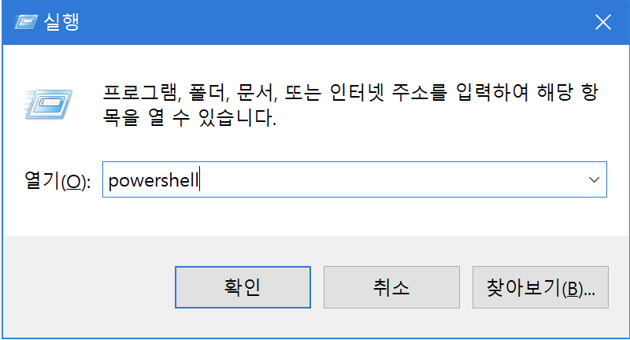
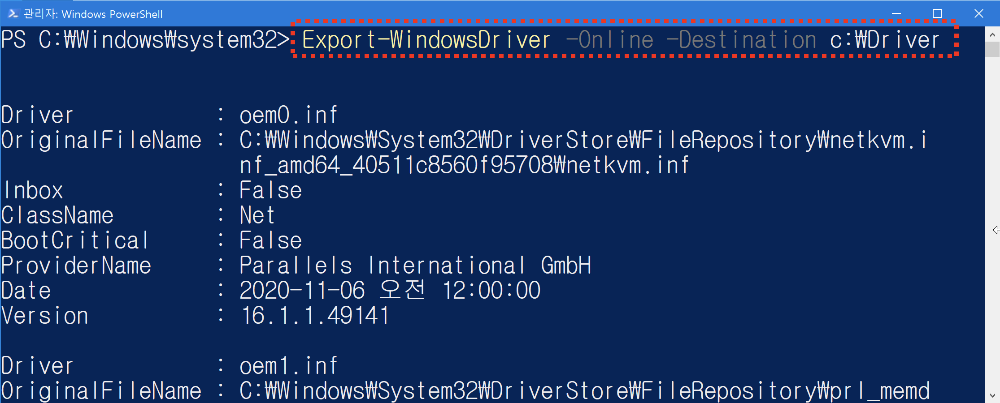
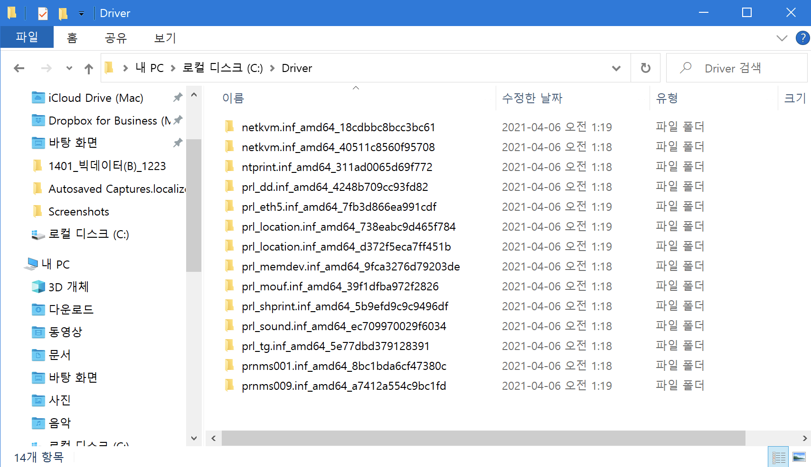

# 장치드라이버 백업

### 장치드라이버란?   
- 드라이버란 그래픽 카드, 렌 카드 등과 같은 하드웨어 장치가 잘 동작할 수 있도록 하는 소프트웨어.
- 대부분의 경우 장치를 구입할 때 CD 형태로 제공됨.
- 대부분 컴퓨터 구입시 제공되는 CD에 포함되어 있지만 대부분의 사용자는 이 CD를 분실하는 경우가 많기 때문에 현재 사용중인 컴퓨터에서 사용중인 드라이버를 백업해 둘 필요가 있음.
- 최신 Window10의 경우 대부분의 데스크탑용 드라이버를 내장하고 있지만 노트북의 경우 제조사에서 제공하는 CD를 보관하지 않으면 드라이버를 미리 백업하거나 제조사 웹 사이트를 통해 내려받아야 함.

### 장치드라이버 백업 방법
1. 파워쉘을 관리자 권한으로 실행하기

- `파워쉘`을 관리자 권한으로 실행한다.
- `WinKey + R` → `powershell` 입력 후 `Ctrl + Shift + Enter`



2. 드라이버 백업 하기

- `C`드라이브 혹은 `D`드라이브에 `Driver`라는 이름의 폴더를 생성한다. (임의의 이름 지정 가능함)
- 실행중인 파워쉘 프로그램에 아래의 명령어를 입력하고 엔터를 누른다.
    
```powershell
Export-WindowsDriver -Online -Destination c:\Driver
```


3. 백업된 드라이버 파일 확인

- 미리 준비한 폴더 안에 드라이버가 백업되어 있는 것을 확인한다.
    

    
> 💡 포멧을 수행하면 C 드라이브 내의 모든 파일들은 삭제된다. 그러므로 C 드라이브에 장치 드라이버를 백업한 경우 이 파일들을 USB나 외장하드 등에 미리 복사해 놓아야 한다.

