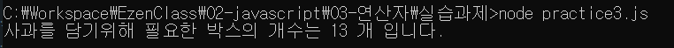
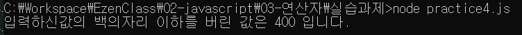

>2022-01-25
## 문제1.
현재 년도에 대한 값을 `year`라는 상수로 생성하고   
이 값을 활용하여 자신의 나이를 연산한 후 `age`라는 이름의 지역변수에 할당하고   
"나는 OO세 입니다." 라는 형식의 문장으로 이스케이프 문자를 활용하여 출력하시오.

```javascript
const year = 2022;
const myBirthYear = 1991;
let age = year - myBirthYear +1;
console.log("나는 %d세 입니다.", age);
```


## 문제2.
자신의 나이를 의미하는 상수 `age`를 정의하고 이 값을 활용하여   
자신이 태어난 년도 `year`를 전역 변수 형식으로 산출하여   
"나는 OOOO년도에 태어났습니다."라는 형식의 문장으로   
이스케이프 문자를 활용하여 출력하시오.

```javascript
const thisYear = 2022;
const age = 32;
var year = thisYear - age + 1;
console.log("나는 %d년도에 태어났습니다.", year);
```


## 문제3.
사과를 바구니에 나누어 담으려고 한다.   
하나의 바구니는 사과를 10개씩 담을 수 있으며 사과를 담다가 10개 미만으로 남는 경우 하나의 바구니를 추가로 사용해야 한다.   
예를 들어 120개의 사과를 나누어 담기 위해서는 12개의 바구니가 필요하지만   
121~130개까지 사과가 있다면 13개의 바구니가 필요하고   
다시 131개의 사과를 나누어 담기 위해서는 14개의 바구니가 필요하게 된다.

현재 갖고 있는 사과의 수를 의미하는 `numOfApples` 변수에 123이라는 값이 할당되어 있을 경우   
필요한 바구니의 수를 구하는 프로그램을 구현하시오.

```javascript
const numOfApples = 123;

let box1 = Math.floor(numOfApples / 10);
let box2 = numOfApples % 10;
let box3 = box2>0? 1:0

let finalBoxNum = box1 + box3;
console.log("사과를 담기위해 필요한 박스의 개수는 %d 개 입니다.",finalBoxNum);
```


## 문제4.

어떤 계산기는 입력된 값에서 백의자리 이하를 버리고 결과를 도출한다고 한다.   
예를 들어 입력된 값이 456이라면 400이 결과로 출력된다.   
이러한 출력결과를 만들 수 있는 코드를 작성하시오.

```javascript
let inputNum = 456;
let resultNum = Math.floor(inputNum /100)*100;
console.log("입력하신값의 백의자리 이하를 버린 값은 %d 입니다.",resultNum);
```

