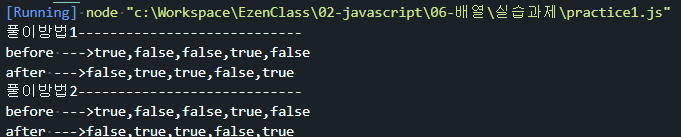
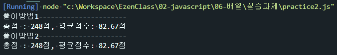
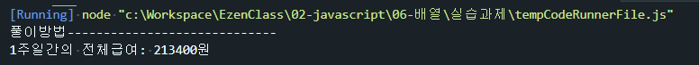
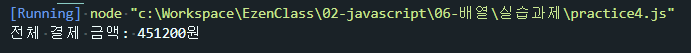

# 배열 연습문제

## 문제1
다음의 소스코드는 boolean 데이터를 저장하고 있는 배열에 대한 어떤 처리를 보여준다.   
실행 결과에서 제시하는 것과 같이 배열에 저장되어 있는 값들을   
반전(true는 false로, false는 true로) 변환하는 처리를 완성하시오.   

```javascript
console.log("풀이방법1----------------------------")
let check_list = [true,false,false,true,false];
console.log("before --->" + check_list);
for(let i=0; i<check_list.length; i++){
    if(check_list[i] === true){
        check_list[i] = false;
    }else {
        check_list[i] = true;
    }
}
console.log("after --->" + check_list);


console.log("풀이방법2----------------------------")
let check_list1 = [true,false,false,true,false];
console.log("before --->" + check_list1);
for(let i=0; i<check_list1.length; i++){
    check_list1[i] = check_list1[i]===true? false:true;
}
console.log("after --->" + check_list1);
```


## 문제2
이 학생의 총점과 평균점수를 구하는 프로그램에 대한 아래의 소스코드를 완성하시오.
```javascript
console.log("풀이방법1----------------------")
let grade =[75,82,91];
let sum = 0, avg=0;

for(let i=0; i<grade.length; i++){
    sum += grade[i];
}

avg = sum / grade.length;
avg = avg.toFixed(2);
console.log("총점 : "+sum + "점, 평균점수: "+avg + "점");


console.log("풀이방법2----------------------")
let grade1 =[75,82,91];
let sum1 = 0, avg1=0;

for(const item of grade1){
    sum1 += item;
}
avg1 = sum1 / grade1.length;
avg1 = avg1.toFixed(2);
console.log("총점 : "+sum1 + "점, 평균점수: "+ avg1 + "점");
```


## 문제3
다음 표는 어떤 학생이 일요일부터 토요일까지의 일주일간 아르바이트를 한 시간이다.   
일 월 화 수 목 금 토   
7  5  5  5  5  10  7   
주말에는 7시간, 평일에는 5시간을 일하기로 했지만, 금요일에 다른 직원의 사정으로   
대신 근무를 하게되어 10시간을 일했다.   
이 학생의 시급이 4,500이었지만 목요일부터는 5,200원으로 올랐다고 할 때   
일주일간의 총 급여를 구하는 프로그램을 작성하시오.   

```javascript
let time = [7,5,5,5,5,10,7];
let money = 0;
let prevSalary = 4500;
let currentSalary = 5200;

for(let i=0; i<time.length; i++){
    if(i < 4){
        money += ( time[i] * prevSalary);
    }else{
        money += (time[i] * currentSalary);
    }
}

console.log("1주일간의 전체급여: " + money + "원");
```


## 문제4
상품의 가격을 원소로 갖는 1차 배열 price와 각 상품의 수량을 원소로 갖는 1차 배열 qty를   
다음과 같이 정의하였을 때 이 사람이 총 얼마를 결제해야 하는지 총 결제금액을 구하는 프로그램을   
작성하시오.   
``` javascript
let price = [38000, 20000, 17900, 17900];
let qty = [6,4,3,5];
let money = 0;

for(let i=0; i<price.length; i++){
    money += (price[i]*qty[i]);
}

console.log("전체 결제 금액: "+money + "원");
```
