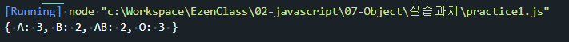

# JSON 연습문제

## 문제1.
다음은 10명의 학생들에 대한 혈액형 데이터이다.
```
['A', 'A', 'A', 'O', 'B', 'B', 'O', 'AB', 'AB', 'O']
```
아래와 같은 JSON을 정의하고, 각 혈액형별 학생수를 아래의 json의 각 key에 대한 value에 저장하시오. (혈액형별 학생 수를 for문을 활용하여 산출해야 합니다.)
```js
const bloodType = ['A', 'A', 'A', 'O', 'B', 'B', 'O', 'AB', 'AB', 'O'];
const result = {"A" : 0, "B" : 0, "AB" : 0, "O" : 0};

for(let i=0; i<bloodType.length; i++){
    if(bloodType[i] == 'A'){
        result['A'] ++;
    }else if(bloodType[i] =='B'){
        result['B'] ++;
    }else if(bloodType[i] =='O'){
        result['O'] ++;
    }else if(bloodType[i] =='AB'){
        result['AB'] ++;
    }
};
console.log(result);
```



---
## 문제2.
다음의 JSON은 어느 학급의 중간고사 성적을 나타낸다.
```js
const exam = {
    "철수": [89, 82, 79, 91],
    "민영": [91, 95, 94, 89],
    "남철": [65, 57, 71, 64],
    "혜진": [82, 76, 81, 83]
}
```
### 2-1.
위 데이터에서 학생별 총점과 평균을 구하시오.
#### 출력결과
```
철수의 총점은 341점 이고 평균은 85.25점 입니다.
민영의 총점은 369점 이고 평균은 92.25점 입니다.
남철의 총점은 257점 이고 평균은 64.25점 입니다.
혜진의 총점은 322점 이고 평균은 80.5점 입니다.
```
```javascript
const exam = {
    "철수": [89, 82, 79, 91],
    "민영": [91, 95, 94, 89],
    "남철": [65, 57, 71, 64],
    "혜진": [82, 76, 81, 83]
};

// console.log(exam['남철'][1]);

for(e in exam){
    let sum = 0;
    for(let i=0; i<exam[e].length; i++){
        sum += exam[e][i]
    }
    let avg = sum / exam[e].length;
    console.log(e + "의 총점은" + sum+"점 이고 평균은"+ avg + "점 입니다." )
}
```

### 2-2.
위 문제의 점수가 순서대로 국어, 영어, 수학, 과학일 경우 수학에 대한 모든 학생의 총점과 평균을 구하시오.
#### 출력결과
```
모든 학생의 수학 총점은 325점 이고 평균은 81.25점 입니다.
```
```javascript
let mathSum = 0;
let keyCount = 0;
for(e in exam){
    keyCount ++;
    for(let i=0; i<exam[e].length; i++){
        if(i==2){
            mathSum += exam[e][2];
        };
    };
};
let avg1 = mathSum / keyCount;
console.log("모든 학생의 수학 총점은"+mathSum+"점 이고 평균은"+avg1+"점 입니다.")
```


---
## 문제3.
아래의 데이터는 2021년 01월 25일부터 02월 01일까지의 Covid19 일별 확진자 수를 표현한 자료구조다.
```javascript
covid19 = [
    {date: '0125': active: 426}, 
    {date: '0126': active: 343}, 
    {date: '0127': active: 547}, 
    {date: '0128': active: 490}, 
    {date: '0129': active: 460}, 
    {date: '0130': active: 443}, 
    {date: '0131': active: 338}, 
    {date: '0201': active: 299}
]
```
### 3-1.
1월 25일부터 2월 1일까지의 누적 확진자 수와 일 평균 확진자 수를 구하시오.
#### 출력결과
```
누적 확진자 수: 3346
평균 확진자 수: 418.25
```
```javascript
covid19 = [
    {date: '0125', active: 426}, 
    {date: '0126', active: 343}, 
    {date: '0127', active: 547}, 
    {date: '0128', active: 490}, 
    {date: '0129', active: 460}, 
    {date: '0130', active: 443}, 
    {date: '0131', active: 338}, 
    {date: '0201', active: 299}
];
let sum =0;
for(let i=0; i<covid19.length; i++){
    sum += covid19[i].active;
}
let avg = sum / covid19.length;
console.log("누적확진자수 :"+sum);
console.log("평균확진자수 :"+avg);
```

### 3-2
1월 25일부터 2월 1일까지 중에서 확진자가 가장 많이 나타난 날짜는 언제인가?

#### 출력결과
```
확진자가 가장 많이 나타난 날: 0127
```
```javascript
let max = 0;
let maxDay = "";
for(let i=0; i<covid19.length; i++){
    if(max < covid19[i].active){
        max = covid19[i].active;
        maxDay = covid19[i].date;
    }
};
console.log("확진자가 가장 많이 나타난 날 : "+ maxDay);
```
