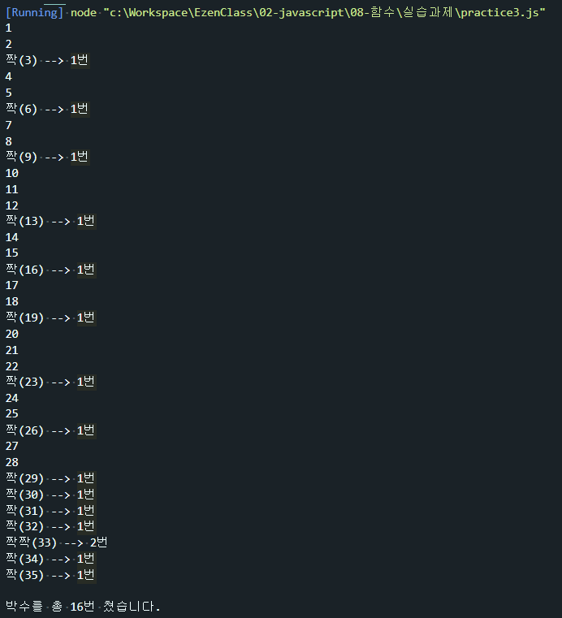

# 함수 연습문제

## 문제1.
아래의 형태로 출력하는 함수를 구현하시오.
```js
// max는 출력해야 할 최대 라인 수
function printStar(max) {
    ... 구현하세요 ...
}
printStar(5)
```
#### 출력결과
```
*
**
***
****
*****
```
```js
function printStar(max){
    for(let i=0; i<max; i++){
        let star = "";
        for(let j=0; j<i+1; j++){
            star += "*";
        }
        console.log(star);
    }
}
printStar(5);
```


---
## 문제2.
1번 문제를 응용하여 같은 파라미터를 받았을 때 별을 역으로 출력하는 `printRevStar(max)` 을 구현하시오.
#### 출력결과
```
*****
****
***
**
*
```
```js
function printRevStar(max){
    for(let i=0; i<max; i++){
        let star = "";
        for(let j=0; j<max-i; j++){
            star += "*";
        }
        console.log(star);
    }
}
printRevStar(5);
```


---
## 문제3
369게임은 숫자를 순서대로 말하면서 3,6,9가 포함된 횟수만큼 박수를 치는 게임이다.   
1부터 파라미터로 전달된 숫자까지 반복하면서 박수를 칠 조건이 충족되면   
 3,6,9 게임 규칙에 따라 박수를 의미하는 "짝"을 출력하고   
 그렇지 않은 경우에는 숫자를 출력하고,   
 박수를 총 몇번 쳤는지를 리턴하는 함수 `myGame(n)`을 작성하시오.

힌트: 문자열은 그 자체가 배열로 인식됩니다.   
ex)
```js
const str = "Hello";
console.log(str[0]); // --> H
console.log(str[1]); // --> e
console.log(str[2]); // --> l
```
```js
function myGame(n){
    let totalClab = 0;
    for(let i=1; i<n+1; i++){
        let str = String(i);
        let clab = ""
        let clabCount = 0;
        for(let j=0; j<str.length; j++){
            if(str[j] === `3`){
                clab += "짝";
                totalClab ++;
                clabCount ++;
            }else if (str[j] === `6`) {
                clab += "짝";
                totalClab ++;
                clabCount ++;
            }else if (str[j] === `9`) {
                clab += "짝";
                totalClab ++;
                clabCount ++;
            }
        }
        if(clab === ""){
            console.log(i);
        }else {
            console.log("%s(%d) --> %d번",clab,i,clabCount );
        }
    }
    console.log("\n박수를 총 %d번 쳤습니다.",totalClab);
}
myGame(35);
```



## 문제4
문제1번을 화살표 함수가 적용된 재귀함수 기법으로 다시 구현해 보세요.


## 문제5 
문제2번을 화살표 함수가 적용된 재귀함수 기법으로 다시 구현해 보세요.
