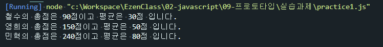
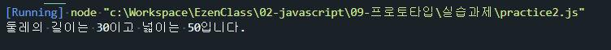

# 프로토타입 연습문제

## 문제1. 
국어, 영어, 수학 점수를 생성자 파라미터로 입력받아서 합계와 평균을 구하는 클래스 Student를 작성하시오.   
이 때 Stuent 클래스는 합계를 리턴하는 메서드인 `sum()`과 평균을 리턴하는 `avg()`를 제공합니다.   
작성된 클래스를 활용하여 아래 표에 대한 학생별 합계 점수와 평균점수를 출력하시오.   
클래스는 JSON 형식으로 작성되어야 합니다.   

| 이름 | 국어 | 영어 | 수학 |
|---|---|---|---|
| 철수 | 92 | 81 | 77 |
| 영희 | 72 | 95 | 98 |
| 민혁 | 80 | 86 | 84 |


#### 출력결과
```
철수의 총점은 249점 이고 평균은 83점 입니다.
영희의 총점은 251점 이고 평균은 83.66666666666667점 입니다.
민혁의 총점은 264점 이고 평균은 88점 입니다.
```
```js
function Student(studentName,kr,en,math){
    this._studentName = studentName;
    this._kr = kr;
    this._en = en;
    this._math = math;
};
Student.prototype = {
    //메서드 정의
    sum : function(){
        return this._kr + this._en + this._math;
    },
    avg : function(){
        return this.sum()/3;
    }
}
const student1  = new Student("철수",30,30,30);
console.log("%s의 총점은 %d점이고 평균은 %d점 입니다.", student1._studentName,student1.sum(),student1.avg());
const student2  = new Student("영희",50,50,50);
console.log("%s의 총점은 %d점이고 평균은 %d점 입니다.", student2._studentName,student2.sum(),student2.avg());
const student3  = new Student("민혁",80,80,80);
console.log("%s의 총점은 %d점이고 평균은 %d점 입니다.", student3._studentName,student3.sum(),student3.avg());
```



## 문제2.
가로(`width`), 세로(`height`)정보를 getter, setter로 관리하는 Rectangle 클래스를 정의하시오.   
이 클래스는 생성자의 파라미터가 없으며 둘레의 길이를 구해 리턴하는 getAround() 메서드와   
넓이를 구해 리턴하는 gerArea() 메서드를 제공합니다.   
클래스는 JSON 형식으로 작성되어야 합니다.   

#### 출력결과
가로가 10이고 세로가 5인 경우
```
둘레의 길이는 30이고 넓이는 50입니다.
```
```js
Rectangle.prototype = {
    get width(){
        return this._width;
    },
    set width(param){
        this._width = param;
    },
    get height(){
        return this._height;
    },
    set height(param){
        this._height = param;
    },
    getAround : function(){
        return (this.height + this.width)*2;
    },
    getArea : function(){
        return this.height * this.width;
    }
};

let rectang = new Rectangle();
rectang.width=10;
rectang.height=5;
console.log("둘레의 길이는 %d이고 넓이는 %d입니다.",rectang.getAround(),rectang.getArea());
```
