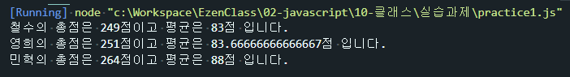
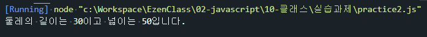

# Class 기반 객체지향 연습문제

## 문제1.
앞 단원에서 수행한 연습문제 1번을 Class 기반의 객체지향으로 재구성하시오.
```js
class Student {
    constructor(studentName,kr,en,math){
        this._studentName = studentName;
        this._kr = kr;
        this._en = en;
        this._math = math;
    };   
    //메서드
    sum(){
        return this.kr+this.en+this.math; 
    };
    avg(){
        return this.sum()/3;
    }; 
};

//객체생성
const grade = [
    ["철수",92,81,76],
    ["영희",72,95,84],
    ["민혁",80,86,98]
];

for(const item of grade){
    const s = new Student(item[0],item[1],item[2],item[3]);
    console.log("%s의 총점은 %d점이고 평균은 %d점 입니다.", item[0],s.sum(),s.avg());
};
```



## 문제2
앞 단원에서 수행한 연습문제 2번을 Class 기반의 객체지향으로 재구성하시오.
```js
class Rectangle {
    constructor(){
        this._width = null;
        this._height = null;
    };
    //getter,setter
    get width(){
        return this._width;
    };
    set width(value){
        if(!value){
            console.log("width를 입력하세요.");
            return;
        }
        this._width = value;
    };
    get height(){
        return this._height;
    };
    set height(value){
        if(!value){
            console.log("height를 입력하세요.");
            return;
        }
        this._height = value;
    };
    //메서드
    getAround(){
        return (this.width+this.height) * 2;
    };
    getArea(){
        return this.width * this.height;
    };
};

//객체생성
const rectang1 = new Rectangle();
rectang1.width =10;
rectang1.height = 5;
console.log("둘레의 길이는 %d이고 넓이는 %d입니다.",rectang1.getAround(), rectang1.getArea());
```
