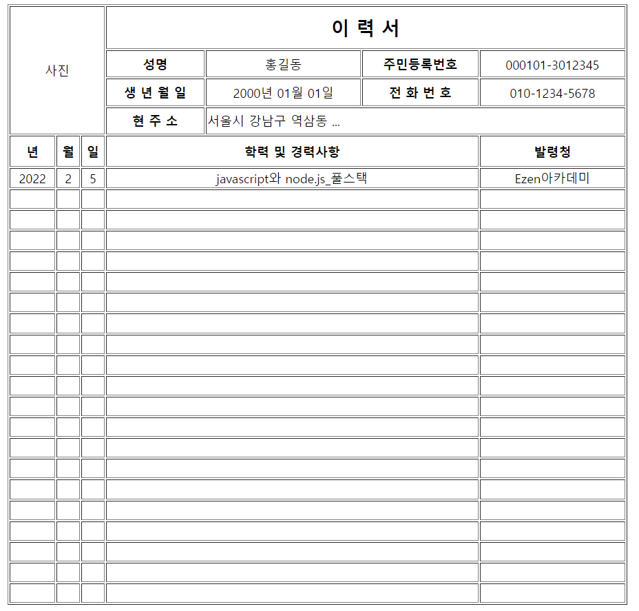

# 문제1. table태그 활용 이력서 양식만들기
```html
<!DOCTYPE html>
<html lang="en">
<head>
    <meta charset="UTF-8">
    <meta http-equiv="X-UA-Compatible" content="IE=edge">
    <meta name="viewport" content="width=device-width, initial-scale=1.0">
    <title>Document</title>
</head>
<body>
    <table width="800" border="1" align="center">
        <thead align="center" >
            <tr height="55">
                <td rowspan="4" colspan="3">사진</td>
                <th colspan="4"><font size="5">이 력 서</font></th>
            </tr>
            <tr height="35">
                <td><strong>성명</strong></td>
                <td>홍길동</td>
                <td><strong>주민등록번호</strong></td>
                <td>000101-3012345</td>
            </tr>
            <tr height="35">
                <td><strong>생 년 월 일</strong></td>
                <td>2000년 01월 01일</td>
                <td><strong>전 화 번 호</strong></td>
                <td>010-1234-5678</td>
            </tr>
            <tr height="35">
                <td><strong>현 주 소</strong></td>
                <td colspan="3" align="left">서울시 강남구 역삼동 ...</td>
            </tr>
        </thead>
        <tbody align="center">
        <tr height="40" >
            <td><strong>년</strong></td>
            <td><strong>월</strong></td>
            <td><strong>일</strong></td>
            <td colspan="3"><strong>학력 및 경력사항</strong></td>
            <td><strong>발령청</strong></td>
        </tr>
        <tr height="25">
            <td>2022</td>
            <td>2</td>
            <td>5</td>
            <td colspan="3">javascript와 node.js_풀스택</td>
            <td>Ezen아카데미</td>
        </tr>
        <tr height="25">
            <td></td>
            <td></td>
            <td></td>
            <td colspan="3"></td>
            <td></td>
        </tr>
        <tr height="25">
            <td></td>
            <td></td>
            <td></td>
            <td colspan="3"></td>
            <td></td>
        </tr>
        <tr height="25">
            <td></td>
            <td></td>
            <td></td>
            <td colspan="3"></td>
            <td></td>
        </tr>
        <tr height="25">
            <td></td>
            <td></td>
            <td></td>
            <td colspan="3"></td>
            <td></td>
        </tr>
        <tr height="25">
            <td></td>
            <td></td>
            <td></td>
            <td colspan="3"></td>
            <td></td>
        </tr>
        <tr height="25">
            <td></td>
            <td></td>
            <td></td>
            <td colspan="3"></td>
            <td></td>
        </tr>
        <tr height="25">
            <td></td>
            <td></td>
            <td></td>
            <td colspan="3"></td>
            <td></td>
        </tr>
        <tr height="25">
            <td></td>
            <td></td>
            <td></td>
            <td colspan="3"></td>
            <td></td>
        </tr>
        <tr height="25">
            <td></td>
            <td></td>
            <td></td>
            <td colspan="3"></td>
            <td></td>
        </tr>
        <tr height="25">
            <td></td>
            <td></td>
            <td></td>
            <td colspan="3"></td>
            <td></td>
        </tr>
        <tr height="25">
            <td></td>
            <td></td>
            <td></td>
            <td colspan="3"></td>
            <td></td>
        </tr>
        <tr height="25">
            <td></td>
            <td></td>
            <td></td>
            <td colspan="3"></td>
            <td></td>
        </tr>
        <tr height="25">
            <td></td>
            <td></td>
            <td></td>
            <td colspan="3"></td>
            <td></td>
        </tr>
        <tr height="25">
            <td></td>
            <td></td>
            <td></td>
            <td colspan="3"></td>
            <td></td>
        </tr>
        <tr height="25">
            <td></td>
            <td></td>
            <td></td>
            <td colspan="3"></td>
            <td></td>
        </tr>
        <tr height="25">
            <td></td>
            <td></td>
            <td></td>
            <td colspan="3"></td>
            <td></td>
        </tr>
        <tr height="25">
            <td></td>
            <td></td>
            <td></td>
            <td colspan="3"></td>
            <td></td>
        </tr>
        <tr height="25">
            <td></td>
            <td></td>
            <td></td>
            <td colspan="3"></td>
            <td></td>
        </tr>
        <tr height="25">
            <td></td>
            <td></td>
            <td></td>
            <td colspan="3"></td>
            <td></td>
        </tr>
        <tr height="25">
            <td></td>
            <td></td>
            <td></td>
            <td colspan="3"></td>
            <td></td>
        </tr>
        
     
    </tbody>
    </table>
</body>
</html>
```
