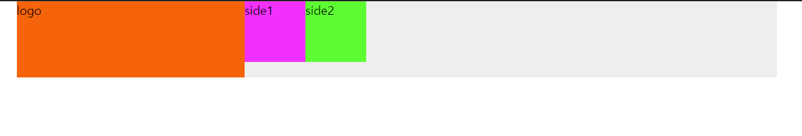
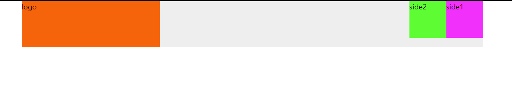
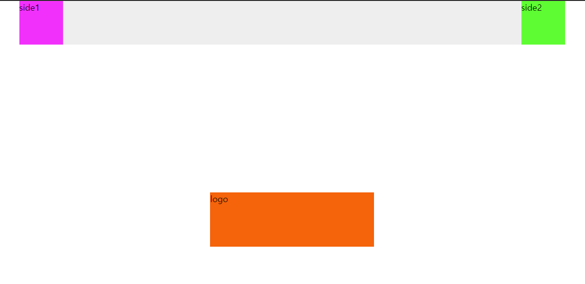

# HTML 요소 배치

## 공통항목(common.css)
```css
*{
    padding :0;
    margin: 0;
}
.text-center{
    text-align: center;
}
.text-right{
    text-align: right;
}
.text-left{
    text-align: left;
}
.inline{
    display: inline;
}
.inline-block{
    display: inline-block;
}
.pull-left{
    float: left;
}
.pull-right{
    float: right;
}
.clearfix::after{
    content: '';
    display: block;
    clear: both;
    float: none;
}
```


## case1 : 모두 왼쪽정렬
```html
<!DOCTYPE html>
<html lang="ko">
<head>
    <meta charset="UTF-8">
    <title>Document</title>
    <link rel="stylesheet" href="common.css">
    <style>
        .container {
            width: 1000px;
            background-color: #eee;
            margin: auto;
        }

        .logo {
            width: 300px;
            height: 100px;
            background-color: #ff6600;
        }

        .side1 {
            width: 80px;
            height: 80px;
            background-color: #ff00ff;
        }

        .side2 {
            width: 80px;
            height: 80px;
            background-color: #00ff00;
        }
    </style>
</head>
<body>
    <div class="container clearfix">
        <div class="logo pull-left">logo</div>
        <div class="side1 pull-left">side1</div>
        <div class="side2 pull-left">side2</div>
    </div>
</body>
</html>
```


## case2 : 로고는 왼쪽, 메뉴 요소들은 오른쪽
```html
<!DOCTYPE html>
<html lang="ko">
<head>
    <meta charset="UTF-8">
    <title>Document</title>
    <link rel="stylesheet" href="common.css">
    <style>
        .container {
            width: 1000px;
            background-color: #eee;
            margin: auto;
        }

        .logo {
            width: 300px;
            height: 100px;
            background-color: #ff6600;
        }

        .side1 {
            width: 80px;
            height: 80px;
            background-color: #ff00ff;
        }

        .side2 {
            width: 80px;
            height: 80px;
            background-color: #00ff00;
        }
    </style>
</head>
<body>
    <div class="container clearfix">
        <div class="logo pull-left">logo</div>
        <div class="side1 pull-right">side1</div>
        <div class="side2 pull-right">side2</div>
    </div>
</body>
</html>

```



## case3 : 로고는 중앙, 메뉴 요소들은 양 끝을 기준으로 간격 조절
```html
<!DOCTYPE html>
<html lang="ko">
<head>
    <meta charset="UTF-8">
    <title>Document</title>
    <link rel="stylesheet" href="common.css">
    <style>
        .container {
            width: 1000px;
            background-color: #eee;
            margin: auto;
        }

        .logo {
            width: 300px;
            height: 100px;
            background-color: #ff6600;

            position: absolute;
            left: 50%;
            top: 50%;
            margin-left: -150px;
            margin-top: -50px;
        }

        .side1 {
            width: 80px;
            height: 80px;
            background-color: #ff00ff;
        }

        .side2 {
            width: 80px;
            height: 80px;
            background-color: #00ff00;
        }
    </style>
</head>
<body>
    <div class="container clearfix">
        <div class="logo">logo</div>
        <div class="side1 pull-left">side1</div>
        <div class="side2 pull-right">side2</div>
    </div>
</body>
</html>
```



## case4 : 모두 가운데에서 출발. 간격조절
```html
<!DOCTYPE html>
<html lang="ko">
<head>
    <meta charset="UTF-8">
    <title>Document</title>
    <link rel="stylesheet" href="common.css">
    <style>
        .container {
            width: 1000px;
            background-color: #eee;
            margin: auto;

            position: relative;
            height: 150px;
        }

        .logo {
            width: 300px;
            height: 100px;
            background-color: #ff6600;

            position :absolute;
            left:50%;
            top:50%;
            margin-left:-150px;
            margin-top:-50px;
        }

        .side1 {
            width: 80px;
            height: 80px;
            background-color: #ff00ff;

            position: absolute;
            left: 50%;
            right: 50%;
            margin-left: -240px;
            margin-top: -40px;
        }

        .side2 {
            width: 80px;
            height: 80px;
            background-color: #00ff00;

            position: absolute;
            left: 50%;
            right: 50%;
            margin-left: 160px;
            margin-top: -40px;
        }
    </style>
</head>
<body>
    <div class="container">
        <div class="logo">logo</div>
        <div class="side1">side1</div>
        <div class="side2">side2</div>
    </div>
</body>
</html>
```

