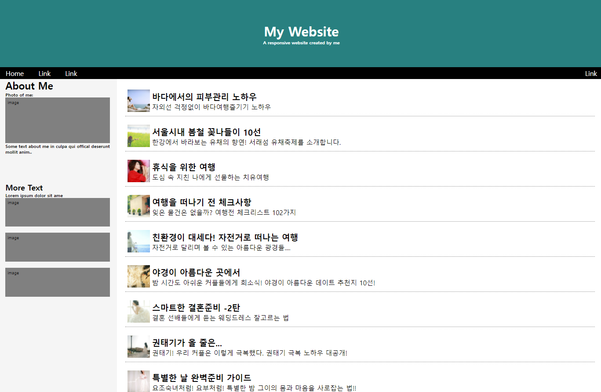
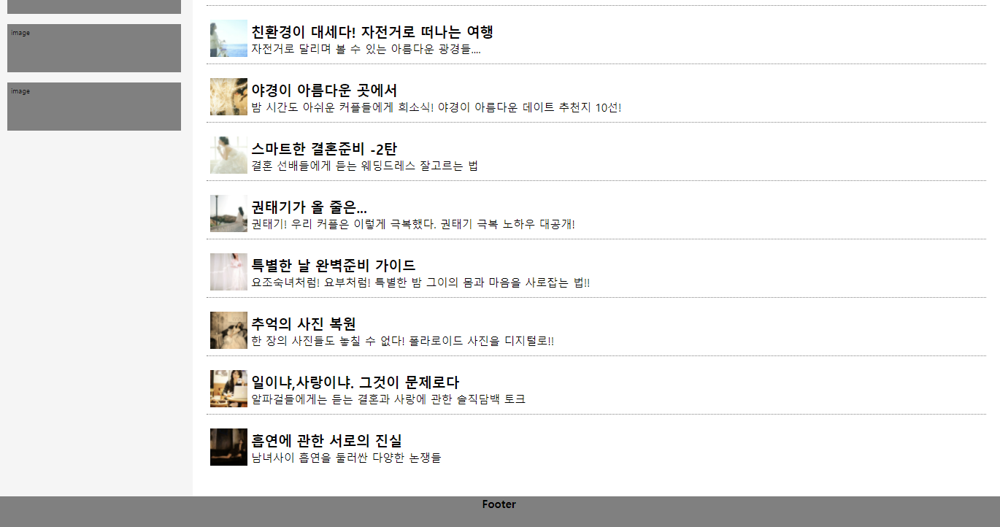

# HTML,CSS clone

HTML문서
```html
<!DOCTYPE html>
<html lang="en">
<head>
    <meta charset="UTF-8">
    <meta http-equiv="X-UA-Compatible" content="IE=edge">
    <meta name="viewport" content="width=device-width, initial-scale=1.0">
    <link rel="stylesheet" href="layout.css">
    <title>Document</title>
</head>
<body>
    <header>
        <div id="title">
            <h1>My Website</h1>
            <h6>A responsive website created by me</h6>
        </div>
        <nav>
            <div id="nav-content1">
                <span>Home</span>
                <span>Link</span>
                <span>Link</span>
            </div>
            <div id="nav-content2">
                <span>Link</span>
            </div>
        </nav>
    </header>

    <main>
        <aside>
            <div id="aside-content1">
                <h2>About Me</h2>
                <h6>Photo of me:</h6>
                <div>image</div>
                <h6>Some text about me in culpa qui offical deserunt mollit anim..</h6>
            </div>
            <div id="aside-content2">
                <h3>More Text</h3>
                <h6>Lorem ipsum dolor sit ame</h6>
                <div>image</div>
                <div>image</div>
                <div>image</div>
            </div>
        </aside>
        <section>
            <ul>
                <li class="gallery-list">
                    <a href="#">
                        <div>
                        
                    </div>
                    <div id="text">
                        <p>바다에서의 피부관리 노하우</p>
                        <p>자외선 걱정없이 바다여행즐기기 노하우</p>
                    </div>
                    </a>
                </li>
                <li class="gallery-list">
                    <a href="#">
                        <div>
                        
                        </div>
                        <div id="text">
                        <p id="text">서울시내 봄철 꽃나들이 10선</p>
                        <p>한강에서 바라보는 유채의 향연! 서래섬 유채축제를 소개합니다.</p>
                    </div>
                    </a>
                </li>
                <li class="gallery-list">
                    <a href="#">
                        <div>
                        
                    </div>
                        <div id="text">
                        <p id="text">휴식을 위한 여행</p>
                        <p>도심 속 지친 나에게 선물하는 치유여행</p>
                    </div>
                    </a>
                </li>
                <li class="gallery-list">
                    <a href="#">
                        <div>
                        
                    </div>
                        <div id="text">
                        <p id="text">여행을 떠나기 전 체크사항</p>
                        <p>잊은 물건은 없을까? 여행전 체크리스트 102가지</p>
                    </div>
                    </a>
                </li>
                <li class="gallery-list">
                    <a href="#">
                        <div>
                        
                    </div>
                    <div id="text">
                        <p id="text">친환경이 대세다! 자전거로 떠나는 여행</p>
                        <p>자전거로 달리며 볼 수 있는 아름다운 광경들....</p>
                    </div>
                    </a>
                </li>
                <li class="gallery-list">
                    <a href="#">
                        <div>
                        
                    </div>
                    <div id="text">
                        <p id="text">야경이 아름다운 곳에서 </p>
                        <p>밤 시간도 아쉬운 커플들에게 희소식! 야경이 아름다운 데이트 추천지 10선!</p>
                    </div>
                    </a>
                </li>
                <li class="gallery-list">
                    <a href="#">
                        <div>
                        
                    </div>
                    <div id="text">
                        <p id="text">스마트한 결혼준비 -2탄</p>
                        <p>결혼 선배들에게 듣는 웨딩드레스 잘고르는 법</p>
                    </div>
                    </a>
                </li>
                <li class="gallery-list">
                    <a href="#">
                        <div>
                        
                    </div>
                    <div id="text">
                        <p id="text">권태기가 올 줄은...</p>
                        <p>권태기! 우리 커플은 이렇게 극복했다. 권태기 극복 노하우 대공개!</p>
                    </div>
                    </a>
                </li>
                <li class="gallery-list">
                    <a href="#">
                        <div>
                        
                    </div>
                    <div id="text">
                        <p id="text">특별한 날 완벽준비 가이드</p>
                        <p>요조숙녀처럼! 요부처럼! 특별한 밤 그이의 몸과 마음을 사로잡는 법!!</p>
                    </div>
                    </a>
                </li>
                <li class="gallery-list">
                    <a href="#">
                        <div>
                        
                    </div>
                    <div id="text">
                        <p id="text">추억의 사진 복원</p>
                        <p>한 장의 사진들도 놓칠 수 없다! 폴라로이드 사진을 디지털로!!</p>
                    </div>
                    </a>
                </li>
                <li class="gallery-list">
                    <a href="#">
                        <div>
                        
                    </div>
                    <div id="text">
                        <p id="text">일이냐,사랑이냐. 그것이 문제로다</p>
                        <p>알파걸들에게는 듣는 결혼과 사랑에 관한 솔직담백 토크</p>
                    </div>
                    </a>
                </li>
                <li class="gallery-list">
                    <a href="#">
                        <div>
                        
                    </div>
                    <div id="text">
                        <p id="text">흡연에 관한 서로의 진실</p>
                        <p>남녀사이 흡연을 둘러싼 다양한 논쟁들</p>
                    </div>
                    </a>
                </li>
            </ul>
        </section>
    </main>
    <footer>
        Footer
    </footer>
</body>
</html>
```

CSS문서
```css
*{
    padding: 0;
    margin: 0;
}

body,html{
    width: 100%;
    height: 100%;
}

header{
    height: 20%;
}

#title{
    width: 100%;
    height: 85%;
    background : teal;
    color: white;
    display: flex;
    flex-direction: column;
    justify-content: center;
    align-items: center;
}

nav{
    height: 15%;
    background-color: black;
    color: white;
    display: flex;
    justify-content: space-between;
    align-items: center;
    /* padding: 10px 0px; */
    box-sizing: border-box;
    
}
nav span{
    margin: 0px 15px;
}

main{
    width: 100%;
    min-height: 100%;
    display: flex;
    justify-content: flex-start;

}
aside{
    width: 20%;
    min-height: 100%;
    background: whitesmoke;

}
section{
    width: 80%;
    height: 65%;
    padding: 20px;
}
footer{
    width: 100%;
    height: 5%;
    /* position: fixed;
    bottom: 0; */
    background-color: gray;
    text-align: center;
    font-weight: bold;
}

aside #aside-content1 {
    width: 90%;
    height: 250px;
    margin: auto;
}

aside #aside-content1 div{
    width: 95%;
    height: 40%;
    background-color: gray;
    padding: 5px 5px;
    font-size: x-small;
}

aside #aside-content2{
    width: 90%;
    height: 200px;
    margin: auto;
}

aside #aside-content2 div{
    width: 95%;
    height: 30%;
    background-color: gray;
    margin-bottom: 15px;
    padding: 5px 5px;
    font-size: x-small;
}

ul{
    height: 100%;
    list-style: none;
}
 .gallery-list{
    border-bottom: 1px dotted gray;
    margin-bottom: 15px;
 }
 .gallery-list:last-child{
    border-bottom: none;
    margin-bottom: none;
 }

.gallery-list > a  {
    text-decoration-line: none;
    color: black;
    display: flex;
    flex-direction: row;
    align-items: center;
}
.gallery-list > a > div#text > p:first-child{
    font-weight: bold;
    font-size: 20px;
}

.gallery-list a img{
    width: auto;
    height: 55px;
    margin: 5px 5px;
}
```



