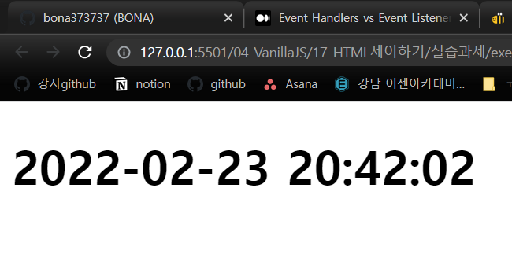
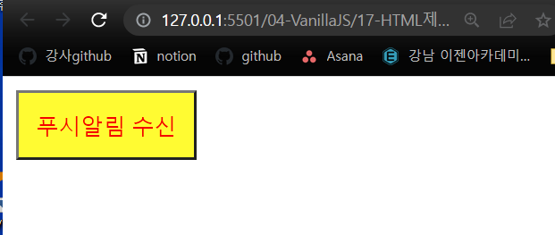
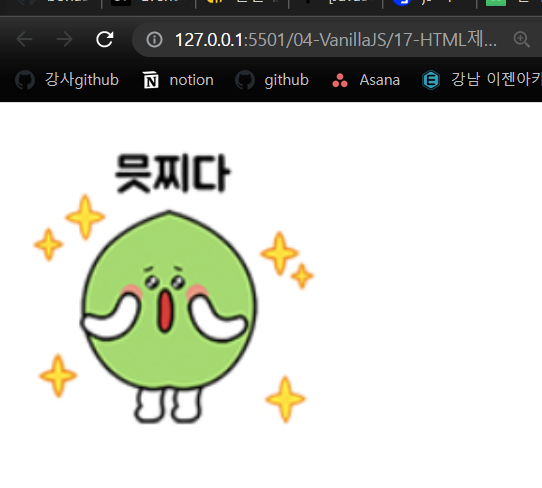
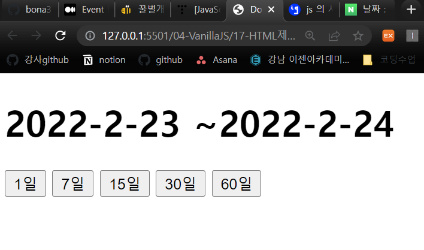

# HTML 제어하기 연습문제 

## 문제1
아래 화면과 같이 현재 시각을 yyyy-mm-dd hh:mi:ss 형식으로 출력하는 웹 페이지를 구현하시오.   
년도는 4자리 숫자로 구성되며 월,일,시,분,초는 2자리 숫자 입니다.   
출력되는 시간은 매초마다 자동으로 화면상에서 갱신되어야 합니다.   
```html
<!DOCTYPE html>
<html lang="en">
<head>
    <meta charset="UTF-8">
    <meta http-equiv="X-UA-Compatible" content="IE=edge">
    <meta name="viewport" content="width=device-width, initial-scale=1.0">
    <title>시계</title>
</head>
<body>
    <h1></h1>

    <script>
        function currentTime(){
            const date = new Date();
            const year = date.getFullYear();
            let month = (date.getMonth()).toString();
            let day = (date.getDate()).toString();
            let hh=(date.getHours()).toString();
            let mm = (date.getMinutes()).toString();
            let ss = (date.getSeconds()).toString();
            
            if(month.length == 1){
                month = 0+month;
            }
            if(day.length ==1){
                day = 0+day;
            }
            if(hh.length ==1){
                hh = 0+hh;
            }
            if(mm.length == 1){
                mm = 0+mm;
            }
            if(ss.length == 1){
                ss = 0+ss;
            }

            const h1 = document.querySelector('h1');
            h1.innerHTML = year+'-'+month+'-'+day+' '+hh+':'+mm+':'+ss;
            
        }
        currentTime();
        setInterval('currentTime()',1000);

    </script>
</body>
</html>
```



## 문제2
off 상태의 버튼이 누를때마다 on/off 의 상태가 변경되도록 CSS를 적용할 수 있는 코드를 작성하세요.
```html
 <!DOCTYPE html>
 <html lang="en">
 <head>
     <meta charset="UTF-8">
     <meta http-equiv="X-UA-Compatible" content="IE=edge">
     <meta name="viewport" content="width=device-width, initial-scale=1.0">
     <title>버튼 on,off</title>
    <style>
        button{
            padding: 10px;
            background: gray;
            color: blue;
        }
        .btn-on{
            background: yellow;
            color: red;
        }
    </style>
</head>

 <body>
     <button id="btn">푸시알림 수신</button>

     <script>
         const btn = document.getElementById('btn');

        btn.addEventListener('click',e=>{
            btn.classList.toggle('btn-on');
        });

     </script>

 </body>
 </html>
```



## 문제3
3장의 이미지가 3초마다 한번씩 자동으로 변경되는 웹 페이지를 작성하시오.   
세 번째 이미지가 표시된 후 3초 후에는 다시 첫 번째 이미지가 표시되어야 합니다.   
이미지 파일은 각자 임의의 이미지를 선정하여 사용하고, 이미지 파일 이름도 각자 임의로 구성합니다.
```html
 <!DOCTYPE html>
 <html lang="en">
 <head>
     <meta charset="UTF-8">
     <meta http-equiv="X-UA-Compatible" content="IE=edge">
     <meta name="viewport" content="width=device-width, initial-scale=1.0">
     <title>Document</title>
 </head>
 <body>
     

     <script>
         const myImg = document.getElementById('myImg');
         
         let i =1; 
         setInterval(() => {
            if(i<4){
                // myImg.src = `./assets/img/img${i}.png`
                myImg.setAttribute('src',`./assets/img/img${i}.png`)
                i++;
            }else{
                i=1;
            }
         }, 3000);
     </script>
 </body>
 </html>
```



## 문제4
 버튼에 따라 과거의 n일 전부터 오늘까지의 범위를 표시하는 웹 페이지를 작성하시오
 ```html
<!DOCTYPE html>
<html lang="en">
<head>
    <meta charset="UTF-8">
    <meta http-equiv="X-UA-Compatible" content="IE=edge">
    <meta name="viewport" content="width=device-width, initial-scale=1.0">
    <title>Document</title>
</head>
<body>
    <h1 id="term">
        <span id="startDay"></span>
        <span id="nowDay"></span>
    </h1>
    <button value="1">1일</button>
    <button value="7">7일</button>
    <button value="15">15일</button>
    <button value="30">30일</button>
    <button value="60">60일</button>

    <script>
        function setStartDay(e){
            const date = new Date();
            const year = date.getFullYear();
            const month = date.getMonth();
            const day = date.getDate();
            document.getElementById('nowDay').innerHTML ='~'+year+'-'+ month +'-'+ day;

            const dayTerm = Number(e.target.value);
            const startDay = new Date();
            startDay.setDate(startDay.getDate()-dayTerm);
            document.getElementById('startDay').innerHTML= startDay.getFullYear()+'-'+startDay.getMonth()+'-'+startDay.getDate();

        }
        document.querySelector('button:nth-child(2)').addEventListener('click',e=>{
            setStartDay(e);
        })
        document.querySelector('button:nth-child(3)').addEventListener('click',e=>{
            setStartDay(e);
        })
        document.querySelector('button:nth-child(4)').addEventListener('click',e=>{
            setStartDay(e);
        })
        document.querySelector('button:nth-child(5)').addEventListener('click',e=>{
            setStartDay(e);
        })
        document.querySelector('button:nth-child(6)').addEventListener('click',e=>{
            setStartDay(e);
        })
    </script>
</body>
</html>
 ```
