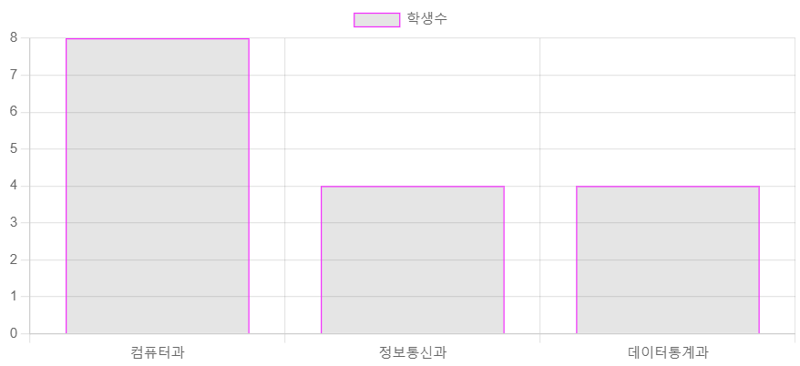
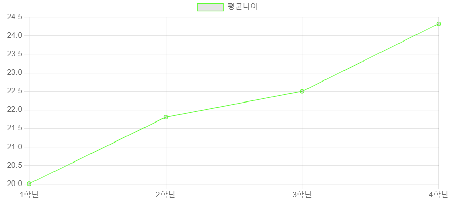
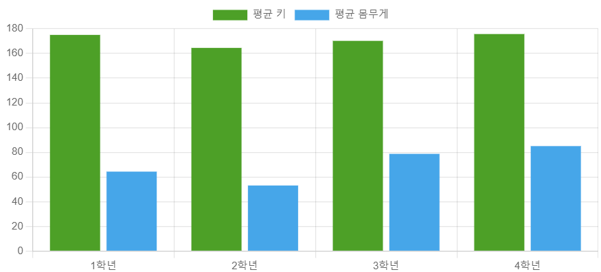

# 라이브러리활용 chartJS문제

## 문제1. 학과별 학생수를 세로막대그래프로 표현하시오
```js
        const department = [];
        const studentCount =[0,0,0];

        for(s of student){
            if(!department.includes(s.deptno)){
                department.push(s.deptno);
            }
        };
        console.log(department);

        for(let j=0; j<department.length; j++){
            for(s of student){
                if(department[j] == s.deptno){
                    studentCount[j]++;
                }
            }
        };
        console.log(studentCount);

        //차트그리기
        const chart1 = document.getElementById('chart1');
        new Chart(chart1, {
            type:'bar',

            data:{
                labels : department,
                datasets:[
                    {
                        label:'학생수',
                        data:studentCount,
                        borderWidth:1,
                        borderColor:'#ff00ff',
                    }
                ]

            },

            options:{
                maintainAspectRatio: false,
            },
        });
```


## 문제2.학년이 올라갈 수록 평균나이가 어떻게 변화하는지를 선그래프로 표현하시오
```js
 const ageInfo = {}
        const thisYear = new Date().getFullYear();

        for(s of student){
            ageInfo[s.grade]=[];
        };
        console.log(JSON.parse(JSON.stringify(ageInfo)));
        
       for(key in ageInfo){  //4번 반복
            for(s of student){  //16번 반복
                if(key == s.grade){
                    let birthYear = Number(s.birthdate.substring(0,4));
                    let age = thisYear - birthYear +1;
                    ageInfo[key].push(age);
                };
            };
        };
        console.log(JSON.parse(JSON.stringify(ageInfo)));

        //최종 필요한 데이터 [1학년평균, 2학년평균, 3학년평균, 4학년평균]
        const ageAvg = [];
        for(let i=1; i<Object.keys(ageInfo).length+1; i++){
            let sum = 0;
            let avg = 0;
            for(item of ageInfo[i]){
                sum += item;
            }
            avg = Number((sum/ageInfo[i].length).toFixed(2));
            ageAvg.push(avg);
        }
        console.log(ageAvg);
        
        //차트 그리기
        const chart2 = document.getElementById('chart2');
        new Chart(chart2, {
            type: 'line',

            data:{
                labels:['1학년','2학년','3학년','4학년'],
                datasets:[
                    {
                        label: '평균나이',
                        data: ageAvg,
                        borderWidth:1,
                        borderColor: '#00ff00',
                    }
                ],
            },

            options:{
                maintainAspectRatio:false,
            }
        });
```


## 문제3.학년별 평균키와 평균몸무게를 세로다중막대그래프로 표현하시오
```js
const bodyInfo = {};

        for(s of student){
            bodyInfo[s.grade]={height:[],weight:[]};
        };
        
        for(key in bodyInfo){
            for(s of student){
                if(key == s.grade){
                    bodyInfo[key]['height'].push(s.height);
                    bodyInfo[key]['weight'].push(s.weight);
                };
            };
        };
        console.log(bodyInfo);


        // 최종구해야하는 데이터
        // 평규몸무게 = [1학년평균, 2학년평균,3학년평균,4학년평균];
        // 평균키 = [1학년평균, 2학년평균,3학년평균,4학년평균];
        const heightAvg = [];
        const weightAvg = [];
        for(let i=1; i<Object.keys(bodyInfo).length+1; i++){
            let heightSum = 0;
            let weightSum = 0;
            for(item of bodyInfo[i]['height']){
                heightSum += item;
            }
            for(item of bodyInfo[i]['weight']){
                weightSum += item;
            }
            heightAvg.push(heightSum/bodyInfo[i]['height'].length);
            weightAvg.push(weightSum/bodyInfo[i]['weight'].length);
        }
        console.log(heightAvg);
        console.log(weightAvg);

        //차트그리기
        const chart3 = document.getElementById('chart3');
        new Chart(chart3, {
            type: 'bar',
            data:{
                labels: ['1학년','2학년','3학년','4학년'],
                datasets:[
                    {
                        label:'평균 키',
                        data:heightAvg,
                        borderWidth: 0.5,
                        borderColor: 'rgba(54,162,23,0.2)',
                        backgroundColor: `rgba(54,162,23,1)`
                    },
                    {
                        label: '평균 몸무게',
                        data:weightAvg,
                        borderWidth: 0.5,
                        borderColor: 'rgba(54,162,235,0.2)',
                        backgroundColor: 'rgba(54,162,235,1)',
                    }
                ]
            },
            options:{
                maintainAspectRatio:false,
            }
        });
```
