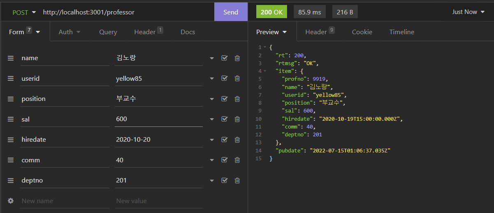
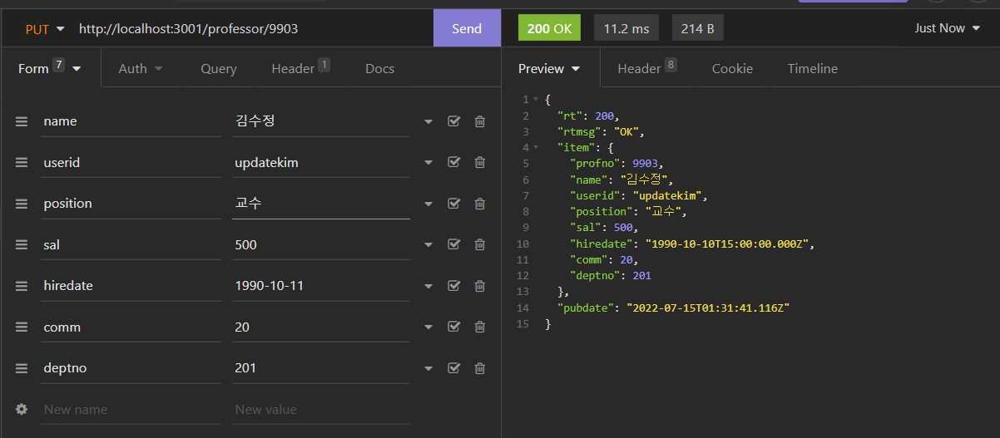
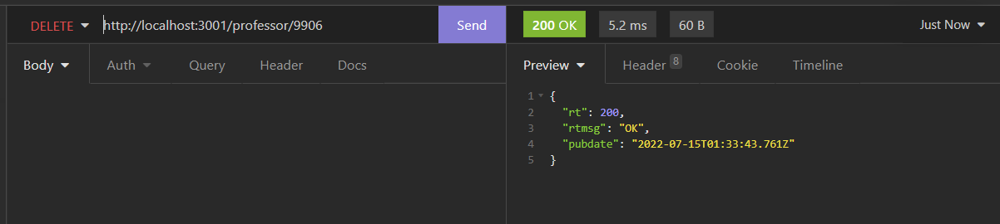
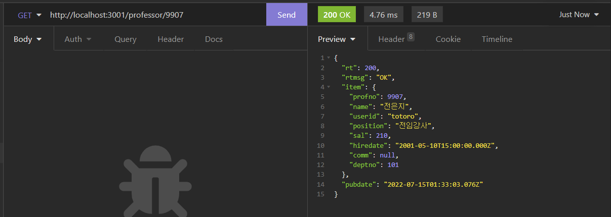
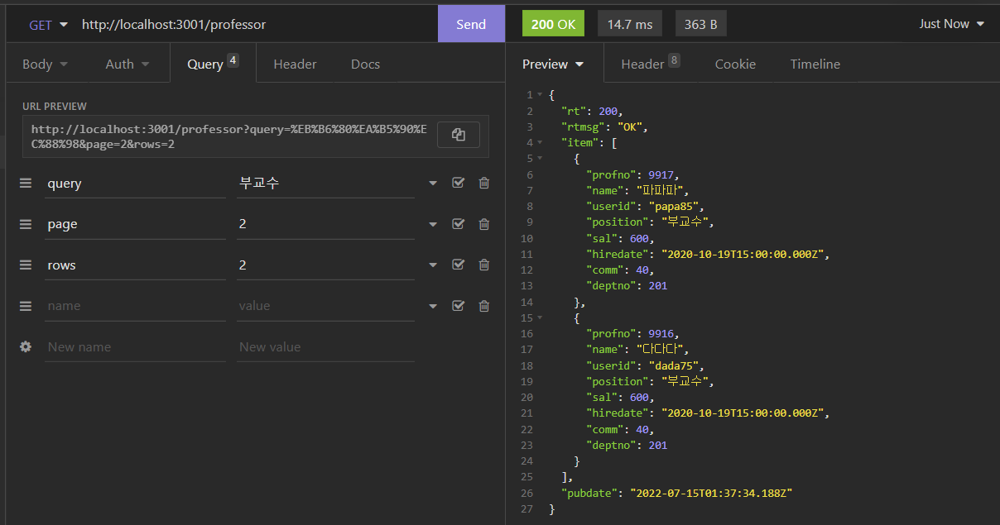

## 1.교수의 데이터를 생성하기 위한 API를 구현하고 작성한 SQL Mapper, Service Layer, Controller의 소스코드를 제시하고 Insomnia로 테스트한 실행결과를 제출하시오.
### SQL Mapper
```xml
<!-- 
    @Filename ProfessorMapper.xml
    @Author 구본아
    @description 교수데이터 수정,삭제,추가,조회를 위한 sql mapper
 -->
<?xml version="1.0" encoding="UTF-8"?>
<!DOCTYPE mapper PUBLIC "-//mybatis.org//DTD Mapper 3.0//EN" "http://mybatis.org/dtd/mybatis-3-mapper.dtd">

    <insert id="insertItem">
        INSERT INTO professor  (name, userid, position, sal, hiredate, comm, deptno)
        VALUES(#{name}, #{userid}, #{position}, #{sal}, #{hiredate}, #{comm}, #{deptno});
    </insert>
```
### Service Layer
```js
/**
 * @FileName ProfessorService.js
 * @Author 구본아
 * @description 교수데이터 수정,삭제,추가,조회 비즈니스로직
 */
async addItem(params){
        let dbcon = null;
        let data = null;

        try {
            dbcon = await DBPool.getConnection();

            //입력한 deptno값이 실재 있는 값인지 확인 
            let sql = MybatisMapper.getStatement('DepartmentMapper', 'selectDeptnoList');
            let [deptnoList] = await dbcon.query(sql);

            let deptnoArr = [];
            for(const item of deptnoList){
                deptnoArr.push(item['deptno'])
            };

            //존재하는 deptno인경우에 데이터추가 진행
            if(deptnoArr.includes(Number(params.deptno))){   
                sql = MybatisMapper.getStatement('ProfessorMapper', 'insertItem', params);
                let [{insertId, affectedRows}] = await dbcon.query(sql);
                
                if(affectedRows === 0){
                    throw new RuntimeException('저장된 데이터가 없습니다.');
                }
                
                sql = MybatisMapper.getStatement('ProfessorMapper', 'selectItem', {profno:insertId});
                let [result] = await dbcon.query(sql);
                console.log(result);
                if(result.length === 0){
                    throw new RuntimeException('저장된 데이터를 조회할 수 없습니다.');
                }
                data = result[0];
            }else{
                throw new BadRequestException('존재하지 않는 학과번호 입니다.')
            }
        } catch (error) {
            throw error;
        } finally {
            if(dbcon){dbcon.release()};
        }

        return data;
    }
```
### Controller
```js
/**
 * @FileName ProfessorController.js
 * @Author 구본아
 * @description 교수데이터 수정,삭제,추가,조회 요청 Controller
 */
router.post(url, async(req,res,next)=>{
        const name = req.post('name');
        const userid = req.post('userid');
        const position = req.post('position');
        const sal = req.post('sal');
        const hiredate = req.post('hiredate');
        const comm = req.post('comm');
        const deptno = req.post('deptno');

        try {
            regexHelper.value(name, '교수이름이 없습니다.')
            regexHelper.kor(name, '교수이름은 한글로만 입력가능합니다.');
            regexHelper.value(userid, '아이디가 없습니다.')
            regexHelper.engNum(userid, "아이디는 영문과 숫자를 혼합하여 입력가능합니다.")
            regexHelper.value(position, '직급이 없습니다.');
            if(position !== '교수'& position !== '조교수' & position !== '부교수' & position !== '전임강사'){
                throw new BadRequestException('없는 직급 입니다.');
            };
            regexHelper.value(sal, '급여가 없습니다.');
            regexHelper.num(sal,'숫자만 입력가능합니다.');
            regexHelper.value(hiredate, '입사일이 없습니다.')
            regexHelper.date(hiredate,"YYYY-MM-DD형식으로만 입력가능합니다.");
            //comm값은 null 허용
            regexHelper.num(comm,'숫자만 입력가능합니다.')
            regexHelper.value(deptno, '학과번호가 없습니다.')
            regexHelper.num(deptno,"숫자만 입력가능합니다.");
        } catch (err) {
            return next(err);
        }

        let json = null;
        try {
            json = await ProfessorService.addItem({
                name :name,
                userid : userid,
                position : position,
                sal : sal,
                hiredate : hiredate,
                comm : comm,
                deptno : deptno
            })
        } catch (err) {
            return next(err);
        }
        res.sendResult({item:json});
    })
```
### Insomnia 테스트결과


## 2.교수의 데이터를 수정하기 위한 API를 구현하고 작성한 SQL Mapper, Service Layer, Controller의 소스코드를 제시하고 Insomnia로 테스트한 실행결과를 제출하시오.
### SQL Mapper
```xml
<!-- 
    @Filename ProfessorMapper.xml
    @Author 구본아
    @description 교수데이터 수정,삭제,추가,조회를 위한 sql mapper
 -->
<?xml version="1.0" encoding="UTF-8"?>
<!DOCTYPE mapper PUBLIC "-//mybatis.org//DTD Mapper 3.0//EN" "http://mybatis.org/dtd/mybatis-3-mapper.dtd">

    <update id="updateItem">
        UPDATE professor SET name=#{name}, userid=#{userid}, position=#{position}, sal=#{sal}, hiredate=#{hiredate}, comm=#{comm}, deptno=#{deptno}
        WHERE profno=#{profno}
    </update>

```
### Service Layer
```js
/**
 * @FileName ProfessorService.js
 * @Author 구본아
 * @description 교수데이터 수정,삭제,추가,조회 비즈니스로직
 */
 async editItem(params){
        let dbcon = null;
        let data = null;
                
        try {
            dbcon = await DBPool.getConnection();

            //입력한 deptno값이 실재 있는 값인지 확인 
            let sql = MybatisMapper.getStatement('DepartmentMapper', 'selectDeptnoList');
            let [deptnoList] = await dbcon.query(sql);

            let deptnoArr = [];
            for(const item of deptnoList){
                deptnoArr.push(item['deptno'])
            };

            //존재하는 deptno인경우에 데이터수정 진행
            if(deptnoArr.includes(Number(params.deptno))){   
                sql = MybatisMapper.getStatement('ProfessorMapper', 'updateItem', params);
                let [{affectedRows}] = await dbcon.query(sql);

                if(affectedRows === 0){
                    throw new RuntimeException('수정된 데이터가 없습니다.')
                }

                sql = MybatisMapper.getStatement('ProfessorMapper','selectItem',{profno:params.profno})
                let [result] = await dbcon.query(sql);

                if(result.length === 0){
                    throw new RuntimeException('수정된 데이터를 조회할 수 없습니다.')
                }
                data = result[0];
            }else{
                throw new BadRequestException('존재하지 않는 학과번호 입니다.')
            }
        } catch (error) {
            throw error;
        } finally {
            if(dbcon){dbcon.release()};
        }
        return data;
    }
```
### Controller
```js
/**
 * @FileName ProfessorController.js
 * @Author 구본아
 * @description 교수데이터 수정,삭제,추가,조회 요청 Controller
 */
 router.put(`${url}/:profno`, async(req,res,next)=>{
        const profno = req.get('profno');
        const name = req.put('name');
        const userid = req.put('userid');
        const position = req.put('position');
        const sal = req.put('sal');
        const hiredate = req.put('hiredate');
        const comm = req.put('comm');
        const deptno = req.put('deptno');

        try {
            regexHelper.value(profno, '교수번호가 없습니다.');
            regexHelper.num(profno, '교수번호가 잘못되었습니다.')
            regexHelper.value(name, '교수이름이 없습니다.')
            regexHelper.kor(name, '교수이름은 한글로만 입력가능합니다.');
            regexHelper.value(userid, '아이디가 없습니다.')
            regexHelper.engNum(userid, "아이디는 영문과 숫자를 혼합하여 입력가능합니다.")
            regexHelper.value(position, '직급이 없습니다.');
            if(position !== '교수'& position !== '조교수' & position !== '부교수' & position !== '전임강사'){
                throw new BadRequestException('없는 직급 입니다.');
            };
            regexHelper.value(sal, '급여가 없습니다.');
            regexHelper.num(sal,'급여는 입력이 잘못되었습니다.');
            regexHelper.value(hiredate, '입사일이 없습니다.')
            regexHelper.date(hiredate,"YYYY-MM-DD형식으로만 입력가능합니다.");
            //comm값은 null 허용
            regexHelper.num(comm,'숫자만 입력가능합니다.')
            regexHelper.value(deptno, '학과번호가 없습니다.')
            regexHelper.num(deptno,"숫자만 입력가능합니다.");
        } catch (err) {
            return next(err);
        }

        let json = null;
        try {
            json = await ProfessorService.editItem({
                profno: profno,
                name :name,
                userid : userid,
                position : position,
                sal : sal,
                hiredate : hiredate,
                comm : comm,
                deptno : deptno
            })
        } catch (err) {
            return next(err);
        }
        res.sendResult({item:json});
    })
```
### Insomnia 테스트결과



## 3.교수의 데이터를 삭제하기 위한 API를 구현하고 작성한 SQL Mapper, Service Layer, Controller의 소스코드를 제시하고 Insomnia로 테스트한 실행결과를 제출하시오.
### SQL Mapper
```xml
<!-- 
    @Filename ProfessorMapper.xml
    @Author 구본아
    @description 교수데이터 수정,삭제,추가,조회를 위한 sql mapper
 -->
<?xml version="1.0" encoding="UTF-8"?>
<!DOCTYPE mapper PUBLIC "-//mybatis.org//DTD Mapper 3.0//EN" "http://mybatis.org/dtd/mybatis-3-mapper.dtd">
    <delete id="deleteItem">
        DELETE FROM professor WHERE profno=#{profno};
    </delete>
```
```xml
<!-- 
    @Filename StudentMapper.xml
    @Author 구본아
    @description 학생데이터에서 특정 교수번호를 NULL값으로 수정
 -->
<?xml version="1.0" encoding="UTF-8"?>
<!DOCTYPE mapper PUBLIC "-//mybatis.org//DTD Mapper 3.0//EN" "http://mybatis.org/dtd/mybatis-3-mapper.dtd">
    <update id="updateItemByProfno">
        update student SET profno=null WHERE profno=#{profno};
    </update>
```
### Service Layer
```js
/**
 * @FileName ProfessorService.js
 * @Author 구본아
 * @description 교수데이터 수정,삭제,추가,조회 비즈니스로직
 */
 sync deleteItem(params){
        let dbcon = null;
        //교수데이터와 참조관계인 학생데이터 먼저 삭제
        try {
            dbcon = await DBPool.getConnection();

            let sql = MybatisMapper.getStatement('StudentMapper','updateItemByProfno',params)
            let [{affectedRows}] = await dbcon.query(sql);
            console.log('수정된 student데이터 개수 :'+ affectedRows);

            sql = MybatisMapper.getStatement('ProfessorMapper', 'deleteItem',params);
            [{affectedRows}] = await dbcon.query(sql);
            console.log('삭제된 professor데이터 개수 :'+ affectedRows);

            if(affectedRows === 0){
                throw new RuntimeException('삭제된 데이터가 없습니다.')
            }
        
        } catch (error) {
            return error;
        } finally{
            if(dbcon){dbcon.release};
        }
    }
```
### Controller
```js
/**
 * @FileName ProfessorController.js
 * @Author 구본아
 * @description 교수데이터 수정,삭제,추가,조회 요청 Controller
 */
router.delete(`${url}/:profno`, async (req,res,next)=>{
        const profno = req.get('profno');

        try {
            regexHelper.value(profno, '교수번호가 없습니다.');
            regexHelper.num(profno,'교수번호가 잘못되었습니다.');
        } catch (error) {
            return next(error)
        }

        try {
            await ProfessorService.deleteItem({
                profno:profno
            })
        } catch (error) {
            return next(error);
        }

        res.sendResult();

    })
```
### Insomnia 테스트결과


## 4.한명의 교수의 데이터를 조회하기 위한 API를 구현하고 작성한 SQL Mapper, Service Layer,Controller의 소스코드를 제시하고 Insomnia로 테스트한 실행결과를 제출하시오.
### SQL Mapper
```xml
<!-- 
    @Filename ProfessorMapper.xml
    @Author 구본아
    @description 교수데이터 수정,삭제,추가,조회를 위한 sql mapper
 -->
<?xml version="1.0" encoding="UTF-8"?>
<!DOCTYPE mapper PUBLIC "-//mybatis.org//DTD Mapper 3.0//EN" "http://mybatis.org/dtd/mybatis-3-mapper.dtd">
    <select id="selectItem">
        SELECT profno, name, userid, position, sal, hiredate, comm, deptno 
        FROM professor 
        WHERE profno=#{profno};
    </select>

```
### Service Layer
```js
/**
 * @FileName ProfessorService.js
 * @Author 구본아
 * @description 교수데이터 수정,삭제,추가,조회 비즈니스로직
 */
async getItem(params){
        let dbcon = null;
        let data = null;

        try {
            dbcon = await DBPool.getConnection();
            let sql = MybatisMapper.getStatement('ProfessorMapper', 'selectItem',params)
            let [result] = await dbcon.query(sql);

            if(result.length === 0){
                throw new RuntimeException('입력하신 교수번호의 데이터가 없습니다.');
            }

            data=result[0]

        } catch (error) {
            throw error;
        }finally {
            if(dbcon){dbcon.release()};
        }

        return data;
    }
```
### Controller
```js
/**
 * @FileName ProfessorController.js
 * @Author 구본아
 * @description 교수데이터 수정,삭제,추가,조회 요청 Controller
 */
 router.get(`${url}/:profno`, async (req, res, next)=>{
        const profno = req.get('profno');

        try {
            regexHelper.value(profno,'교수번호가 없습니다.');
            regexHelper.num(profno, '교수번호가 잘못되었습니다.')
        } catch (error) {
            return next(error);
        }

        let json = null;
        try {
            json = await ProfessorService.getItem({
                profno:profno
            });
        } catch (error) {
            return next(error);            
        }

        res.sendResult({item:json});
    })
```
### Insomnia 테스트결과


## 5.교수목록을 조회하기 위한 API를 구현하고 작성한 SQL Mapper, Service Layer, Controller의 소스코드를 제시하고 Insomnia로 테스트한 실행결과를 제출하시오.
### SQL Mapper
```xml
<!-- 
    @Filename ProfessorMapper.xml
    @Author 구본아
    @description 교수데이터 수정,삭제,추가,조회를 위한 sql mapper
 -->
<?xml version="1.0" encoding="UTF-8"?>
<!DOCTYPE mapper PUBLIC "-//mybatis.org//DTD Mapper 3.0//EN" "http://mybatis.org/dtd/mybatis-3-mapper.dtd">

    <select id="selectList" >
        SELECT profno, name, userid, position, sal, hiredate, comm, deptno 
        FROM professor
        <where>
            <if test="name != null and name !=''">
                name LIKE concat('%', #{name},'%')
            </if>
             <if test="userid != null and userid !='' ">
                OR userid LIKE concat('%', #{userid},'%')
            </if>
            <if test="position != null and position != '' ">
                OR position LIKE concat('%', #{position},'%')
            </if>
            <if test="sal != null and sal != '' ">
                OR sal LIKE concat('%',#{sal},'%')
            </if>
            <if test="hiredate != null and hiredate != ''">
                OR hiredate LIKE concat('%', #{hiredate}, '%')
            </if>
            <if test='comm != null and comm != "" '>
                OR comm LIKE concat('%', #{comm}, '%')
            </if>
            <if test="deptno != null and deptno != '' ">
                OR deptno = #{deptno}
            </if>
        </where>
        ORDER BY profno DESC
        <if test='listCount > 0'>
            LIMIT ${offset}, ${listCount}
        </if>
    </select>

     <select id="selectCountAll">
        SELECT COUNT(*) AS cnt FROM professor
        <where>
            <if test='name != null and name !=""'>
                name LIKE concat('%', #{name}, '%')
            </if>
            <if test='userid != null and userid !=""'>
                OR userid LIKE concat('%', #{userid}, '%')
            </if>
            <if test='position != null and position !=""'>
                OR position LIKE concat('%', #{position}, '%')
            </if>
            <if test='sal != null and sal !=""'>
                OR sal LIKE concat('%', #{sal}, '%')
            </if>
            <if test='hiredate != null and hiredate !=""'>
                OR hiredate LIKE concat('%', #{hiredate}, '%')
            </if>
            <if test='comm != null and comm !=""'>
                OR comm LIKE concat('%', #{comm}, '%')
            </if>
            <if test='deptno != null and deptno !=""'>
                OR deptno = #{deptno}
            </if>
        </where>
    </select>

```
### Service Layer
```js
/**
 * @FileName ProfessorService.js
 * @Author 구본아
 * @description 교수데이터 수정,삭제,추가,조회 비즈니스로직
 */
 async getList(params){
        let dbcon = null;
        let data = null;

        console.log(params);

        try {
            dbcon = await DBPool.getConnection();
            let sql = MybatisMapper.getStatement('ProfessorMapper', 'selectList', params);
            // console.log(sql);
            let [result] = await dbcon.query(sql);

            if(result.length === 0){
                throw new RuntimeException('조회된 데이터가 없습니다.');
            }
            data = result;

        } catch (error) {
            throw error;
        } finally {
            if(dbcon){dbcon.release()};
        }

        return data;
    }
```
### Controller
```js
/**
 * @FileName ProfessorController.js
 * @Author 구본아
 * @description 교수데이터 수정,삭제,추가,조회 요청 Controller
 */
router.get(url, async(req,res,next)=>{
        const query = req.get('query');
        const page = req.get('page',1);
        const rows = req.get('rows',10);

        const params = {};
        if(query){
            params.name = query,
            params.userid = query,
            params.position = query,
            params.sal = query,
            params.hiredate = query,
            params.comm = query,
            params.deptno = query
        }

        let json = null;
        let pageInfo = null;

        try {
            const totalCount = await ProfessorService.getCount(params);
            pageInfo = pagenation(totalCount, page, rows);

            params.offset = pageInfo.offset;
            params.listCount = pageInfo.listCount;
            json = await ProfessorService.getList(params);
        } catch (error) {
            return next(error);            
        }

        res.sendResult({item:json});
    })
```
### Insomnia 테스트결과

