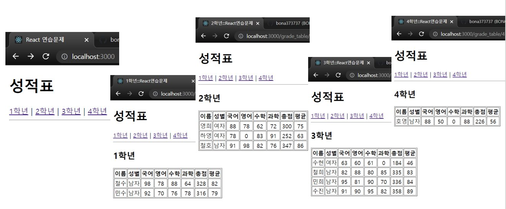

# 연습문제04-1

```
                             Meta.js                                    Meta.js
App.js ----/path:param----> GradeTable.js ----GradeData[param]-----> GradeItem.js
                            (import GradeData )
```



## App.js

```js
import React from "react";
import { Routes, Route } from "react-router-dom";

import Meta from "./components/Meta";
import GradeTable from "./page/GradeTable";

function App() {
  return (
    <div>
      <Meta />

      <h1>성적표</h1>
      <nav>
        <a href="/grade_table/1">1학년</a>&nbsp;|&nbsp;
        <a href="/grade_table/2">2학년</a>&nbsp;|&nbsp;
        <a href="/grade_table/3">3학년</a>&nbsp;|&nbsp;
        <a href="/grade_table/4">4학년</a>
      </nav>
      <hr />

      <Routes>
        <Route path="/grade_table/:grade" element={<GradeTable />} />
      </Routes>
    </div>
  );
}

export default App;
```

## Meta.js

```js
import React from "react";
import { Helmet } from "react-helmet";

const Meta = ({ title }) => {
  return (
    <Helmet>
      <title>{title}</title>
    </Helmet>
  );
};

Meta.defaultProps = {
  title: "React 연습문제",
};

export default Meta;
```

## GradeTable.js

```js
import React from "react";
import { useParams } from "react-router-dom";

import Meta from "../components/Meta";
import GradeItem from "../components/GradeItem";
import GradeData from "../GradeData";

const GradeTable = () => {
  const params = useParams();
  // console.log(params);
  let { grade } = params;
  grade += "학년";
  // console.log(grade);
  // console.log(GradeData[grade]);

  return (
    <div>
      <Meta title={grade + ":::React연습문제"} />
      <h2>{grade}</h2>
      <table border={1}>
        <thead>
          <tr>
            <th>이름</th>
            <th>성별</th>
            <th>국어</th>
            <th>영어</th>
            <th>수학</th>
            <th>과학</th>
            <th>총점</th>
            <th>평균</th>
          </tr>
        </thead>
        <tbody>
          {GradeData[grade].map((item, index) => {
            return (
              <GradeItem
                key={index}
                name={item.이름}
                sex={item.성별}
                kor={item.국어}
                eng={item.영어}
                math={item.수학}
                scinc={item.과학}
              />
            );
          })}
        </tbody>
      </table>
    </div>
  );
};

export default GradeTable;
```

## GradeItem.js

```js
import React from "react";
import PropTypes from "prop-types";

const GradeItem = ({ name, sex, kor, eng, math, scinc }) => {
  const sum = parseInt(kor + eng + math + scinc);
  const avg = parseInt(sum / 4);

  return (
    <tr align="center">
      <td>{name}</td>
      <td>{sex}</td>
      <td>{kor}</td>
      <td>{eng}</td>
      <td>{math}</td>
      <td>{scinc}</td>
      <td>{sum}</td>
      <td>{avg}</td>
    </tr>
  );
};

GradeItem.propTypes = {
  name: PropTypes.string,
  sex: PropTypes.string,
  kor: PropTypes.number,
  eng: PropTypes.number,
  math: PropTypes.number,
  scinc: PropTypes.number,
};

GradeItem.defaultProps = {
  kor: 0,
  eng: 0,
  math: 0,
  scinc: 0,
};
export default GradeItem;
```
