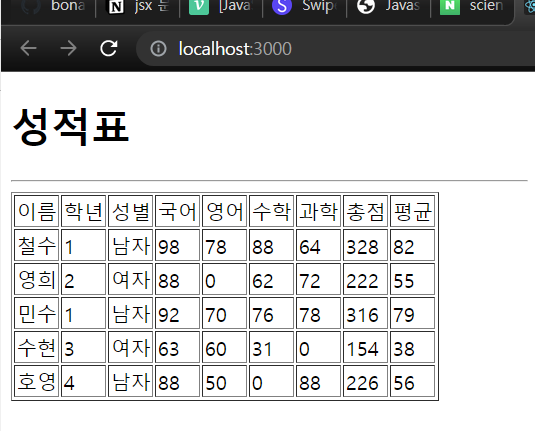

# 연습문제04



## App.js

```js
import React from "react";
import GradeItem from "./components/GradeItem";
import GradeData from "./GradeData";

function App() {
  return (
    <div>
      <h1>성적표</h1>
      <hr />
      <table border="1">
        <thead>
          <tr>
            <td>이름</td>
            <td>학년</td>
            <td>성별</td>
            <td>국어</td>
            <td>영어</td>
            <td>수학</td>
            <td>과학</td>
            <td>총점</td>
            <td>평균</td>
          </tr>
        </thead>
        <tbody>
          {GradeData.map((item, index) => {
            return (
              <GradeItem
                key={index}
                studentName={item.studentName}
                grade={item.grade}
                gender={item.gender}
                kor={item.kor}
                eng={item.eng}
                math={item.math}
                science={item.science}
              />
            );
          })}
        </tbody>
      </table>
    </div>
  );
}
export default App;
```

## GradeItem.js

```js
import React from "react";
import PropTypes from "prop-types";

// const {studentName, grade, gender, kor,eng,math,science} =props;
const GradeItem = ({ studentName, grade, gender, kor, eng, math, science }) => {
  kor = kor == "미응시" ? 0 : kor;
  eng = eng == "미응시" ? 0 : eng;
  math = math == "미응시" ? 0 : math;
  science = science == "미응시" ? 0 : science;

  const sum = kor + eng + math + science;
  const avg = parseInt(sum / 4);

  return (
    <tr>
      <td>{studentName}</td>
      <td>{grade}</td>
      <td>{gender}</td>
      <td>{kor}</td>
      <td>{eng}</td>
      <td>{math}</td>
      <td>{science}</td>
      <td>{sum}</td>
      <td>{avg}</td>
    </tr>
  );
};

GradeItem.propTypes = {
  studentName: PropTypes.string,
  grade: PropTypes.number,
  gender: PropTypes.string,
  kor: PropTypes.number,
  eng: PropTypes.number,
  math: PropTypes.number,
  science: PropTypes.number,
};

export default GradeItem;
```

## GradeData.js

```js
import React from "react";

const GradeData = [
  {
    studentName: "철수",
    grade: 1,
    gender: "남자",
    kor: 98,
    eng: 78,
    math: 88,
    science: 64,
  },
  {
    studentName: "영희",
    grade: 2,
    gender: "여자",
    kor: 88,
    eng: "미응시",
    math: 62,
    science: 72,
  },
  {
    studentName: "민수",
    grade: 1,
    gender: "남자",
    kor: 92,
    eng: 70,
    math: 76,
    science: 78,
  },
  {
    studentName: "수현",
    grade: 3,
    gender: "여자",
    kor: 63,
    eng: 60,
    math: 31,
    science: "미응시",
  },
  {
    studentName: "호영",
    grade: 4,
    gender: "남자",
    kor: 88,
    eng: 50,
    math: "미응시",
    science: 88,
  },
];

export default GradeData;
```
