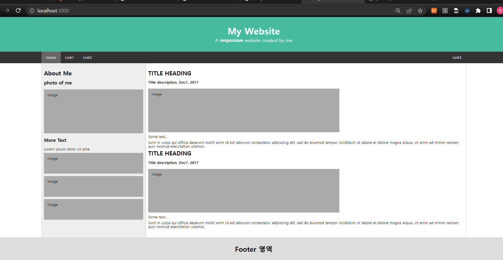

# 연습문제 05



## App.js

```js
import React from "react";

import { Helmet } from "react-helmet";
import "./assets/css/reset.css";
import "./assets/css/comm.css";

import Header from "./components/Header";
import Content from "./page/Content";
import Footer from "./components/Footer";

function App() {
  return (
    <div>
      <Helmet>
        <meta charSet="utf*8" />
        <meta httpEquiv="X-UA-Compatible" content="IE=edge" />
        <title>My Website</title>
        <link rel="preconnect" href="https://fonts.googleapis.com" />
        <link rel="preconnect" href="https://fonts.gstatic.com" crossorigin />
        <link
          href="https://fonts.googleapis.com/css2?family=Gugi&family=Noto+Sans+KR:wght@100;300;400;500&display=swap"
          rel="stylesheet"
        />
        <link rel="stylesheet" href="reset.css" />
        <link rel="stylesheet" href="comm.css" />
      </Helmet>

      <Header />
      <Content />
      <Footer />
    </div>
  );
}

export default App;
```

## Header.js

```js
import React from "react";
import { NavLink } from "react-router-dom";
import styled, { css } from "styled-components";

const HeaderContainer = styled.div`
  width: 100%;
  color: white;

  .header {
    background-color: #1abc9c;
    height: 150px;
    text-align: center;
    display: flex;
    flex-direction: column;
    justify-content: center;

    h1 {
      font-size: 40px;
      font-weight: bold;
      padding-bottom: 10px;
    }

    p {
      font-size: 20px;
    }

    span {
      font-weight: bold;
    }
  }

  .navbar {
    background-color: #333;
    height: 50px;

    .navbar-wrap {
      width: 80%;
      height: 50px;
      margin: auto;
      display: flex;
      justify-content: space-between;
      align-items: center;

      .navlink-wrap {
        width: auto;
        height: 50px;
        display: flex;
      }

      .home {
        background-color: #666;
      }

      .navlink {
        display: block;
        height: 50px;
        line-height: 50px;
        color: white;
        text-decoration: none;
        padding: 0 20px;
        transition: all 0.1s;

        &:hover {
          background-color: #ddd;
          color: black;
        }
      }
    }
  }
`;

const Header = () => {
  return (
    <HeaderContainer>
      <header className="header">
        <h1>My Website</h1>
        <p>
          A <span>responsive</span> website created by me
        </p>
      </header>
      <nav className="navbar">
        <div className="navbar-wrap">
          <div className="navlink-wrap">
            <NavLink className="navlink home" to="#">
              Home
            </NavLink>
            <NavLink className="navlink" to="#">
              Link1
            </NavLink>
            <NavLink className="navlink" to="#">
              Link2
            </NavLink>
          </div>
          <div>
            <NavLink className="navlink" to="#">
              Link3
            </NavLink>
          </div>
        </div>
      </nav>
    </HeaderContainer>
  );
};
export default Header;
```

## Content.js

```js
import React from "react";
import Main from "../components/Main";
import Side from "../components/Side";
import styled, { css } from "styled-components";

const ContentContainer = styled.div`
  width: 80%;
  margin: auto;
  display: flex;
`;

const Content = () => {
  return (
    <ContentContainer>
      <Side />
      <Main />
    </ContentContainer>
  );
};
export default Content;
```

## Content.js - Side.js

```js
import React from "react";
import styled, { css } from "styled-components";

const SideContainer = styled.div`
  width: 500px;
  background-color: #eee;
  border-left: 1px solid #d5d5d5;
  border-right: 1px solid #d5d5d5;
  padding: 30px 10px;

  h1 {
    font-size: 25px;
    font-weight: bold;
    margin-bottom: 10px;
  }

  h3 {
    font-size: 20px;
    font-weight: bold;
    margin: 20px 0px;
  }

  .img-wrap {
    height: 300px;
    display: flex;
    flex-direction: column;
  }

  .fake-img {
    background-color: #aaa;
    width: 400px;
    height: 80px;
    margin-top: 10px;
    padding: 15px;
  }

  .big-img {
    height: 160px;
  }
`;

const Side = () => {
  return (
    <SideContainer>
      <h1>About Me</h1>
      <div>
        <h3>photo of me</h3>
        <div>
          <div className="fake-img big-img">image</div>
        </div>
        <p></p>
      </div>
      <div>
        <h3>More Text</h3>
        <p>Lorem ipsum dolor sit ame.</p>
        <div className="img-wrap">
          <div className="fake-img">image</div>
          <div className="fake-img">image</div>
          <div className="fake-img">image</div>
        </div>
      </div>
    </SideContainer>
  );
};
export default Side;
```

## Content.js - Main.js

```js
import React from "react";
import styled, { css } from "styled-components";

const MainContainer = styled.div`
  border-left: 1px solid #d5d5d5;
  border-right: 1px solid #d5d5d5;
  padding: 30px 10px;

  h1 {
    font-size: 25px;
    font-weight: bold;
    margin-bottom: 20px;
  }
  h3 {
    font-weight: bold;
    margin-bottom: 20px;
  }
  p {
    margin: 10px 0;
  }

  .fake-img {
    background-color: #aaa;
    width: 800px;
    height: 160px;
    margin-top: 10px;
    padding: 15px;
  }
`;

const Main = () => {
  return (
    <MainContainer>
      <article>
        <h1>TITLE HEADING</h1>
        <h3>Title description, Dec7, 2017</h3>
        <div className="fake-img">image</div>
        <p>Some text...</p>
        <p>
          Sunt in culpa qui officia deserunt mollit anim id est laborum
          consectetur adipiscing elit, sed do eiusmod tempor incididunt ut
          labore et dolore magna aliqua. Ut enim ad minim veniam, quis nostrud
          exercitation ullamco.
        </p>
      </article>
      <article>
        <h1>TITLE HEADING</h1>
        <h3>Title description, Dec7, 2017</h3>
        <div className="fake-img">image</div>
        <p>Some text...</p>
        <p>
          Sunt in culpa qui officia deserunt mollit anim id est laborum
          consectetur adipiscing elit, sed do eiusmod tempor incididunt ut
          labore et dolore magna aliqua. Ut enim ad minim veniam, quis nostrud
          exercitation ullamco.
        </p>
      </article>
    </MainContainer>
  );
};
export default Main;
```

## Footer.js

```js
import React from "react";
import styled, { css } from "styled-components";

const FooterContainer = styled.div`
  width: 100%;
  height: 100px;
  background-color: #ddd;
  text-align: center;
  line-height: 100px;
  font-size: 30px;
  font-weight: bold;
`;

const Footer = () => {
  return (
    <FooterContainer>
      <h2>Footer 영역</h2>
    </FooterContainer>
  );
};
export default Footer;
```
