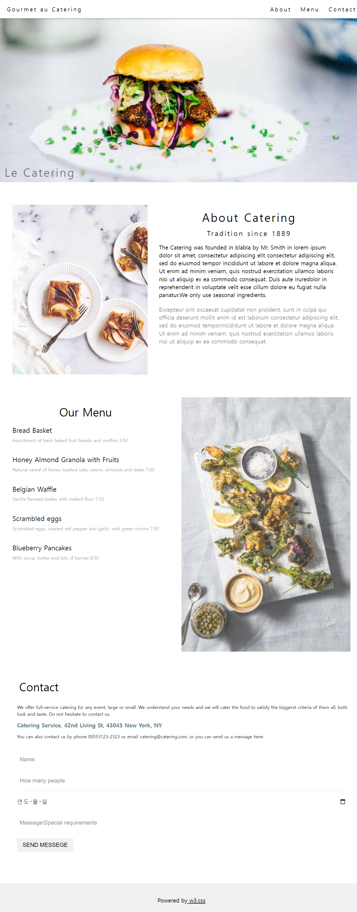
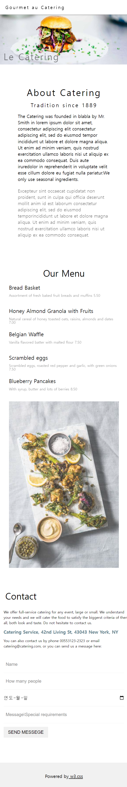

# W3css Gourmet Catering Template_React clone

## 구현결과




```
index.js -GlobalStyles.js
         -Meta.js
         -App.js -Header.js
                 -Main.js -About.js, Menu.js, Contact.js
                 -Footer.js
```

## index.js

```js
import React from "react";
import ReactDOM from "react-dom/client";
import App from "./App";
import { BrowserRouter } from "react-router-dom";
import GlobalStyles from "./GlobalStyles";
import Meta from "./Meta";

const root = ReactDOM.createRoot(document.getElementById("root"));
root.render(
  <React.StrictMode>
    <GlobalStyles />
    <Meta />
    <BrowserRouter>
      <App />
    </BrowserRouter>
  </React.StrictMode>
);
```

## GlobalStyles.js

```js
/**
 * @filename GlobalStyles.js
 * @description 전역으로 적용할 style정의, 기본css reset
 */

/**패키지설치 */
import React from "react";
import { createGlobalStyle } from "styled-components";
// css reset
import "../src/assets/css/reset.css";

const GlobalStyles = createGlobalStyle`
    *{
    }

    :root{
        --font-size-large : 50px;
        --font-size-middle: 30px;
        --font-size-small: 25px;
        --color-gray : #f1f1f1;
        --color-gray-dark:#909090;
    }

`;
export default GlobalStyles;
```

## Meta.js

```js
/**
 * @filename Meta.js
 * @description <head>태그 내의 SEO 처리 및 기본 참조 리소스 명시
 */

/**패키지설치 */
import React from "react";
import { Helmet, HelmetProvider } from "react-helmet-async";

const Meta = (props) => {
  return (
    <HelmetProvider>
      <Helmet>
        <meta charSet="uft-8" />
        <title>{props.title}</title>
        <meta name="keywords" content={props.kewords} />
      </Helmet>
    </HelmetProvider>
  );
};

Meta.defaultProps = {
  title: "Gurmet au Catering",
  keywords: "React",
};

export default Meta;
```

## App.js

```js
import React from "react";

import Header from "./components/Header";
import Footer from "./components/Footer";
import Main from "./page/Main";

function App() {
  return (
    <>
      <Header />
      <Main />
      <Footer />
    </>
  );
}

export default App;
```

## Header.js

```js
import React from "react";
import { NavLink } from "react-router-dom";
import styled from "styled-components";
import headTopImg from "../assets/img/hamburger.jpg";
import GlobalStyles from "../GlobalStyles";

const HeaderContainer = styled.div`
  width: 100%;
  text-decoration: none;

  .navbar {
    width: 100%;
    height: 80px;
    background-color: white;
    box-shadow: 0 1px 8px var(--color-gray-dark);
    padding: 0 10px;
    font-size: 25px;
    display: flex;
    justify-content: space-between;
    align-items: center;
    position: fixed;
    top: 0;
    z-index: 20;

    .navlink {
      text-decoration: none;
      letter-spacing: 5px;
      padding: 0 20px;
      color: black;
      display: block;
      height: 60px;
      line-height: 60px;

      &:hover {
        background-color: var(--color-gray-dark);
      }
    }

    nav {
      display: flex;
      margin-right: 20px;
    }
  }

  .head-img-wrap {
    position: relative;
    margin: auto;

    .head-img {
      display: block;
      margin: auto;
      width: 100%;
      max-width: 2300px;
    }
    span {
      position: absolute;
      left: 20px;
      bottom: 20px;
      font-size: var(--font-size-large);
      letter-spacing: 5px;
      opacity: 0.5;
    }
  }

  @media screen and (max-width: 800px) {
    .navbar nav {
      display: none;
    }
  }
`;

const Header = () => {
  return (
    <HeaderContainer>
      <div className="navbar">
        <NavLink className="navlink" to="#">
          Gourmet au Catering
        </NavLink>
        <nav>
          <NavLink className="navlink" to="#">
            About
          </NavLink>
          <NavLink className="navlink" to="#">
            Menu
          </NavLink>
          <NavLink className="navlink" to="#">
            Contact
          </NavLink>
        </nav>
      </div>
      <div className="head-img-wrap">
        
        <span>Le Catering</span>
      </div>
    </HeaderContainer>
  );
};
export default Header;
```

## Main.js

```js
import React from "react";
import About from "../components/About";
import Menu from "../components/Menu";
import Contact from "../components/Contact";

const Main = () => {
  return (
    <>
      <About />
      <Menu />
      <Contact />
    </>
  );
};
export default Main;
```

## About.js

```js
import React from "react";
import styled from "styled-components";
import aboutImg from "../assets/img/tablesetting2.jpg";

const AboutContainer = styled.div`
  .about-wrap {
    display: flex;
    flex-direction: row;
    justify-content: space-between;
    margin: 100px auto;
    padding: 0 50px;
    max-width: 1500px;

    img {
      width: 50%;
      height: 30%;
      opacity: 0.8;
    }

    .about-desc {
      text-align: center;
      padding: 0 20px;
      h1 {
        font-size: var(--font-size-large);
        margin: 30px 0;
        letter-spacing: 5px;
      }
      h4 {
        font-size: var(--font-size-middle);
        margin: 20px;
        letter-spacing: 5px;
      }
      p {
        text-align: left;
        font-size: var(--font-size-small);
        margin: 30px;
        line-height: 35px;

        &:last-child {
          opacity: 0.5;
        }
      }
    }
  }
  @media screen and (max-width: 800px) {
    .about-wrap {
      flex-direction: column;

      img {
        display: none;
      }
    }
  }
`;

const About = () => {
  return (
    <AboutContainer>
      <div className="about-wrap">
        
        <div className="about-desc">
          <h1>About Catering</h1>
          <h4>Tradition since 1889</h4>
          <p>
            The Catering was founded in blabla by Mr. Smith in lorem ipsum dolor
            sit amet, consectetur adipiscing elit consectetur adipiscing elit,
            sed do eiusmod tempor incididunt ut labore et dolore magna aliqua.
            Ut enim ad minim veniam, quis nostrud exercitation ullamco laboris
            nisi ut aliquip ex ea commodo consequat. Duis aute iruredolor in
            reprehenderit in voluptate velit esse cillum dolore eu fugiat nulla
            pariatur.We only use <span> seasonal </span>ingredients.
          </p>
          <p>
            Excepteur sint occaecat cupidatat non proident, sunt in culpa qui
            officia deserunt mollit anim id est laborum consectetur adipiscing
            elit, sed do eiusmod temporincididunt ut labore et dolore magna
            aliqua. Ut enim ad minim veniam, quis nostrud exercitation ullamco
            laboris nisi ut aliquip ex ea commodo consequat.
          </p>
        </div>
      </div>
    </AboutContainer>
  );
};
export default About;
```

## Menu.js

```js
import React from "react";
import styled from "styled-components";
import menuImg from "../assets/img/tablesetting.jpg";
import GlobalStyles from "../GlobalStyles";

const MenuContainer = styled.div`
  .menu-wrap {
    display: flex;
    flex-direction: row;
    justify-content: space-between;
    margin: 100px auto;
    padding: 0 50px;
    max-width: 1500px;

    img {
      width: 50%;
      opacity: 0.8;
    }

    .menu-list {
      h1 {
        text-align: center;
        font-size: var(--font-size-large);
        margin: 40px;
      }
      ul {
        li {
          margin: 10px 0;
          height: 120px;
          h3 {
            font-size: var(--font-size-middle);
            margin-bottom: 20px;
          }
          p {
            font-size: 20px;
            opacity: 0.5;
          }
        }
      }
    }
  }
  @media screen and (max-width: 800px) {
    .menu-wrap {
      flex-direction: column;

      img {
        margin: auto;
        width: 100%;
      }
    }
  }
`;

const Menu = () => {
  return (
    <MenuContainer>
      <div className="menu-wrap">
        <div className="menu-list">
          <h1>Our Menu</h1>
          <ul>
            <li>
              <h3>Bread Basket</h3>
              <p>Assortment of fresh baked fruit breads and muffins 5.50</p>
            </li>
            <li>
              <h3>Honey Almond Granola with Fruits</h3>
              <p>
                Natural cereal of honey toasted oats, raisins, almonds and dates
                7.00
              </p>
            </li>
            <li>
              <h3>Belgian Waffle</h3>
              <p>Vanilla flavored batter with malted flour 7.50</p>
            </li>
            <li>
              <h3>Scrambled eggs</h3>
              <p>
                Scrambled eggs, roasted red pepper and garlic, with green onions
                7.50
              </p>
            </li>
            <li>
              <h3>Blueberry Pancakes</h3>
              <p>With syrup, butter and lots of berries 8.50</p>
            </li>
          </ul>
        </div>
        
      </div>
    </MenuContainer>
  );
};
export default Menu;
```

## Contact.js

```js
import React from "react";
import styled from "styled-components";
import GlobalStyles from "../GlobalStyles";

const ContactContainer = styled.div`
  .contact-wrap {
    display: flex;
    flex-direction: column;
    margin: 100px auto;
    max-width: 1500px;

    h1 {
      font-size: var(--font-size-large);
      margin: 30px;
    }
    p {
      font-size: 20px;
      line-height: 30px;
      margin: 20px;
      width: 100%;

      &:nth-child(2) {
        color: #607d8b;
        font-weight: bold;
        font-size: var(--font-size-small);
      }
    }

    form {
      display: flex;
      flex-direction: column;
      padding: 20px;

      input {
        border: none;
        border-bottom: 2px solid var(--color-gray);
        font-size: var(--font-size-small);
        height: 90px;

        &::placeholder {
          text-indent: 10px;
          color: var(--color-gray-dark);
        }
      }

      button {
        background-color: var(--color-gray);
        border: none;
        width: 250px;
        height: 60px;
        font-size: var(--font-size-small);
        margin: 20px 0;

        &:hover {
          border: none;
          background-color: var(--color-gray-dark);
        }
      }
    }
  }
`;

const Contact = () => {
  return (
    <ContactContainer>
      <div className="contact-wrap">
        <h1>Contact</h1>
        <div className="contact-text">
          <p>
            We offer full-service catering for any event, large or small. We
            understand your needs and we will cater the food to satisfy the
            biggerst criteria of them all, both look and taste. Do not hesitate
            to contact us.
          </p>
          <p>Catering Service, 42nd Living St, 43043 New York, NY</p>
          <p>
            You can also contact us by phone 00553123-2323 or email
            catering@catering.com, or you can send us a message here:
          </p>
        </div>
        <form>
          <input type="text" placeholder="Name" />
          <input type="number" placeholder="How many people" />
          <input type="date" />
          <input type="text" placeholder="Message\Special requirements" />
          <button>SEND MESSEGE</button>
        </form>
      </div>
    </ContactContainer>
  );
};
export default Contact;
```

## Footer.js

```js
import React from "react";
import styled from "styled-components";
import GlobalStyles from "../GlobalStyles";

const FooterContainer = styled.div`
  width: 100%;
  height: 150px;
  background-color: var(--color-gray);
  text-align: center;

  span {
    line-height: 150px;
    font-size: var(--font-size-small);
  }

  a {
    color: black;
  }
`;

const Footer = () => {
  return (
    <FooterContainer>
      <span>
        Powered by
        <a href="https://www.w3schools.com/w3css/default.asp" target="_blank">
          &nbsp;w3.css
        </a>
      </span>
    </FooterContainer>
  );
};
export default Footer;
```

### 작업소감

이전의 학습내용 전체를 활용하는 클론프로젝트를 수행해보니 그간 학습이 미흡한 부분들을 미뤄두었던 내용들이 꽤 쌓여 있는 것을 몸소 깨달을 수있었습니다.  
이전까지는 pc화면 전체크기에 맞춰서만 작업을 했어서 화면 크기를 줄이거나, 화면을 축소,확대했을때 레이아웃이 깨지는 현상을 계속해서 경험했었습니다.  
이번에 리액트로 진행한 클론프로젝트를 진행함에 앞서 재학습을 통해 컨텐츠들을 크기를 페이지 크기에 맞게 적용되도로 값을 지정하고, 미디어쿼리를 사용하여  
페이지를 반응형으로 만들 수 있게되었습니다.
