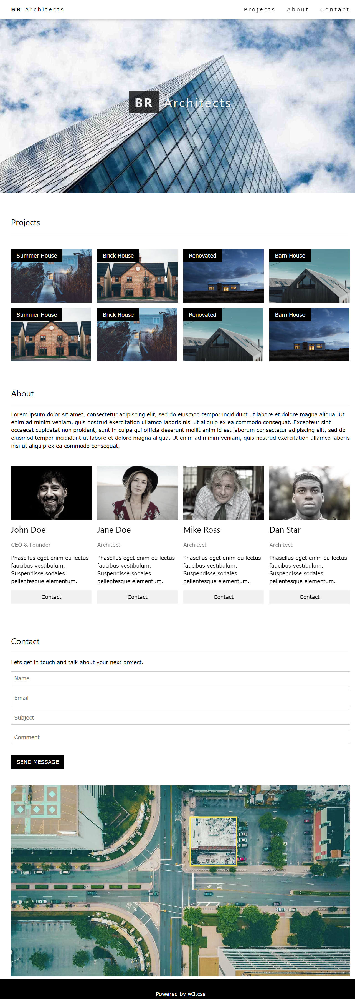
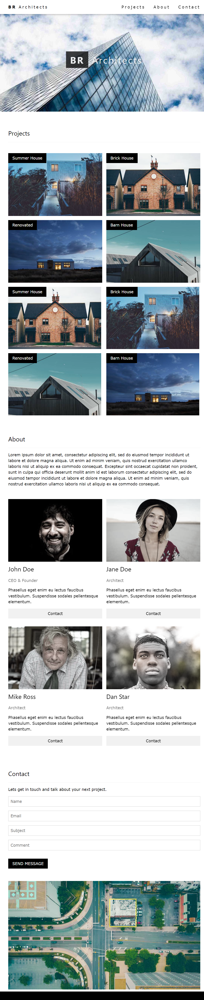

# W3css architects template_react clone

template: https://www.w3schools.com/w3css/tryw3css_templates_architect.htm

## 구현결과





## 문서구조

```
index.js
     -┌ GlobalStyles.js
      ├ Meta.js
      └ App.js -┌ Header.js
                ├ Main.js---import Data.js---┌ Projects.js (props:Data.project)
                └ Footer.js                  ├ About.js (props:Data.about)
                                             └ Contact.js
```

## index.js

```js
import React from "react";
import ReactDOM from "react-dom/client";
import { BrowserRouter } from "react-router-dom";
import GlobalStyles from "./GlobalStyles";
import App from "./App";

const root = ReactDOM.createRoot(document.getElementById("root"));
root.render(
  <React.StrictMode>
    <GlobalStyles />
    <BrowserRouter>
      <App />
    </BrowserRouter>
  </React.StrictMode>
);
```

## Global.js

```js
import React from "react";
import { createGlobalStyle } from "styled-components";

const GlobalStyles = createGlobalStyle`

*{
    padding: 0;
    margin: 0;
}
a{
    text-decoration: none;
    color:black;
}
ul{
    list-style: none;
}
button{
    cursor: pointer;
}
:root{
    --color-gray-light: #f1f1f1;
    --color-gray-dark:#909090;
    
    --font-size-large: 50px;
    --font-size-middle: 30px;
    --font-size-small: 25px;
}
`;
export default GlobalStyles;
```

## Meta.js

```js
import React from "react";
import { Helmet, HelmetProvider } from "react-helmet-async";

const Meta = (props) => {
  return (
    <HelmetProvider>
      <Helmet>
        <meta charSet="utf-8" />
        <title>{props.title}</title>
        <meta name="description" content={props.description} />
        <meta name="keywords" content={props.keywords} />
        <meta name="author" content={props.author} />
        <meta name="or:type" content="website" />
        <meta name="or:title" content={props.title} />
        <meta name="or:description" content={props.description} />
        <meta name="or:url" content={props.url} />
      </Helmet>
    </HelmetProvider>
  );
};

Meta.defaultProps = {
  title: "Arichitects",
  keywords: "w3scc template clone",
  author: "bongbong",
  url: window.location.href,
};
export default Meta;
```

## App.js

```js
import React from "react";

import Header from "./components/Header";
import Main from "./pages/Main";
import Footer from "./components/Footer";

function App() {
  return (
    <>
      <Header />
      <Main />
      <Footer />
    </>
  );
}

export default App;
```

## Header.js

```js
import React from "react";
import styled from "styled-components";
import { NavLink } from "react-router-dom";
import headerImg from "../assets/img/headerImg.jpg";

const HeaderContainer = styled.div`
  width: 100%;

  .navbar {
    width: 100%;
    height: 80px;
    background-color: white;
    display: flex;
    justify-content: space-between;
    align-items: center;
    font-size: var(--font-size-middle);
    letter-spacing: 5px;
    box-shadow: 0 1px 10px var(--color-gray-dark);
    position: fixed;
    top: 0px;
    z-index: 20;

    .logo {
      margin: 0 20px;
      padding: 10px;
      span {
        font-weight: bold;
      }
      &:hover {
        background-color: var(--color-gray-dark);
      }
    }

    .links {
      display: flex;
      justify-content: space-between;

      .navlink {
        display: block;
        padding: 10px;
        margin: 0 20px;
        &:hover {
          background-color: var(--color-gray-dark);
        }
      }
    }
  }

  .header-img {
    position: relative;
    img {
      display: block;
      margin: 0 auto;
      max-width: 2250px;
      width: 100%;
    }
    .img-text {
      position: absolute;
      left: 40%;
      top: 50%;
      letter-spacing: 10px;
      font-size: var(--font-size-large);
      text-align: center;
      color: white;
      span:first-child {
        background-color: black;
        opacity: 0.8;
        padding: 20px 28px;
        margin: 0 10px;
        font-weight: bold;
      }
    }
  }
  @media screen and (max-width: 900px) {
    .navbar .links {
      display: none;
    }
    .img-text {
      .invisible {
        display: none;
      }
    }
  }
`;

const Header = () => {
  return (
    <HeaderContainer>
      <div className="navbar">
        <div className="logo  navlink">
          <span>BR</span> Architects
        </div>
        <div className="links">
          <NavLink className="navlink" to="#">
            Projects
          </NavLink>
          <NavLink className="navlink" to="#">
            About
          </NavLink>
          <NavLink className="navlink" to="#">
            Contact
          </NavLink>
        </div>
      </div>
      <div className="header-img">
        
        <div className="img-text">
          <span>BR</span>
          <span className="invisible">Architects</span>
        </div>
      </div>
    </HeaderContainer>
  );
};
export default Header;
```

## Footer.js

```js
import React from "react";
import styled from "styled-components";
import footerImg from "../assets/img/footerImg.jpg";

const FooterContainer = styled.div`
  width: 100%;

  .footer-img {
    margin: auto;
    box-sizing: border-box;
    img {
      width: 90%;
      max-width: 2100px;
      display: block;
      margin: 10px auto;
    }
  }

  .footer {
    height: 150px;
    background-color: black;
    color: white;
    line-height: 150px;
    text-align: center;
    font-size: var(--font-size-middle);

    a {
      color: white;
      text-decoration: underline;
      &:hover {
        color: green;
      }
    }
  }
`;

const Footer = () => {
  return (
    <FooterContainer>
      <div className="footer-img">
        
      </div>
      <div className="footer">
        Powered by &nbsp;
        <a href="https://www.w3schools.com/w3css/default.asp" target="_balnk">
          w3.css
        </a>
      </div>
    </FooterContainer>
  );
};
export default Footer;
```

## Main.js

```js
import React from "react";

import Projects from "../components/Projects";
import About from "../components/About";
import Contact from "../components/Contact";

import data from "../assets/data";

const Main = () => {
  return (
    <div>
      <Projects items={data.project} />
      <About items={data.about} />
      <Contact />
    </div>
  );
};
export default Main;
```

## Projects.js

```js
import React from "react";
import styled from "styled-components";

const ProjectsContainer = styled.div`
  width: 90%;
  margin: 50px auto;

  h1 {
    font-size: var(--font-size-middle);
    letter-spacing: 5px;
    margin-bottom: 50px;
    padding-bottom: 20px;
    border-bottom: 1px solid var(--color-gray-light);
  }
  .project-wrap {
    display: flex;
    justify-content: space-between;
    flex-wrap: wrap;

    .project-list {
      position: relative;
      width: 23%;
      margin-bottom: 20px;
      img {
        width: 100%;
      }
      .img-title {
        position: absolute;
        top: 0;
        left: 0;
        padding: 10px;
        background-color: black;
        color: white;
        font-size: var(--font-size-small);
      }
    }
  }
  @media screen and (max-width: 900px) {
    .project-wrap .project-list {
      width: 44%;
    }
  }
  @media screen and (max-width: 700px) {
    .project-wrap .project-list {
      width: 90%;
      margin: auto;
      margin-bottom: 20px;
    }
  }
`;

const Projects = ({ items }) => {
  return (
    <ProjectsContainer>
      <h1>Projects</h1>
      <ul className="project-wrap">
        {items.map((v, i) => {
          return (
            <li className="project-list" key={i}>
              
              <div className="img-title">{v.subject}</div>
            </li>
          );
        })}
      </ul>
    </ProjectsContainer>
  );
};
export default Projects;
```

## About.js

```js
import React from "react";
import styled from "styled-components";

const AboutContainer = styled.div`
  width: 90%;
  margin: auto;

  h1 {
    font-size: var(--font-size-middle);
    letter-spacing: 5px;
    padding: 20px 0;
    border-bottom: 1px solid var(--color-gray-light);
  }
  p {
    width: 100%;
    font-size: var(--font-size-small);
    padding: 30px 0;
  }
  .about-content {
    display: flex;
    flex-direction: row;
    flex-wrap: wrap;
    justify-content: space-between;
    margin: 30px 0;

    .about-item {
      width: 23%;
      img {
        width: 100%;
      }
      .member-name {
        font-size: var(--font-size-middle);
        font-weight: bold;
        padding: 15px 0;
      }
      .member-position {
        color: var(--color-gray-dark);
        padding: 15px 0;
      }
      .member-desc {
        line-height: 30px;
      }
      button {
        width: 100%;
        padding: 15px 0;
        font-size: var(--font-size-small);
        border: none;
        &:hover {
          background-color: var(--color-gray-dark);
        }
      }
    }
  }
  @media screen and (max-width: 1000px) {
    .about-content .about-item {
      width: 44%;
      margin-bottom: 30px;
    }
  }
  @media screen and (max-width: 700px) {
    .about-content .about-item {
      width: 90%;
      margin: auto;
      margin-bottom: 30px;
    }
  }
`;

const About = ({ items }) => {
  return (
    <AboutContainer>
      <h1>About</h1>
      <p>{items.content}</p>
      <ul className="about-content">
        {items.member.map((v, i) => {
          return (
            <li className="about-item" key={i}>
              
              <p className="member-name">{v.name}</p>
              <p className="member-position">{v.position}</p>
              <p className="member-desc">{v.desc}</p>
              <button>Contact</button>
            </li>
          );
        })}
      </ul>
    </AboutContainer>
  );
};
export default About;
```

## Contact.js

```js
import React from "react";
import styled from "styled-components";

const ContactContainer = styled.div`
  width: 90%;
  margin: 50px auto;

  h1 {
    font-size: var(--font-size-middle);
    margin-bottom: 20px;
    padding-bottom: 20px;
    border-bottom: 1px solid var(--color-gray-light);
  }
  p {
    font-size: var(--font-size-small);
    margin: 20px 0;
  }

  .contact-form {
    display: flex;
    flex-direction: column;

    input {
      margin-bottom: 30px;
      height: 50px;
      font-size: var(--font-size-small);
      border: 1px solid var(--color-gray-light);
      &::placeholder {
        text-indent: 10px;
      }
    }
    button {
      border: none;
      padding: 10px 0;
      width: 250px;
      background-color: black;
      color: white;
      font-size: var(--font-size-small);
      &:hover {
        background-color: var(--color-gray-dark);
        color: black;
      }
    }
  }
`;

const Contact = () => {
  return (
    <ContactContainer>
      <h1>Contact</h1>
      <p>Lets get in touch and talk about your next project.</p>
      <form className="contact-form">
        <input type="text" placeholder="Name" />
        <input type="text" placeholder="Email" />
        <input type="text" placeholder="Subject" />
        <input type="text" placeholder="Comment" />
        <button>SEND MESSAGE</button>
      </form>
    </ContactContainer>
  );
};
export default Contact;
```

## 소감

처음에 미디어쿼리만 따로 모아서 코드를 작성하려고 GlobalStyles.js에서 코드를 입력하였더니  
적용이 되지 않아 각각의 컴포넌트에서 미디어쿼리 코드를 작성하였습니다.  
작은 단위로 나누어 생각할 수 있어서 클론과제 진행이 좀더 수월해 졌지만,  
아직 컴포넌트단위로 나뉘어진 코드들을 활용하는것에 대한 이해와 학습이 좀더 필요하다고 생각했습니다.
