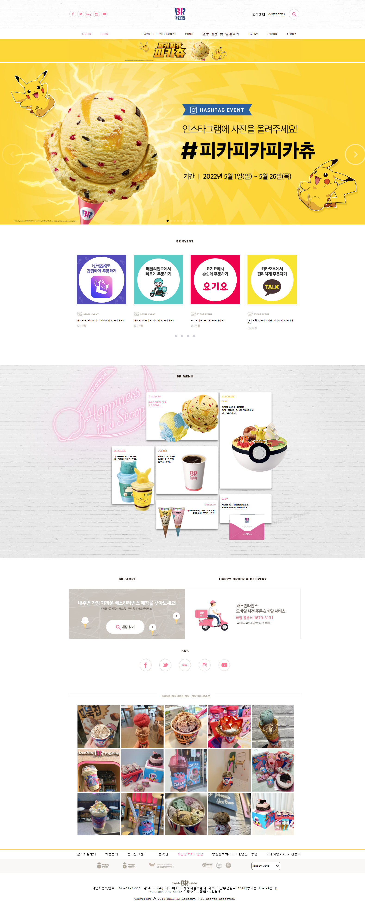

# 배스킨라빈스 사이트 클론작업
- http://www.baskinrobbins.co.kr/   

## 구현결과


## 프로젝트 구조
```
index.js - GlobalStyles.js
         - Meta.js
         - App.js - Header.js
                  - Main.js
                  - Footer.js
```
```
Header.js - SearchMenu.js
          - SubMenue.js
```
```
Main.js - TopImg.js
        - MySwiper.js (ajax통신활용)
        - BrEvent.js
        - BrMenu.js
        - BrStore.js (ajax통신활용)
        - BrInstagram.js (ajax통신활용)
```

## backend data
```json
{
  "sliderImg":[
    "slider1.jpg","slider2.png","slider3.png","slider4.png","slider5.png","slider6.png","slider7.png","slider8.png","slider9.png","slider10.png","slider11.png"
  ],
 "brEvent":[
   {
     "img":"banner_delivery.png",
     "category":"stit_store.gif",
     "desc":"해피오더 딜리버리로 간편하게 주문하세요!",
     "period":"상시진행"
   },
   {
     "img":"banner_delivery_bm.png",
     "category":"stit_store.gif",
     "desc":"배달의 민족에서 빠르게 주문하세요!",
     "period":"상시진행"
   },
   {
     "img":"banner_delivery_ygy.png",
     "category":"stit_store.gif",
     "desc":"요기요에서 손쉽게 주문하세요!",
     "period":"상시진행"
   },
   {
     "img":"banner_delivery_kakao.png",
     "category":"stit_store.gif",
     "desc":"카카오톡 주문하기에서 편리하게 주문하세요!",
     "period":"상시진행"
   },
   {
     "img":"1670146074.png",
     "category":"stit_online.gif",
     "desc":"기아 멤버스 최대 50%제휴 혜택!",
     "period":"상시진행"
   },
   {
     "img":"1667538956.png",
     "category":"stit_online.gif",
     "desc":"2022 베스킨라빈스 특별한 제휴혜택!",
     "period":"상시진행"
   },
   {
     "img":"1659436130.png",
     "category":"stit_store.gif",
     "desc":"고소한 오트밀크와 깔끔한 콜드브루의 만남, 콜드브루 오트라떼 출시!",
     "period":"상시진행"
   },
   {
     "img":"1643869329.png",
     "category":"stit_store.gif",
     "desc":"KT멤버십 고객이라면 누구나 파인트30% 할인!",
     "period":"상시진행"
   },
   {
     "img":"1667382917.png",
     "category":"stit_store.gif",
     "desc":"현대카드 M포인트 50% 사용",
     "period":"상시진행"
   },
   {
     "img":"1639297260.png",
     "category":"stit_store.gif",
     "desc":"제휴 할인카드 혜택 안내",
     "period":"상시진행"
   },
   {
     "img":"1570702843.png",
     "category":"stit_online.gif",
     "desc":"2018한글날 기념 무료 글꼴 공개! 베스킨라빈스체",
     "period":"상시진행"
   },
   {
     "img":"1578277305.png",
     "category":"stit_store.gif",
     "desc":"1회용 컵 사용 줄이기 안내",
     "period":"상시진행"
   },
   {
     "img":"banner_praise_2022-1.png",
     "category":"stit_store.gif",
     "desc":"2022년 1분기 고객 Best칭찬점포 안내",
     "period":"상시진행"
   }
 ],
 "instgram":[
    "https://cdn.attractt.com/contents/2021/08/04/229973875_305153981400613_2223996587754436928_n.jpg",
    "https://cdn.attractt.com/contents/2021/08/04/229406351_2187020871440326_8733502732645542656_n.jpg",
    "https://cdn.attractt.com/contents/2021/08/03/227876094_352508759597582_6579421695504754782_n.jpg",
    "https://cdn.attractt.com/contents/2021/04/26/CbjyopiLZXR_carousel_01.jpg",
    "https://cdn.attractt.com/contents/2021/04/26/CabS6jOLLcY_image.jpg",
    "https://cdn.attractt.com/contents/2021/04/26/Cal8BBKFq1m_carousel_01.jpg",
    "https://cdn.attractt.com/contents/2021/04/26/Capx4LMh2qR_carousel_01.jpg",
    "https://cdn.attractt.com/contents/2021/04/26/Ca7CriEp60y_image.jpg",
    "https://cdn.attractt.com/contents/2021/04/26/CajyHTwBUNh_image.jpg",
    "https://cdn.attractt.com/contents/2021/04/26/CawCkFnljuR_carousel_01.jpg",
    "https://cdn.attractt.com/contents/2021/04/26/CbIiJOZhE3s_image.jpg",
    "https://cdn.attractt.com/contents/2021/04/26/CbSZp4EJn3S_image.jpg",
    "https://cdn.attractt.com/contents/2021/04/26/CbSJXt8lUwZ_carousel_01.jpg",
    "https://cdn.attractt.com/contents/2021/04/26/Ca16fydPnGS_image.jpg",
    "https://cdn.attractt.com/contents/2021/04/26/Ca0hML6BQPk_carousel_01.jpg",
    "https://cdn.attractt.com/contents/2021/04/26/Ca4eFeNvZiu_carousel_01.jpg",
    "https://cdn.attractt.com/contents/2021/04/26/Ca4sSPFLZsy_carousel_01.jpg",
    "https://cdn.attractt.com/contents/2021/04/26/CbFU239BUgf_image.jpg",
    "https://cdn.attractt.com/contents/2021/04/26/CbXIOYoPFHe_carousel_01.jpg",
    "https://cdn.attractt.com/contents/2021/04/26/CbPwCoEpHF0_carousel_01.jpg",
    "https://cdn.attractt.com/contents/2021/04/26/CXNnnS8veor_carousel_01.jpg",
    "https://cdn.attractt.com/contents/2021/04/26/CXOYfPxprz3_carousel_01.jpg",
    "https://cdn.attractt.com/contents/2021/04/26/CXVPBfgvekD_image.jpg",
    "https://cdn.attractt.com/contents/2021/04/26/CXY5OiRP0u-_carousel_01.jpg",
    "https://cdn.attractt.com/contents/2021/04/26/CVwvGEaBbzR_carousel_01.jpg",
 ]
}
```
## Header.js
```js
import React from 'react';
import styled from 'styled-components';
import {Link, Routes, Route} from 'react-router-dom';
import SearchMenu from './SearchMenu';
import SubMenu from './SubMenu';

const HeaderContainer = styled.div`
  width: 100%;

    .header-top {
      //public폴더 안의 img파일 절대경로로 지정
      background: url("img/bg_header.gif");
      .content-wrap{
        width: 1200px;
        height: 150px;
        display: flex;
        justify-content: space-between;
        align-items: center;
        margin: auto;

        .icon-wrap{
          width: 200px;
          display: flex;
          justify-content: space-between;
        }
        
        .contact-wrap {
          width: 250px;
          display: flex;
          justify-content: space-between;
          align-items: center;
        }
      }//content-wrap
    } //header-top
    nav {
      border-top: 1px solid black;
      border-bottom: 2px solid black;
      .content-wrap{
        width: 1200px;
        display: flex;
        justify-content: space-between;
        margin: auto;
        .member {
          display: flex;
          justify-content: space-around;
          a{
            color: #3C2821;
            opacity: 0.8;
            font-weight: bold;
            padding: 25px;
            &:first-child {
              color: #FF7C98;
            }
          }
        }
        .gnb {
          display: flex;
          justify-content: space-around;
          a{
            color: #3C2821;
            font-weight: bold;
            padding: 25px;
          }
        }
      }//content-wrap
    } //nav
`;

const Header = () => {
  const [ searchToggle, setSearchToggle]=React.useState(false);
  const [ navHover, setNavHover] = React.useState(false);
  

  const onClickSearch =()=> {
    // searchToggle===false? setSearchToggle(searchToggle=>true) : setSearchToggle(searchToggle=>false)
    setSearchToggle(searchToggle=>!searchToggle);
  }

  const onMouseNav=()=>{
    setNavHover(navHover=>true);
  }
  const onMouseOutNav=()=>{
    setNavHover(navHover=>false);
  }

  return (
    <>
      <HeaderContainer>
        <section className="header-top">
          <div className="content-wrap">
            <div className="icon-wrap">
              <Link to="">
                
              </Link>
              <Link to="">
                
              </Link>
              
              <Link to="">
                
              </Link>
              <Link to="">
                
              </Link>
            </div>
            <div className="logo">
              <Link to="">
                
              </Link>
            </div>
            <div className="contact-wrap">
              <Link to="">고객센터</Link>
              <Link to="">CONTACTUS</Link>
              <button onClick={onClickSearch}>
                
              </button>
            </div>
          </div>
        </section>
        <nav>
          <div className="content-wrap">
            <ul className="member">
              <li>
                <Link to="">LOGIN</Link>
              </li>
              <li>
                <Link to="">JOIN</Link>
              </li>
            </ul>
            <div onMouseOver={onMouseNav} onMouseOut={onMouseOutNav}>
              <ul className="gnb">
                <li>
                  <Link to="">FAVOR OF THE MONTH</Link>
                </li>
                <li>
                  <Link to="">MENU</Link>
                </li>
                <li>
                  <Link to="">영양 성분 및 알레르기</Link>
                </li>
                <li>
                  <Link to="">EVENT</Link>
                </li>
                <li>
                  <Link to="">STORE</Link>
                </li>
                <li>
                  <Link to="">ABOUT</Link>
                </li>
              </ul>
              {/* {navHover === true ? <SubMenu /> : ""} */}
              {navHover && <SubMenu /> }
            </div>
          </div>
        </nav>
      </HeaderContainer>
      {/* {searchToggle === true ? <SearchMenu /> : ""} */}
      {searchToggle && <SearchMenu />}
    </>
  );
};
export default Header;
```
## SearchMenu.js
```js
import React from 'react';
import styled from 'styled-components';

const SearchMenuContainer=styled.div`
  background-color: #0003;
  width: 100%;
  height: 100%;
  position: absolute;
  z-index: 9999;
 
 .content-wrap{
   width: 100%;
    height: 400px;
    background-color: white;

    
    table{
    width: 1200px;
    margin: auto;

    th{
      height: 100px;
    }
    
    td{
      width: 600px;
      vertical-align: top;
    }
    .favtag span{
      color: #FF7C98;
    }
    input{
      background-color: #EFEFEF;
      border: none;
    }
    select{
      border: 1px solid #EFEFEF;
    }
    button{
      width: 150px;
      height: 40px;
      color: white;
      background-color: #FF7C98;
      border-radius: 20px;
      margin: auto;
    }
  }
}
  
`;

const SearchMenu = () => {
  return (
    <SearchMenuContainer>
      <div className="content-wrap">
      <table>
        <tbody>
        <tr>
          <td>
            <h6>제품명</h6>
            <form>
            <select name="" id="">
              <option value="">전체</option>
              <option value="">아이스크림</option>
              <option value="">아이스크림케이크</option>
              <option value="">음료</option>
              <option value="">커피</option>
              <option value="">디저트</option>
              <option value="">block pack</option>
              <option value="">ready pack</option>
            </select>
            <input type="text" />
            </form>
          </td>
          <td className='hashtag'>
            <h6>해시태그</h6>
            <div>
            <input type="text" />
            <div className="favtag">
            <p>자주찾는 해시태그</p>
            <span>#피카피카피카츄</span>
            <span>#피카츄초코바나나블라스트</span>
            <span>#쿨쿨잠만보밀키소다블라스트</span>
            <span>#고라파덕아이스크림콘</span>
            <span>#푸린아이스크림콘</span>
            <span>#포켓몬스터</span>
          </div>
            </div>
          </td>
        </tr>
        <tr>
          <td colSpan={2}>
            <h6>알레르기 성분</h6>
            <form>
            <input type="checkbox" name="" id="" />계란
            <input type="checkbox" name="" id="" />대두
            <input type="checkbox" name="" id="" />돼지고기
            <input type="checkbox" name="" id="" />땅콩
            <input type="checkbox" name="" id="" />밀
            <input type="checkbox" name="" id="" />복숭아
            <input type="checkbox" name="" id="" />우유
            <input type="checkbox" name="" id="" />없음
            </form>
          </td>
        </tr>
        </tbody>
      <button> 검색 </button>
      </table>
      </div>
    </SearchMenuContainer>
  );
};

export default SearchMenu;
```
## subMenu.js
```js
import React from 'react';
import styled  from 'styled-components';
import { Link } from 'react-router-dom';

const SubMenuContainer = styled.div`
  width: 100%;
  height: 300px;
  background-color: white;
  position: absolute;
  left: 0;
  z-index: 9999;
  display: flex;
  flex-direction: row;
  justify-content: space-between;

  .content-wrap{
    width: 1200px;
    margin: auto;

    .app-event{
      padding: 50px 0;
    }
    
    .menu-list{
      display: flex;
      justify-content: space-between;

      li{
        line-height: 40px;
        text-align: center;

        a{
          color: #CABCAA;
        &:hover{
          color: #FF7C98;
        }
        }
      }
    }
  }

`;

const SubMenu = () => {
  return (
    <SubMenuContainer>
      <div className="content-wrap">
      <div className="app-event">
        
      </div>
      <div className="icaream">
        
      </div>
      <div className="menu-list">
        <ul>
          <li><Link to=''>아이스크림</Link></li>
          <li><Link to=''>아이스크림케이크</Link></li>
          <li><Link to=''>음료</Link></li>
          <li><Link to=''>커피</Link></li>
          <li><Link to=''>디저트</Link></li>
        </ul>
        <ul>
          <li><Link to=''>아이스크림</Link></li>
          <li><Link to=''>음료</Link></li>
          <li><Link to=''>커피</Link></li>
        </ul>
        <ul>
          <li><Link to=''>진행중이이벤트</Link></li>
          <li><Link to=''>당첨자발표</Link></li>
        </ul>
        <ul>
          <li><Link to=''>매장찾기</Link></li>
          <li><Link to=''>고객센터</Link></li>
          <li><Link to=''>단체주문</Link></li>
        </ul>
        <ul>
          <li><Link to=''>공지사항</Link></li>
          <li><Link to=''>보도자료</Link></li>
          <li><Link to=''>채용정보</Link></li>
          <li><Link to=''>점포개설문의</Link></li>
          <li><Link to=''>CONTACT US</Link></li>
        </ul>
      </div>
      </div>
    </SubMenuContainer>
  );
};

export default SubMenu;
```

## MySwiper.js
- swiperjs 라이브러리 사용
- swiper이미지파일명 ajax통신으로 전달 
```js
/**
 * @filename Swiper.js
 * @description Swiperjs 라이브러리를 사용한 img swiper구현
 */

 import React from "react";
 import { Swiper, SwiperSlide } from "swiper/react";
 import styled from 'styled-components';
 
 // Import Swiper styles
 import "swiper/css";
 import "swiper/css/navigation";
 import "swiper/css/pagination";
 
 // import required modules
 import { Navigation, Pagination, Mousewheel, Keyboard } from "swiper";
import axios from "axios";
 
  const SwiperContainer = styled.div`
    width: 100%;
    .swiper {
      width: 100%;
      height: 100%;
    }
    .swiper-slide {
      text-align: center;
      font-size: 18px;
      background: tomato;

      /* Center slide text vertically */
      display: -webkit-box;
      display: -ms-flexbox;
      display: -webkit-flex;
      display: flex;
      -webkit-box-pack: center;
      -ms-flex-pack: center;
      -webkit-justify-content: center;
      justify-content: center;
      -webkit-box-align: center;
      -ms-flex-align: center;
      -webkit-align-items: center;
      align-items: center;
    }
    .swiper-slide img {
      display: block;
      width: 100%;
      height: 100%;
      object-fit: cover;
    }
    .swiper-button-next{
      background: url("/img/btn_banner_next.png") no-repeat;
      background-position:auto 50%;
      width: 120px;
      height: 120px;
      margin: 0;
    }
    .swiper-button-prev{
      background: url("/img/btn_banner_prev.png") no-repeat;
      background-position: auto 50%;
      width: 120px;
      height: 120px;
      margin: 0;
    }
    .swiper-button-next::after,
    .swiper-button-prev::after{
      display: none;
    }
    .swiper-pagination-bullet{
      width: 10px;
      height: 10px;
      background-color: white;
    }
      .swiper-pagination-bullet-active{
      background-color: black;
    }
  `;

 const MySwiper=()=>{
   const [ swiper, setSwiper] = React.useState([]);

   React.useEffect(()=>{
     (async()=>{
       let json = null;
      try {
        const response = await axios.get(' http://localhost:3001/sliderImg');
        // console.log(response);
        json=response.data;
      } catch (e) {
        console.error(e);
        alert('ajax 통신 실패');
      }
      if(json != null){
        setSwiper(swiper=>json);
      }
    })();
  },[])

    return (
      <SwiperContainer>
      <Swiper
        cssMode={true}
        navigation={true}
        pagination={{clickable:true,}}
        mousewheel={true}
        keyboard={true}
        modules={[Navigation, Pagination, Mousewheel, Keyboard]}
        className="MySwiper"
      >
        {
            swiper.map((v,i)=>{
              return(
                <SwiperSlide key={i}></SwiperSlide>
                )
              })
        }
      </Swiper>
    </SwiperContainer>
  );
 }
 export default MySwiper;
```
## BrEvent.js
- ajax통신으로 event 데이터전달
- 각 페이지별 데이터4개씩 출력되도록 처리
```js
import React from 'react';
import styled from 'styled-components';
import {Link} from 'react-router-dom'; 
import axios from 'axios';

const StyledBrEvent=styled.div`
  width: 100%;
  padding: 50px 0;
  text-align: center;
  .content-wrap{
    width: 1200px;
    height: 600px;
    margin: auto;

    div:first-child{
      margin: 30px 0;
    }
    .event-list{
      display: flex;
      text-align: left;
      justify-content: space-between;
      li{
        padding-right: 20px;
        width: 255px;

        .event-img{
          object-fit: cover;
          img{
            width: 100%;
          }
        }
        .event-desc{
          padding-top: 5px;
          font-size: 12px;

          p:nth-child(3){
            color: #C9C3BB;
          }
        }
      }
    }
    .page{
      display: flex;
      justify-content: center;

      button{
        margin:0 10px;
        width: 8px;
        height: 10px;
        border-radius: 50%;
        background-color: #CDCCD5;

        &.active{
          background-color: black;
        }
      }
    }
  }
`;

const BrEvent = () => {
  const [brEventContent, setBrEventContent] = React.useState([]);
  const [brEventPage, setBrEventPage] = React.useState([]);
  const [brEventIndex, setBrEventIndex] = React.useState(0);

//마운트되는 시점에 event 데이터를 ajax통신으로 가져오고 그중 4개 데이터만 화면에 그려준다.
  React.useEffect(()=>{
    (async()=>{
      let json=null;
      
      try {
        const response = await axios.get('http://localhost:3001/brEvent');
        json=response.data;
        // console.log(json);
        // setBrEventContent(brEventContent=>response.data);
        // console.log(brEventContent);
      } catch (e) {
        console.error(e);
        alert('ajax 연동 실패');
      }
      
      if(json != null){
        setBrEventContent(brEventContent=>json);
        setBrEventPage(brEventPage=>json.slice(0,4));
        // console.log(brEventContent)
      }
    })();
  },[])

//페이지 버튼을 누르면 해당 페이지에서 보여줄 data의 시작 index번호를 설정
  const onBrEventPage=React.useCallback( e=>{
    console.log(e);
    const {page} = e.target.dataset;
    setBrEventIndex(brEventIndex=>page);
    // console.log(page);
  });

//페이지번호 클릭할때 brEventIndex값이 변경될때마다 원본데이터에서 특정 index범위의 데이터 4개만 화면에 다시 그려주기
  React.useEffect(()=>{
    setBrEventPage(brEventPage=> brEventContent.slice(brEventIndex,parseInt(brEventIndex)+4));
  },[brEventIndex])


  return (
    <StyledBrEvent>
      <div className="content-wrap">
        <div></div>
        <ul className='event-list'>
          {/* 마운팅됬을때 index 1번부터 4번까지의 데이터를 화면에 보여주고,,,page이동시... */}
          {
            brEventPage.map((v,i)=>{
              return(
                <li key={i}><Link to=''>
                <div className="event-img">
                  
                </div>
                <div className="event-desc">
                
                <p>{v.desc}</p>
                <p>{v.period}</p>
                </div>
                </Link></li> 
              )
            })
          }
        </ul>
        <div className="page">
          <button data-page={0} onClick={onBrEventPage}></button>
          <button data-page={4} onClick={onBrEventPage}></button>
          <button data-page={8} onClick={onBrEventPage}></button>
          <button data-page={12} onClick={onBrEventPage}></button>
        </div>
      </div>
    </StyledBrEvent>
  );
};

export default BrEvent;
```
## BrMenu.js
```js
import React from 'react';
import styled from 'styled-components';

const MenuContainer = styled.div`
  background: url('/img/bg_menu.jpg');
  background-position: 40% 60%;
  height:1000px;
  

  .content-wrap{
    width: 1200px;
    margin: auto;
    text-align: center;
    .menu-head{
        padding: 50px 0;
    }
    .menu-board{
      position: relative;
      text-align: left;
      h5{
        line-height: 3px;
      }
      h6{
        line-height: 15px;
        margin: 0;
      }
      
      .board{
        background-color: white;
        box-shadow: 0px 5px 9px gray;
        border-radius: 4px;
        padding: 0 10px;
      }

      .icecream{
        position: absolute;
        top: 20px;
        left: 400px;
        width: 350px;
        height: 250px;
        .text{
          position: relative;
          color: #FF97C0;
          img{
            position: absolute;
            width: 200px;
          }
          .img1{
            left: 30px;
            transform: rotate(-45deg);
          }
          .img2{
            left: 150px;
            top: -40px;
            transform: rotate(35deg);
            width: 250px;
            
          }
        }
      }
      .icecream-cake{
        position: absolute;
        top: 20px;
        left: 780px;
        width: 250px;
        height: 500px;
        .text{
          position: relative;
          h5{
            color: #FEC62A;
          }
          img{
            position: absolute;
            top: 60px;
          }
        }
      }
      .beverage{
        position: absolute;
        top: 300px;
        left: 220px;
        width: 200px;
        height: 300px;
        h5{
          color: #FF9DA8;
        }
        img{
          width: 300px;
        }
        .img1{
          position: absolute;
          left: -60px;
          top: 35px;
          
        }
        .img2{
          position: absolute;
        }
      }
      .coffee{
        position: absolute;
        top: 300px;
        left: 450px;
        width: 300px;
        height: 250px;
        h5{
          color: #BB7B4C;
        }
        img{
            position: absolute;
            top: 0px;
            left: 60px;
            height: 270px;
          }
      }
      .gift{
        position: absolute;
        top: 550px;
        left: 780px;
        width: 250px;
        height: 150px;
        .text{
          position: relative;
          h5{
            color: #EA74A8;
          }
          img{
            position: absolute;
            left: 40px;
            top: 80px;
          }
        }
      }
      .dessert{
        position: absolute;
        top: 580px;
        left: 450px;
        width: 300px;
        height: 150px;
        .text{
          text-align: right;
          position: relative;
          h5{
            color: #F48BA2;
          }
          img{
            width:200px;
          }
          .img1{
            position: absolute;
            left: 50px;
            top:-10px;
            left: -60px;
          }
          .img2{
            position: absolute;
            top: -10px;
            left: 5px;
          }
        }
      }
    }
  }
`;

const BrMenu = () => {
  return (
    <MenuContainer>
      <div className="content-wrap">
        <div className='menu-head'>
          
        </div>
        <div className="menu-board">
          <div className="icecream board">
            <div className="text">
              <h5>ICECREAM</h5>
              <h6>아이스크림의 기준</h6>
              <h6>배스킨라빈스</h6>
              
              
            </div>
          </div>
          <div className="icecream-cake board">
            <div className="text">
              <h5>ICECREAM</h5>
              <h5>CAKE</h5>
              <h6>아이와 어른이 좋아하는</h6>
              <h6>아이스크림을 하나의 케이크에서</h6>
              <h6>모두 즐기세요!</h6>
              
            </div>
          </div>
          <div className="beverage board">
            <div className="text">
              <h5>BEVERAGE</h5>
              <h6>아이스크림으로 즐기는</h6>
              <h6>배스킨라빈스만의 음료!</h6>
              
              
            </div>
          </div>
          <div className="coffee board">
            <div className="text">
              <h5>COFFEE</h5>
              <h6>배스킨라빈스만의</h6>
              <h6>부드러운 촉감과</h6>
              <h6>달콤한 풍미!</h6>
              
            </div>
          </div>
          <div className="gift board">
            <div className="text">
              <h5>GIFT</h5>
              <h6>특별한 날, 배스킨라빈스로</h6>
              <h6>달콤한 선물을 전해보세요!</h6>
              
            </div>
          </div>
          <div className="dessert board">
            <div className="text">
              <h5>DESSERT</h5>
              <h6>아이스크림을 더욱 재미있게!</h6>
              <h6>간편하게 즐기는 방법!</h6>
              
              
            </div>
          </div>
        </div>
      </div>
    </MenuContainer>
  );
};

export default BrMenu;
```
## BrStore.js
```js
import React from 'react';
import { Link } from 'react-router-dom';
import styled from 'styled-components';

const BrStoreContainer = styled.div`
  width: 100%;
  padding: 80px 0;
  .content-wrap{
    width: 1200px;
    margin: auto;

    .storeAndOrder{
      display: flex;
      text-align: center;
      .store{
        img{
          margin: 20px 0;
        }
      }
      .order{
        img{
          margin: 20px 0;
        }
      }
    }
    .sns{
      text-align: center;
      margin: 30px 0;

      div:first-child{
        margin: 30px 0;
      }

      a{
        padding: 0 20px;
      }
    }
  }
`;

const BrStore = () => {
  return (
    <BrStoreContainer>
      <div className="content-wrap">
        <div className="storeAndOrder">
          <div className="store">
            
            <Link to=''></Link>
          </div>
          <div className="order">
          
          <Link to=''></Link>
          </div>
        </div>
        <div className="sns">
          <div></div>
          <Link to=''></Link>
          <Link to=''></Link>
          <Link to=''></Link>
          <Link to=''></Link>
          <Link to=''></Link>
        </div>
      </div>
      
    </BrStoreContainer>
  );
};

export default BrStore;
```
## BrInstagram.js
```js
import axios from 'axios';
import React from 'react';
import { Link } from 'react-router-dom';
import styled from 'styled-components';

const BrInstagram=styled.div`
  width: 100%;
  .content-wrap{
    width: 1200px;
    height: 800px;
    margin: auto;
    position: relative;
    hr{
      color: #C2BCB3;
      opacity: 0.5;
    }
    .section-name{
      position: absolute;
      top: 0;
      left: 38%;
    }
    .instagram-img{
      margin: 50px 0;
      display: flex;
      flex-wrap: wrap;

      li{
        width: 220px;
        height: 220px;
        overflow: hidden;
        margin: 3px;

        img{
          width: 100%;
          height: 100%;
          object-fit: cover;
        }
      }
    }
  }
`;

const BrInstgram = () => {
  const [instagram, setInstagram] = React.useState([]);

  React.useEffect(()=>{
    (async()=>{
      let json=null;
      try {
        const response = await axios.get('http://localhost:3001/instgram');
        json=response.data;
        setInstagram(instagram=>json.slice(0,15));
      } catch (e) {
        console.log(e);
        alert('ajax통신 실패')
      }
    })();
  },[])

  return (
    <BrInstagram>
    <div className="content-wrap">
      <hr />
      
      <ul className="instagram-img">
        {
          instagram.map((v,i)=>{
            return(
              <li><Link to=''></Link></li>
            )
          })
        }
      </ul>

    </div>
    </BrInstagram>
  );
};
export default BrInstgram;
```
## Footer.js
```js
import React from 'react';
import styled from 'styled-components';
import {Link} from 'react-router-dom';

const FooterContainer= styled.div`
  width: 100%;
  border-top: 1px solid #FEAF2A;
  .content-wrap{
    width: 1200px;
    margin: auto;
    text-align: center;

    .footer-links{
      display: flex;
      justify-content: space-between;
      align-items: center;

      li:nth-child(5) a{
        color: #FF7C98;
      }
    }
  }

  .site-wrap{
    width: 100%;
    background-color: #F9F8F7;
    .site{
      width: 1200px;
      margin: auto;
      display: flex;
      justify-content: space-evenly;
      align-items: center;
       ul{
        display: flex;
        justify-content: space-between;
        align-items: center;
        width: 400px;

        &:nth-child(2){
          width: 150px;
        }
  
        .img1{
          height: 30px;
        }
      }
      .family-site{
        height: 40px;
        width: 150px;
        border-radius: 10px;
      }
    }
  }
  .address-wrap{
    text-align: center;
    margin: 40px 0;
  }
`;

const Footer = () => {
  return (
    <FooterContainer>
      <div className="content-wrap">
        <ul className="footer-links">
          <li><Link to=''>점포개설문의</Link></li>
          <li><Link to=''>채용문의</Link></li>
          <li><Link to=''>윤리신고센터</Link></li>
          <li><Link to=''>이용약관</Link></li>
          <li><Link to=''>개인정보처리방침</Link></li>
          <li><Link to=''>영상정보처리기기운영관리방침</Link></li>
          <li><Link to=''>거래희망회사 사전등록</Link></li>
        </ul>
      </div>
      <div className="site-wrap">
        <div className="site">
        <ul>
          <li><Link to=''></Link></li>
          <li><Link to=''></Link></li>
          <li><Link to=''></Link></li>
        </ul>
          <ul>
          <li><Link to=''></Link></li>
          <li><Link to=''></Link></li>
          <li><Link to=''></Link></li>
          </ul>
          <select className="family-site">
            <option value=""> Family site </option>
            <option value="">배스킨스쿨</option>
            <option value="">SPC그룹사이트</option>
            <option value="">SPC MAGAZINE</option>
            <option value="">BR코리아</option>
            <option value="">해피포인트카드</option>
            <option value="">파스쿠찌</option>
            <option value="">삼립</option>
            <option value="">파리바케트</option>
            <option value="">던킨도너츠</option>
          </select>
        </div>
      </div>
      <div className="address-wrap">
          
        <div className="address">
          <div>
            <span>사업자등록번호: 303-81-09535</span>
            <span>비알코리아(주) 대표이사 도세호</span>
            <span>서울특별시 서초구 남부순환로 2620(양재동 11-149번지)</span>
          </div>
          <div>
            <span>TEL: 080-555-3131</span>
            <span>개인정보관리책임자:김경우</span>
          </div>
          <p>Copyright ⓒ 2016 BRKOREA Company. All Rights Reserved.</p>
        </div>
      </div>
    </FooterContainer>
  );
};

export default Footer;
```

# 클론프로젝트 수행 소감
- React hook을 사용하여 기능을 구현할때 상태값이 전달되는 흐림과 렌더링되는 시점에 대해 좀더 명확히 정리할 필요가 있다고 생각했습니다.   
  클로프로젝트를 진행하다보니 변경된 상태값이 적용되지 않고 초기값이 그대로 적용되어 화면에 데이터가 출력되지 않는 경우 있었습니다.
- if문또는 삼항연산자를 사용한 조건식처리 외에도 논린연산자를 활용한 조건식처리 코드를 숙지하여 좀더 리액트스러운 코드를 작성하도록 해야겠다고 생각했습니다. 
- vanillaJs의 기능만을 사용했던 때와 비교해보면 반응형으로 각기 다른 동작과 화면이 보여지게 하는 기능을 구현하는 것이 좀더 편리해진것같고   
  hook기능을 사용하는 부분에서 좀더 훈련된다면 기능구현을 할때 생각의 순서대로 자연스럽게 동작순서를 정리할 수 있을것 같습니다. 
  근데 기존에 CSS classList와 attribute를 element에 추가해줬던 방법들 처럼 스타일 관련된 기능들을 리액트에서 다루는 부분은 좀더 연습이 필요할 것같습니다. 

