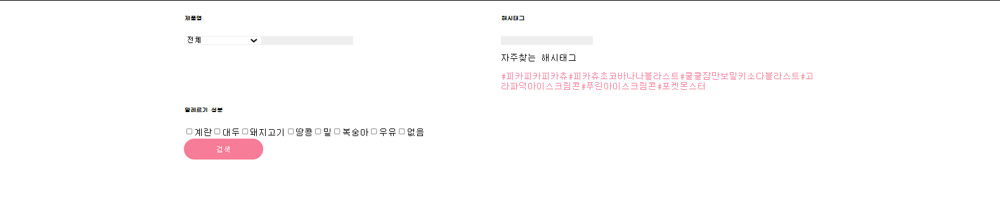
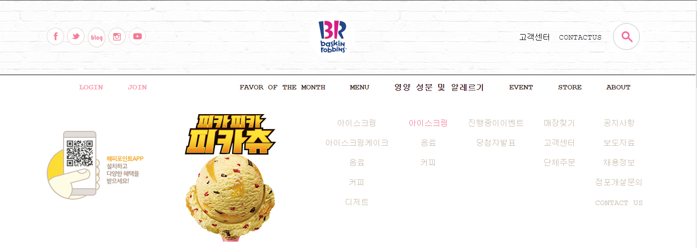

# 배스킨라빈스 사이트 클론작업
```

아직 미완성입니다_작업중간과제물 제출

```
- http://www.baskinrobbins.co.kr/   


## 프로젝트 구조
```
index.js - GlobalStyles.js
         - Meta.js
         - App.js - Header.js
                  - Main.js
                  - Footer.js
```
```
Header.js - SearchMenu.js
          - SubMenue.js
```
```
Main.js - TopImg.js
        - MySwiper.js (ajax통신활용)
        - BrEvent.js
        - BrMenu.js
        - BrStore.js (ajax통신활용)
        - BrInstagram.js
```
```
Footer.js

```
## backend data
```json
{
  "sliderImg":[
    "slider1.jpg","slider2.png","slider3.png","slider4.png","slider5.png","slider6.png","slider7.png","slider8.png","slider9.png","slider10.png","slider11.png"
  ],
 "brEvent":[
   {
     "img":"banner_delivery.png",
     "category":"stit_store.gif",
     "desc":"해피오더 딜리버리로 간편하게 주문하세요!",
     "period":"상시진행"
   },
   {
     "img":"banner_delivery_bm.png",
     "category":"stit_store.gif",
     "desc":"배달의 민족에서 빠르게 주문하세요!",
     "period":"상시진행"
   },
   {
     "img":"banner_delivery_ygy.png",
     "category":"stit_store.gif",
     "desc":"요기요에서 손쉽게 주문하세요!",
     "period":"상시진행"
   },
   {
     "img":"banner_delivery_kakao.png",
     "category":"stit_store.gif",
     "desc":"카카오톡 주문하기에서 편리하게 주문하세요!",
     "period":"상시진행"
   },
   {
     "img":"1670146074.png",
     "category":"stit_online.gif",
     "desc":"기아 멤버스 최대 50%제휴 혜택!",
     "period":"상시진행"
   },
   {
     "img":"1667538956.png",
     "category":"stit_online.gif",
     "desc":"2022 베스킨라빈스 특별한 제휴혜택!",
     "period":"상시진행"
   },
   {
     "img":"1659436130.png",
     "category":"stit_store.gif",
     "desc":"고소한 오트밀크와 깔끔한 콜드브루의 만남, 콜드브루 오트라떼 출시!",
     "period":"상시진행"
   },
   {
     "img":"1643869329.png",
     "category":"stit_store.gif",
     "desc":"KT멤버십 고객이라면 누구나 파인트30% 할인!",
     "period":"상시진행"
   },
   {
     "img":"1667382917.png",
     "category":"stit_store.gif",
     "desc":"현대카드 M포인트 50% 사용",
     "period":"상시진행"
   },
   {
     "img":"1639297260.png",
     "category":"stit_store.gif",
     "desc":"제휴 할인카드 혜택 안내",
     "period":"상시진행"
   },
   {
     "img":"1570702843.png",
     "category":"stit_online.gif",
     "desc":"2018한글날 기념 무료 글꼴 공개! 베스킨라빈스체",
     "period":"상시진행"
   },
   {
     "img":"1578277305.png",
     "category":"stit_store.gif",
     "desc":"1회용 컵 사용 줄이기 안내",
     "period":"상시진행"
   },
   {
     "img":"banner_praise_2022-1.png",
     "category":"stit_store.gif",
     "desc":"2022년 1분기 고객 Best칭찬점포 안내",
     "period":"상시진행"
   }
 ]
}
```
## Header.js


```js
import React from 'react';
import styled from 'styled-components';
import {Link, Routes, Route} from 'react-router-dom';
import SearchMenu from './SearchMenu';
import SubMenu from './SubMenu';

const HeaderContainer = styled.div`
  width: 100%;

    .header-top {
      //public폴더 안의 img파일 절대경로로 지정
      background: url("img/bg_header.gif");
      .content-wrap{
        width: 1200px;
        height: 150px;
        display: flex;
        justify-content: space-between;
        align-items: center;
        margin: auto;

        .icon-wrap{
          width: 200px;
          display: flex;
          justify-content: space-between;
        }
        
        .contact-wrap {
          width: 250px;
          display: flex;
          justify-content: space-between;
          align-items: center;
        }
      }//content-wrap
    } //header-top
    nav {
      border-top: 1px solid black;
      border-bottom: 3px solid black;
      .content-wrap{
        width: 1200px;
        display: flex;
        justify-content: space-between;
        margin: auto;
        .member {
          display: flex;
          justify-content: space-around;
        }
        .gnb {
          display: flex;
          justify-content: space-around;
        }
      }//content-wrap
    } //nav
`;

const Header = () => {
  const [ searchToggle, setSearchToggle]=React.useState(false);
  const [ navHover, setNavHover] = React.useState(false);
  

  const onClickSearch =()=> {
    searchToggle===false? setSearchToggle(searchToggle=>true) : setSearchToggle(searchToggle=>false)
  }

  const onMouseNav=()=>{
    setNavHover(navHover=>true);
  }
  const onMouseOutNav=()=>{
    setNavHover(navHover=>false);
  }

  return (
    <>
      <HeaderContainer>
        <section className="header-top">
          <div className="content-wrap">
            <div className="icon-wrap">
              <Link to="">
                
              </Link>
              <Link to="">
                
              </Link>
              
              <Link to="">
                
              </Link>
              <Link to="">
                
              </Link>
            </div>
            <div className="logo">
              <Link to="">
                
              </Link>
            </div>
            <div className="contact-wrap">
              <Link to="">고객센터</Link>
              <Link to="">CONTACTUS</Link>
              <button onClick={onClickSearch}>
                
              </button>
            </div>
          </div>
        </section>
        <nav>
          <div className="content-wrap">
            <ul className="member">
              <li>
                <Link to="">LOGIN</Link>
              </li>
              <li>
                <Link to="">JOIN</Link>
              </li>
            </ul>
            <div onMouseOver={onMouseNav} onMouseOut={onMouseOutNav}>
              <ul className="gnb">
                <li>
                  <Link to="">FAVOR OF THE MONTH</Link>
                </li>
                <li>
                  <Link to="">MENU</Link>
                </li>
                <li>
                  <Link to="">영양 성분 및 알레르기</Link>
                </li>
                <li>
                  <Link to="">EVENT</Link>
                </li>
                <li>
                  <Link to="">STORE</Link>
                </li>
                <li>
                  x<Link to="">ABOUT</Link>
                </li>
              </ul>
              {navHover === true ? <SubMenu /> : ""}
            </div>
          </div>
        </nav>
      </HeaderContainer>
      {searchToggle === true ? <SearchMenu /> : ""}
    </>
  );
};
export default Header;
```
## SearchMenu.js
```js
import React from 'react';
import styled from 'styled-components';

const SearchMenuContainer=styled.div`
  width: 100%;
  height: 400px;
  position: absolute;
  background-color: white;
  z-index: 9999;

  table{
    width: 1200px;
    margin: auto;

    th{
      height: 100px;
    }
    
    td{
      width: 600px;
      vertical-align: top;

    }
  }

`;

const SearchMenu = () => {
  return (
    <SearchMenuContainer>
      <table>
        <tbody>
        <tr>
          <td>
            <h6>제품명</h6>
            <form>
            <select name="" id="">
              <option value="">전체</option>
              <option value="">아이스크림</option>
              <option value="">아이스크림케이크</option>
              <option value="">음료</option>
              <option value="">커피</option>
              <option value="">디저트</option>
              <option value="">block pack</option>
              <option value="">ready pack</option>
            </select>
            <input type="text" />
            </form>
          </td>
          <td>
            <h6>해시태그</h6>
            <div>
            <input type="text" />
            <div className="favtag">
            <p>자주찾는 해시태그</p>
            <span>#피카피카피카츄</span>
            <span>#피카츄초코바나나블라스트</span>
            <span>#쿨쿨잠만보밀키소다블라스트</span>
            <span>#고라파덕아이스크림콘</span>
            <span>#푸린아이스크림콘</span>
            <span>#포켓몬스터</span>
          </div>
            </div>
          </td>
        </tr>
        <tr>
          <td colSpan={2}>
            <h6>알레르기 성분</h6>
            <form>
            <input type="checkbox" name="" id="" />계란
            <input type="checkbox" name="" id="" />대두
            <input type="checkbox" name="" id="" />돼지고기
            <input type="checkbox" name="" id="" />땅콩
            <input type="checkbox" name="" id="" />밀
            <input type="checkbox" name="" id="" />복숭아
            <input type="checkbox" name="" id="" />우유
            <input type="checkbox" name="" id="" />없음
            </form>
          </td>
        </tr>
        </tbody>
      </table>
    </SearchMenuContainer>
  );
};
export default SearchMenu;
```
## subMenu.js
```js
import React from 'react';
import styled  from 'styled-components';
import { Link } from 'react-router-dom';

const SubMenuContainer = styled.div`
  width: 100%;
  height: 300px;
  background-color: white;
  position: absolute;
  left: 0;
  z-index: 9999;
  display: flex;
  flex-direction: row;
  justify-content: space-between;

  .content-wrap{
    width: 1200px;
    margin: auto;

    .app-event{
      padding: 50px 0;
    }
    
    .menu-list{
      display: flex;
      justify-content: space-between;
    }
  }

`;

const SubMenu = () => {
  return (
    <SubMenuContainer>
      <div className="content-wrap">
      <div className="app-event">
        
      </div>
      <div className="icaream">
        
      </div>
      <div className="menu-list">
        <ul>
          <li><Link to=''>아이스크림</Link></li>
          <li><Link to=''>아이스크림케이크</Link></li>
          <li><Link to=''>음료</Link></li>
          <li><Link to=''>커피</Link></li>
          <li><Link to=''>디저트</Link></li>
        </ul>
        <ul>
          <li><Link to=''>아이스크림</Link></li>
          <li><Link to=''>음료</Link></li>
          <li><Link to=''>커피</Link></li>
        </ul>
        <ul>
          <li><Link to=''>진행중이이벤트</Link></li>
          <li><Link to=''>당첨자발표</Link></li>
        </ul>
        <ul>
          <li><Link to=''>매장찾기</Link></li>
          <li><Link to=''>고객센터</Link></li>
          <li><Link to=''>단체주문</Link></li>
        </ul>
        <ul>
          <li><Link to=''>공지사항</Link></li>
          <li><Link to=''>보도자료</Link></li>
          <li><Link to=''>채용정보</Link></li>
          <li><Link to=''>점포개설문의</Link></li>
          <li><Link to=''>CONTACT US</Link></li>
        </ul>
      </div>
      </div>
    </SubMenuContainer>
  );
};
export default SubMenu;
```

## MySwiper.js
- swiperjs 라이브러리 사용
- swiper이미지파일명 ajax통신으로 전달 

```js
/**
 * @filename Swiper.js
 * @description Swiperjs 라이브러리를 사용한 img swiper구현
 */

 import React from "react";
 import { Swiper, SwiperSlide } from "swiper/react";
 import styled from 'styled-components';
 
 // Import Swiper styles
 import "swiper/css";
 import "swiper/css/navigation";
 import "swiper/css/pagination";
 
 // import required modules
 import { Navigation, Pagination, Mousewheel, Keyboard } from "swiper";
import axios from "axios";
 
  const SwiperContainer = styled.div`
    width: 100%;
    .swiper {
      width: 100%;
      height: 100%;
    }
    .swiper-slide {
      text-align: center;
      font-size: 18px;
      background: tomato;

      /* Center slide text vertically */
      display: -webkit-box;
      display: -ms-flexbox;
      display: -webkit-flex;
      display: flex;
      -webkit-box-pack: center;
      -ms-flex-pack: center;
      -webkit-justify-content: center;
      justify-content: center;
      -webkit-box-align: center;
      -ms-flex-align: center;
      -webkit-align-items: center;
      align-items: center;
    }
    .swiper-slide img {
      display: block;
      width: 100%;
      height: 100%;
      object-fit: cover;
    }
    .swiper-button-next{
      background: url("/img/btn_banner_next.png") no-repeat;
      background-position:auto 50%;
      width: 120px;
      height: 120px;
      margin: 0;
    }
    .swiper-button-prev{
      background: url("/img/btn_banner_prev.png") no-repeat;
      background-position: auto 50%;
      width: 120px;
      height: 120px;
      margin: 0;
    }
    .swiper-button-next::after,
    .swiper-button-prev::after{
      display: none;
    }
    .swiper-pagination-bullet{
      width: 10px;
      height: 10px;
      background-color: white;
    }
      .swiper-pagination-bullet-active{
      background-color: black;
    }
  `;

 const MySwiper=()=>{
   const [ swiper, setSwiper] = React.useState([]);

   React.useEffect(()=>{
     (async()=>{
       let json = null;
      try {
        const response = await axios.get(' http://localhost:3001/sliderImg');
        // console.log(response);
        json=response.data;
      } catch (e) {
        console.error(e);
        alert('ajax 통신 실패');
      }
      if(json != null){
        setSwiper(swiper=>json);
      }
    })();
  },[])

    return (
      <SwiperContainer>
      <Swiper
        cssMode={true}
        navigation={true}
        pagination={{clickable:true,}}
        mousewheel={true}
        keyboard={true}
        modules={[Navigation, Pagination, Mousewheel, Keyboard]}
        className="MySwiper"
      >
        {
            swiper.map((v,i)=>{
              return(
                <SwiperSlide key={i}></SwiperSlide>
                )
              })
        }
      </Swiper>
    </SwiperContainer>
  );
 }
 export default MySwiper;
```
## BrEvent.js
- ajax통신으로 event 데이터전달
- 각 페이지별 데이터4개씩 출력되도록 처리( 미완성 )

```js
import React from 'react';
import styled from 'styled-components';
import {Link} from 'react-router-dom'; 
import axios from 'axios';

const StyledBrEvent=styled.div`
  width: 100%;
  padding: 50px 0;
  text-align: center;
  .content-wrap{
    width: 1200px;
    height: 700px;
    margin: auto;
    .event-list{
      display: flex;
      text-align: left;
      li{
        padding: 20px;

        .event-img{

        }
        .event-desc{
          padding-top: 20px;
        }
      }
    }
    .page{
      display: flex;
      justify-content: center;
    }
  }
`;

const BrEvent = () => {
  const [brEventContent, setBrEventContent] = React.useState([]);
  const [brEventIndex, setBrEventIndex] = React.useState(0);

//마운트되는 시점에 event list 전체를 ajax통신으로 가져옴
  React.useEffect(()=>{
    (async()=>{
      let json=null;
      
      try {
        const response = await axios.get('http://localhost:3001/brEvent');
        json=response.data;
      } catch (e) {
        console.error(e);
        alert('ajax 연동 실패');
      }
      
      if(json != null){
        setBrEventContent(brEventContent=> json.slice(0,4));
        // console.log(brEventContent)
      }
    })();
  },[])

  // const onBrEventPage=e=>{
  //   const {page} = e.target.dataset;
  //   setBrEventIndex(brEventIndex=>page);
  //   console.log(page);
  // }

  // React.useEffect(()=>{
  //   (async()=>{
  //     let json2=null;
      
  //     try {
  //       const response = await axios.get('http://localhost:3001/brEvent');
  //       json2=response.data;
  //     } catch (e) {
  //       console.error(e);
  //       alert('ajax 연동 실패');
  //     }
      
  //     if(json2 != null){
  //       setBrEventContent(brEventContent=>json2.slice(brEventIndex,brEventIndex+5));
  //       // console.log(brEventContent);
  //     }
  //   })();
  // },[brEventIndex])


  return (
    <StyledBrEvent>
      <div className="content-wrap">
        <div></div>
        <ul className='event-list'>
          {/* 마운팅됬을때 index 1번부터 4번까지의 데이터를 화면에 보여주고,,,page이동시... */}
          {
            brEventContent.map((v,i)=>{
              return(
                <li key={i}><Link to=''>
                <div className="event-img">
                  
                </div>
                <div className="event-desc">
                
                <p>{v.desc}</p>
                <p>{v.period}</p>
                </div>
                </Link></li> 
              )
            })
          }
        </ul>
        <div className="page">
          <button data-page={0} onClick={onBrEventPage}>페이지1</button>
          <button data-page={4} onClick={onBrEventPage}>페이지2</button>
          <button data-page={8} onClick={onBrEventPage}>페이지3</button>
          <button data-page={12} onClick={onBrEventPage}>페이지4</button>
        </div>
      </div>
    </StyledBrEvent>
  );
};

export default BrEvent;
```
