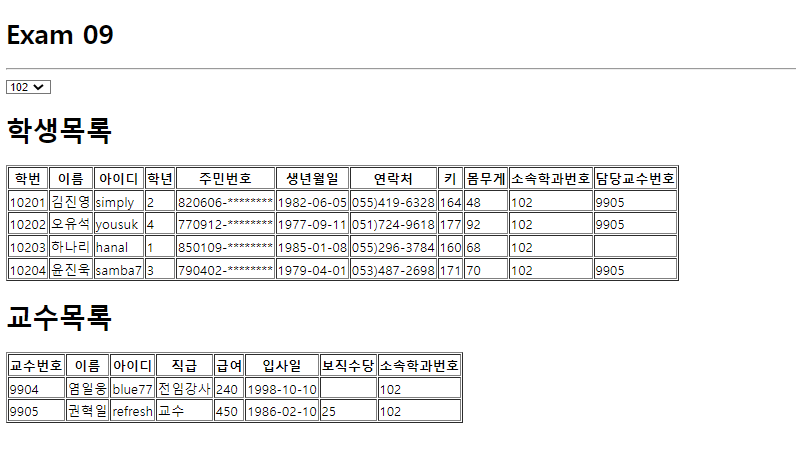

# Exam09


## App.js
```js
import React, { useState } from 'react';
import axios from 'axios';

import Spinner from './components/Spinner';
import Professor from './components/Professor';
import Student from './components/Student';


function App() {
  const [ department, setDepartment] = useState([]);
  const [ loading, setLoading ] = useState(false);
  const [ selectedDeptno, setSelectedDeptno] = useState(-1);

  React.useEffect(()=>{
    setLoading(loading=>true);

    (async()=>{
      let json=null;
      try {
        const respons = await axios.get('http://localhost:3001/department');
        json=respons.data;
      } catch (e) {
        console.error(e);
        alert('ajax통신 실패');
      }finally{
        setLoading(loading=>false);
      }

      if(json !=null){
        setDepartment(department=>json);
      }

    })();
  },[]);

  //select값이 변경되면 선택된 학과의  학과번호를 저장-->props로 전달할 데이터
  const selectDepartment=React.useCallback((e)=>{
    // let {deptno}=e.target.dataset;  
    // setSelectedDeptno(selectedDeptno=>deptno);
    // setSelectedDeptno(selectedDeptno=>e.target.value);
    
    const current= e.target;
    const id=parseInt(current[current.selectedIndex].value);
    setSelectedDeptno(id);
  });


  return (
    <>
      <h1>Exam 09</h1>
      <hr />
      <Spinner visible={loading}/>
      <select name="" id="" onChange={selectDepartment}>
        {
          department.map((v,i)=>{
            return(
              // <option key={i} data-deptno={v.id}>{v.dname}</option>
              <option key={v.id} value={v.id}>{v.dname}</option>
              )
            })
          }
      </select>
      <Student deptno={selectedDeptno}/>
      <Professor deptno={selectedDeptno}/>
    </>
  );
}
export default App;
```

## Spinner.js
```js
/**
 * @filename Spinner.js
 * @description react-loader-spinner라이브러리 활용 로딩바 구현
 * @reference https://mhnpd.github.io/react-loader-spinner/
 * @install yarn add react-loader-spinner
 */

 import React from "react";
 import PropsTypes from "prop-types";
 import styled from "styled-components";
 import { Grid } from "react-loader-spinner";
 
 const TransLayer = styled.div`
   position: fixed;
   left: 0;
   top: 0;
   z-index: 9999;
   background-color: #0003;
   width: 100%;
   height: 100%;
 `;
 
 const Spinner = ({ visible, color, width, height }) => {
   return (
     <>
       {visible && (
         <TransLayer>
           <Grid
             height={height}
             width={width}
             color={color}
             ariaLabel="loading-indicator"
             wrapperStyle={{
               position: "absolute",
               zIndex: "50%",
               left: "50%",
               top: "50%",
               marginLeft: -width / 2 + "px",
               marginTop: -height / 2 + "px",
             }}
           />
         </TransLayer>
       )}
     </>
   );
 };
 Spinner.defaultProps = {
   visible: false,
   color: "#06f",
   width: 100,
   height: 100,
 };
 
 Spinner.PropsTypes = {
   visible: PropsTypes.bool.isRequired,
   color: PropsTypes.string,
   width: PropsTypes.number,
   height: PropsTypes.number,
 };
 
 export default Spinner;
```

## Student.js
```js
import axios from 'axios';
import React, { useState } from 'react';
import styled from 'styled-components';
import PropTypes from 'prop-types';
import Spinner from './Spinner';

const StudentContainer=styled.div`
  width: 100%;
`;

const Student = ({deptno}) => {
  const [loading, setLoading] = useState(false);
  const thead =['학번','이름','아이디','학년','주민번호','생년월일','연락처','키','몸무게','소속학과번호','담당교수번호'];
  const [tbody,setTbody] = useState([]);

  React.useEffect(()=>{
    setLoading(true);

    (async()=>{
      let json=null;
      try {
        const response = await axios.get(`http://localhost:3001/student?deptno=${deptno}`);
        json=response.data;
        // console.log(json);
      } catch (e) {
        console.error(e);
        alert('ajax 통신 실패');
      }finally{
        setLoading(false);
      }
      if( json != null){
        setTbody(tbody=>json);
        // console.log(tbody);
      }
    })();
  },[deptno]);


  return (
    <StudentContainer>
      <Spinner visible={loading}/>
      <h1>학생목록</h1>
      <table border={1}>
        <thead>
          <tr>
            {
              thead.map((v,i)=><th key={i}>{v}</th>)
            }
          </tr>
        </thead>
        <tbody>
            {
              tbody.map((v,i)=>{
                return(
                  <tr key={i}>
                    <td>{v.id}</td>
                    <td>{v.name}</td>
                    <td>{v.userid}</td>
                    <td>{v.grade}</td>
                    <td>{v.idnum.slice(0,6) + '-********'}</td>
                    <td>{v.birthdate.slice(0,10)}</td>
                    <td>{v.tel}</td>
                    <td>{v.height}</td>
                    <td>{v.weight}</td>
                    <td>{v.deptno}</td>
                    <td>{v.profno}</td>
                  </tr>
                )
              })
            }
        </tbody>
      </table>
    </StudentContainer>
  );
};

Student.propTypes={
  deptno:PropTypes.number.isRequired
}

export default Student;
```

## Professor.js
```js
import axios from 'axios';
import React, { useState } from 'react';
import styled from 'styled-components';
import PropTypes from 'prop-types';
import Spinner from './Spinner';

const ProfessorContainer=styled.div`

`;

const Professor = ({deptno}) => {
  const [loading, setLoading] = useState(false);
  const thead =['교수번호','이름','아이디','직급','급여','입사일','보직수당','소속학과번호'];
  const [tbody,setTbody] = useState([]);

  React.useEffect(()=>{
    setLoading(true);

    (async()=>{
      let json=null;
      try {
        const response = await axios.get(` http://localhost:3001/professor?deptno=${deptno}`);
        json=response.data;
        // console.log(json);
      } catch (e) {
        console.error(e);
        alert('ajax 통신 실패');
      }finally{
        setLoading(false);
      }
      if( json != null){
        setTbody(tbody=>json);
        console.log(tbody);
      }
    })();
  },[deptno]);

  return (
    <ProfessorContainer>
      <Spinner visible={loading}/>
      <h1>교수목록</h1>
      <table border={1}>
        <thead>
          <tr>
            {
              thead.map((v,i)=><th key={i}>{v}</th>)
            }
          </tr>
        </thead>
        <tbody>
            {
              tbody.map((v,i)=>{
                return(
                  <tr key={i}>
                    <td>{v.id}</td>
                    <td>{v.name}</td>
                    <td>{v.userid}</td>
                    <td>{v.position}</td>
                    <td>{v.sal}</td>
                    <td>{v.hiredate.slice(0,10)}</td>
                    <td>{v.comm}</td>
                    <td>{v.deptno}</td>
                  </tr>
                )
              })
            }
        </tbody>
      </table>
      
    </ProfessorContainer>
  );
};

Professor.propTypes={
  deptno:PropTypes.number.isRequired
}

export default Professor;
```