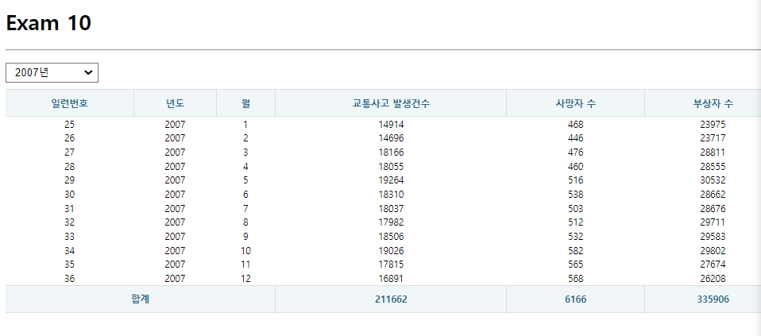

# Exam10_ axios hooks


## App.js
```js
import React from 'react';
// import axios from 'axios';
import useAxios from 'axios-hooks';
import styled from 'styled-components';

import Spinner from './components/Spinner';
import Table from './components/Table';
import useMountedRef from './hooks/useMountedRef';

const SelectContainer = styled.div`
  position: sticky;
  top: 0;
  padding: 10px 0;
  margin: 0;
  select{
    margin-right: 15px;
    font-size: 16px;
    padding: 5px 10px;
  }

`;
function App() {
  let accidentSum =0;
  let deathSum =0;
  let injurySum =0;
  
  const [selectedYear, setSelectedYear] = React.useState ({year:''});

  //컴포넌트가 마운트될때 API로부터 전체데이터 받아와 출력
  const URL = 'http://localhost:3001/traffic_acc';
  const [{data,loading,error},refetch] = useAxios(URL);


  //selec 값이 변경될때 호출할 이벤트
  const onChangeSelect =React.useCallback((e)=>{
    e.preventDefault();
    //selec된 값을 selectYear 상태값으로 설정
    const key= e.target.name;
    const value= e.target.value;
    const newState = {...setSelectedYear, [key]:value}
    setSelectedYear(selectedYear=> newState);
    console.log(e.target.value) //현재 선택된 값이 나오고
    console.log(selectedYear) //현재 선택된 값 바로 이전의 값이 나옴... 왜??? 기능은 정상작동함
  },[selectedYear]);

  const mountedRef = useMountedRef();
  //selectedYear상태값이 변경될때 실핼될 hook.. 마운트될때 실행되지 않도록 if문처리
  React.useEffect(()=>{
    if(mountedRef.current){
      //selec선택값을 파마미터로 함께 전달하여 데이터 다시 받아오기.
      refetch({params: selectedYear });
    }
  },[mountedRef,refetch,selectedYear])

  if(error){
    console.error(error);
    return(
      <div>
        <h1> !!!! {error.code} Error</h1>
        <hr />
        <p>{error.message}</p>
      </div>
    )
  }
  return (
    <>
    <h1>Exam 10</h1>
    <hr />
    <SelectContainer>
      <select name='year' onChange={onChangeSelect}>
      {
        for(let i=2005; i<2016; i++){
          return(
            <option value={i}>{i}년</option>
          )
        }
      }
        <option value="">--년도 선택--</option>
        <option value="2005">2005년</option>
        <option value="2006">2006년</option>
        <option value="2007">2007년</option>
        <option value="2008">2008년</option>
        <option value="2009">2009년</option>
        <option value="2010">2010년</option>
        <option value="2011">2011년</option>
        <option value="2012">2012년</option>
        <option value="2013">2013년</option>
        <option value="2014">2014년</option>
        <option value="2015">2015년</option>
      </select>
    </SelectContainer>
    
    <Table>
      <Spinner visible={loading}/>
      <thead>
        <tr>
          <th>일련번호</th>
          <th>년도</th>
          <th>월</th>
          <th>교통사고 발생건수</th>
          <th>사망자 수</th>
          <th>부상자 수</th>
        </tr>
      </thead>
      <tbody>
        {
          data && data.map(({ id,year, month, accident, death, injury },i)=>{
            accidentSum += accident;
            deathSum += death;
            injurySum += injury
            return(
              <tr key={i}>
                <td>{id}</td>
                <td>{year}</td>
                <td>{month}</td>
                <td>{accident}</td>
                <td>{death}</td>
                <td>{injury}</td>
              </tr>
            )
          })
        }
        <tr>
          <th colSpan={3}>합계</th>
          <th>{accidentSum}</th>
          <th>{deathSum}</th>
          <th>{injurySum}</th>
        </tr>
      </tbody>
    </Table>
    </>
  );
}
export default App;
```