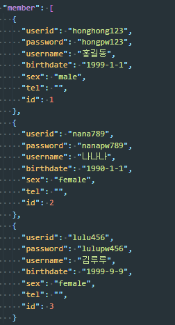

# 네이버 회원가입페이지 클론코딩

<!--  -->
<!--  -->


## App.js

```js
import React, { useRef } from "react";
import styled from "styled-components";
import axios from "axios";
import useAxios from "axios-hooks";

import { FontAwesomeIcon } from "@fortawesome/react-fontawesome";
import { faLock } from "@fortawesome/free-solid-svg-icons";
import RegexHelper from "./regex/RegexHelper";

const StyledInput = styled.input`
    height: 60px;
    margin: 5px 0;
    font-size: 25px;
    border: 1px solid #dadada;
    text-indent: 10px;
    &:focus {
        outline: none;
        border: 1px solid #02c75a;
    }
`;

const StyledButton = styled.button`
    height: 60px;
    background-color: #02c75a;
    border: none;
    font-size: 25px;
    color: white;
    &:focus {
        outline: none;
        border: 1px solid #02c75a;
    }
`;

const StyledSelect = styled.select`
    height: 60px;
    font-size: 25px;
    border: 1px solid #dadada;
    text-indent: 10px;
    &:focus {
        outline: none;
        border: 1px solid #02c75a;
    }
`;

const AppContainer = styled.div`
    width: 100%;
    height: 100%;
    background-color: #f5f6f7;

    .content-wrap {
        width: 600px;
        margin: auto;

        .logo {
            text-align: center;
            padding: 50px 0;
        }

        form {
            display: flex;
            flex-direction: column;

            .input-box {
                display: flex;
                flex-direction: column;
                margin: 18px 0;
                font-size: 25px;

                .icon-position {
                    position: relative;
                    input {
                        position: relative;
                        width: 600px;
                    }
                    svg {
                        position: absolute;
                        right: 10px;
                        top: 25px;
                        color: gray;
                    }
                }

                #userid {
                    &::placeholder {
                        text-align: right;
                        padding-right: 15px;
                        font-size: 20px;
                        opacity: 0.5;
                    }
                    &:focus::-webkit-input-placeholder {
                        text-align: right;
                    }
                }

                label {
                    margin: 5px 0;
                }
                p {
                    color: red;
                    font-size: 15px;
                    margin: 3px 0;
                }
                .birthdate-box {
                    display: flex;
                    justify-content: space-between;
                    align-items: center;
                    input {
                        width: 180px;
                    }
                    select {
                        width: 180px;
                    }
                }
                .authorize-box {
                    display: flex;
                    justify-content: space-between;
                    align-items: center;
                    input {
                        width: 400px;
                    }
                }
                input[name="authorizationNum"] {
                    background-color: #f7f7f7;
                }
            }
        } //form end

        footer {
            font-size: 17px;
            opacity: 0.8;
            text-align: center;
            ul {
                list-style: none;
                display: flex;
                padding: 0;
                justify-content: center;
                margin-top: 50px;

                li {
                    padding: 0 5px;
                    &::after {
                        content: "|";
                        opacity: 0.5;
                        padding-left: 5px;
                    }
                    &:last-child::after {
                        content: "";
                    }
                    a {
                        text-decoration: none;
                        color: black;
                        opacity: 0.5;
                    }
                }
            } //ul end
        } //footer end
    }
`;

function App() {
    const signup_form = React.useRef();
    const authorizationnum = React.useRef();
    const [formData, setFormData] = React.useState({
        userid: "",
        password: "",
        passwordcheck: "",
        username: "",
        birthdate: "",
        birthyear: "",
        birthmonth: "",
        birthday: "",
        sex: "",
        tel: "",
    });

    const [{ loading }, refetch] = useAxios(
        {
            url: "http://localhost:3001/member",
            method: "POST",
        },
        { manual: true }
    );

    /*************************** 이코드가 있을때  Too many render 오류가 발생했다.  */
    // const {birthyear, birthmonth, birthday} = formData;
    // const birthdate = [birthyear,birthmonth,birthday].join('-');
    // setFormData(formData => ({...formData, [birthdate]:birthdate}));
    // console.log({formData});

    //onBlur된 input값 유효성검사 진행
    const onBlurInput = React.useCallback((e) => {
        const current = e.target;
        try {
            switch (current.name) {
                case "userid":
                    RegexHelper.value(current, "필수 정보입니다.");
                    RegexHelper.checkId(
                        current,
                        "5~20자의 영문 소문자, 숫자와 특수기호(_),(-)만 사용 가능합니다."
                    );
                    setFormData((formData) => ({
                        ...formData,
                        [current.name]: current.value,
                    }));
                    document.querySelector(
                        `p[data-${current.name}]`
                    ).innerHTML = "";
                    break;
                case "password":
                    RegexHelper.value(current, "필수 정보입니다.");
                    RegexHelper.checkPw(
                        current,
                        "8~16자 영문 대 소문자, 숫자, 특수문자를 사용하세요."
                    );
                    setFormData((formData) => ({
                        ...formData,
                        [current.name]: current.value,
                    }));
                    document.querySelector(
                        `p[data-${current.name}]`
                    ).innerHTML = "";
                    document.querySelector(".pwicon").style.color = "#02C75A";

                    break;
                case "passwordcheck":
                    RegexHelper.value(current, "필수 정보입니다.");
                    RegexHelper.compareTo(
                        signup_form.current.password,
                        current,
                        "비밀번호가 일치하지 않습니다."
                    );
                    setFormData((formData) => ({
                        ...formData,
                        [current.name]: current.value,
                    }));
                    document.querySelector(
                        `p[data-${current.name}]`
                    ).innerHTML = "";
                    document.querySelector(".pwcheckicon").style.color =
                        "#02C75A";
                    break;
                case "username":
                    RegexHelper.value(current, "필수 정보입니다.");
                    setFormData((formData) => ({
                        ...formData,
                        [current.name]: current.value,
                    }));
                    document.querySelector(
                        `p[data-${current.name}]`
                    ).innerHTML = "";
                    break;
                case "sex":
                    RegexHelper.value(current, "필수 정보입니다.");
                    document.querySelector(
                        `p[data-${current.name}]`
                    ).innerHTML = "";
                    setFormData((formData) => ({
                        ...formData,
                        [current.name]: current.value,
                    }));
                    break;
                case "birthyear":
                    RegexHelper.value(
                        current,
                        "태어난 년도 4자리를 정확하게 입력하세요."
                    );
                    RegexHelper.birthYearNum(
                        current,
                        "태어난 년도 4자리를 정확하게 입력하세요."
                    );
                    document.querySelector(
                        `p[data-${current.name}]`
                    ).innerHTML = "";
                    setFormData((formData) => ({
                        ...formData,
                        [current.name]: current.value,
                    }));
                    break;
                case "birthmonth":
                    RegexHelper.value(current, "태어난 월을 입력하세요.");
                    document.querySelector(
                        `p[data-${current.name}]`
                    ).innerHTML = "";
                    setFormData((formData) => ({
                        ...formData,
                        [current.name]: current.value,
                    }));
                    break;
                case "birthday":
                    RegexHelper.value(
                        current,
                        "태어난 일(날짜) 2자리를 정확하게 입력하세요."
                    );
                    document.querySelector(
                        `p[data-${current.name}]`
                    ).innerHTML = "";
                    setFormData((formData) => ({
                        ...formData,
                        [current.name]: current.value,
                    }));
                    break;
                case "tel":
                    RegexHelper.value(
                        signup_form.current.tel,
                        "필수정보입니다."
                    );
                    break;
                default:
            }
        } catch (error) {
            // console.dir(error);
            document.querySelector(`p[data-${current.name}]`).innerHTML =
                error.message;
            document.querySelector(`p[data-${current.name}]`).style.color =
                "red";
            if (current.name === "password") {
                document.querySelector(".pwicon").style.color = "red";
            }
            if (current.name === "passwordcheck") {
                document.querySelector(".pwcheckicon").style.color = "red";
            }
            return;
        }
    }, []); //onBlurInput이벤트 end

    //유효성검사가 정상적으로 완료되어 상태값으로 저장된 아이디 값을  ajax통신으로 받아온 member데이터로 아이디 중복여부 검사
    const useridCheck = () => {
        if (formData.userid) {
            (async () => {
                let json = null;
                try {
                    const response = await axios.get(
                        "http://localhost:3001/member"
                    );
                    json = response.data;
                    console.log(json);
                } catch (error) {
                    console.error(error);
                }
                //동일한 아이디가 있는 경우 ---> " 이미 사용중이거나 탈퇴한 아이디입니다." 출력
                //중복아이디 없는경우 ---->" 멋진 아이디네요!" 출력
                if (json.some((item) => item.userid === formData.userid)) {
                    document.querySelector("p[data-userid]").innerHTML =
                        "이미 사용중이거나 탈퇴한 아이디 입니다.";
                } else {
                    document.querySelector("p[data-userid]").innerHTML =
                        "멋진 아이디네요!";
                    document.querySelector("p[data-userid]").style.color =
                        "#02C75A";
                }
            })();
        }
    };

    React.useEffect(() => {
        useridCheck();
        //   if(formData.userid){
        //     (async()=>{
        //     let json = null;
        //     try {
        //       const response = await axios.get('http://localhost:3001/member');
        //       json = response.data;
        //       console.log(json);
        //     } catch (error) {
        //       console.error(error);
        //     }
        //     //동일한 아이디가 있는 경우 ---> " 이미 사용중이거나 탈퇴한 아이디입니다." 출력
        //     //중복아이디 없는경우 ---->" 멋진 아이디네요!" 출력
        //     if(json.some((item)=> item.userid === formData.userid)){
        //       document.querySelector('p[data-userid]').innerHTML = '이미 사용중이거나 탈퇴한 아이디 입니다.';
        //     }else{
        //       document.querySelector('p[data-userid]').innerHTML = '멋진 아이디네요!';
        //       document.querySelector('p[data-userid]').style.color='#02C75A';
        //     }
        //   })();
        // }
    }, [formData.userid]);

    //인증번호 받기 button 클릭이벤트
    const onClickBtn = (e) => {
        try {
            RegexHelper.value(
                signup_form.current.tel,
                "형식에 맞지않는 번호입니다."
            );
            RegexHelper.cellphone(
                signup_form.current.tel,
                "형식에 맞지않는 번호입니다."
            );
            document.querySelector("p[data-authorize").innerHTML =
                "인증번호를 발송했습니다.(유효시간 30분)<br/>인증번호가 오지 않으면 입력하신 정보가 정확한지 확인하여 주세요.<br/>이미 가입된 번호이거나, 가상전화번호는 인증번호를 받을 수 없습니다.";
            // console.log(authorizationnum.current)
            authorizationnum.current.disabled = false;
            document.querySelector("p[data-authorize").style.color = "#02C75A";
        } catch (e) {
            document.querySelector("p[data-authorize").innerHTML = e.message;
            document.querySelector("p[data-authorize").style.color = "red";

            return;
        }
    };

    /**
     * axios post전송
     */
    const onSubmitForm = (e) => {
        e.preventDefault();

        let json = null;
        (async () => {
            try {
                const response = await refetch({
                    data: {
                        userid: formData.userid,
                        password: formData.password,
                        username: formData.username,
                        birthdate: [
                            formData.birthyear,
                            formData.birthmonth,
                            formData.birthday,
                        ].join("-"),
                        sex: formData.sex,
                        tel: formData.tel,
                    },
                });
                json = response.data;
            } catch (e) {
                console.log(e);
                window.alert(e.message);
            }

            if (json !== null) {
                window.alert("가입을 환영합니다.");
            }
        })();
    };

    return (
        <AppContainer>
            <div className="content-wrap">
                <div className="logo">
                    
                </div>
                <form ref={signup_form} onSubmit={onSubmitForm}>
                    <div className="input-box">
                        <label htmlFor="">아이디</label>
                        <StyledInput
                            type="text"
                            name="userid"
                            id="userid"
                            onBlur={onBlurInput}
                            placeholder="@naver.com"
                        />
                        <p data-userid="errorMessage"></p>
                    </div>
                    <div className="input-box">
                        <label htmlFor="">비밀번호</label>
                        <div className="icon-position">
                            <StyledInput
                                type="password"
                                name="password"
                                id="password"
                                onBlur={onBlurInput}
                            />
                            <FontAwesomeIcon icon={faLock} className="pwicon" />
                        </div>
                        <p data-password="errorMessage"></p>
                    </div>
                    <div className="input-box">
                        <label htmlFor="">비밀번호 재확인</label>
                        <div className="icon-position">
                            <StyledInput
                                type="password"
                                name="passwordcheck"
                                id="passwordCheck"
                                onBlur={onBlurInput}
                            />
                            <FontAwesomeIcon
                                icon={faLock}
                                className="pwcheckicon"
                            />
                        </div>
                        <p data-passwordcheck="errorMessage"></p>
                    </div>
                    <div className="input-box">
                        <label htmlFor="">이름</label>
                        <StyledInput
                            type="text"
                            name="username"
                            id="username"
                            onBlur={onBlurInput}
                        />
                        <p data-username="errorMessage"></p>
                    </div>
                    <div className="input-box">
                        <label htmlFor="birthyear">생년월일</label>
                        <div className="birthdate-box">
                            <StyledInput
                                type="text"
                                className="birthdate"
                                name="birthyear"
                                id="birthyear"
                                placeholder="년(4자)"
                                onBlur={onBlurInput}
                                maxLength={4}
                            />
                            <StyledSelect
                                className="birthdate"
                                name="birthmonth"
                                onBlur={onBlurInput}
                            >
                                <option value="">월</option>
                                <option value="1">1</option>
                                <option value="2">2</option>
                                <option value="3">3</option>
                                <option value="4">4</option>
                                <option value="5">5</option>
                                <option value="6">6</option>
                                <option value="7">7</option>
                                <option value="8">8</option>
                                <option value="9">9</option>
                                <option value="10">10</option>
                                <option value="11">11</option>
                                <option value="12">12</option>
                            </StyledSelect>
                            <StyledInput
                                type="text"
                                className="birthdate"
                                name="birthday"
                                placeholder="일"
                                onBlur={onBlurInput}
                                maxLength={3}
                            />
                        </div>
                        <p
                            data-birthyear="errorMessage"
                            data-birthmonth="errorMessage"
                            data-birthday="errorMessage"
                        ></p>
                    </div>
                    <div className="input-box">
                        <label htmlFor="sex">성별</label>
                        <StyledSelect name="sex" id="sex" onBlur={onBlurInput}>
                            <option value="">성별</option>
                            <option value="male">남자</option>
                            <option value="female">여자</option>
                            <option value="no">선택안함</option>
                        </StyledSelect>
                        <p data-sex="errorMessage"></p>
                    </div>
                    <div className="input-box">
                        <label htmlFor="">
                            본인 확인 이메일<span>(선택)</span>
                        </label>
                        <StyledInput
                            type="text"
                            name=""
                            id=""
                            placeholder="선택입력"
                        />
                    </div>
                    <div className="input-box">
                        <label htmlFor="tel">휴대전화</label>
                        <StyledSelect name="nation">
                            <option value="korea">대한민국 +82</option>
                        </StyledSelect>
                        <div className="authorize-box">
                            <StyledInput
                                type="text"
                                name="tel"
                                id="tel"
                                onBlur={onBlurInput}
                                placeholder="전화번호 입력"
                            />
                            <StyledButton type="button" onClick={onClickBtn}>
                                인증번호 받기
                            </StyledButton>
                        </div>
                        <StyledInput
                            type="text"
                            name="authorizationnum"
                            ref={authorizationnum}
                            placeholder="인증번호를 입력하세요"
                            disabled
                            onBlur={onBlurInput}
                        ></StyledInput>
                        <p
                            data-authorize="errorMessage"
                            data-tel="errorMessage"
                        ></p>
                    </div>
                    <StyledButton type="submit">가입하기</StyledButton>
                </form>
                <footer>
                    <ul>
                        <li>
                            <a
                                href="https://policy.naver.com/rules/service.html"
                                target="_blank"
                            >
                                이용악관
                            </a>
                        </li>
                        <li>
                            <a
                                href="https://policy.naver.com/policy/privacy.html"
                                target="_blank"
                            >
                                개인정보처리방침
                            </a>
                        </li>
                        <li>
                            <a
                                href="https://policy.naver.com/rules/disclaimer.html"
                                target="_blank"
                            >
                                책임의 한계와 법적고지
                            </a>
                        </li>
                        <li>
                            <a
                                href="https://help.naver.com/support/service/main.help?serviceNo=532&_membership_p.membership_p.membership_26&from=alias"
                                target="_blank"
                            >
                                회원정보 고객센터
                            </a>
                        </li>
                    </ul>
                    <div>ⓒ NAVER Corp.</div>
                </footer>
            </div>
        </AppContainer>
    );
}

export default App;
```

## 가입등록 후 backend data 확인


