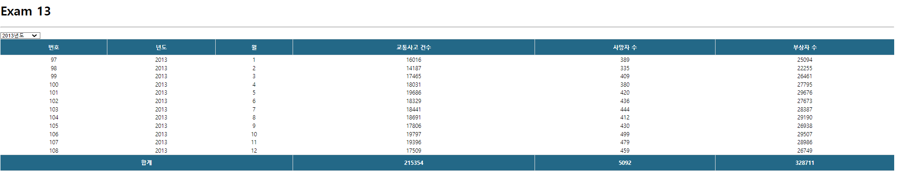

# 연습문제13_ 교통사고현황 + redux



## AccidentSlice.js
```js
import { createSlice, createAsyncThunk } from '@reduxjs/toolkit';
import axios from 'axios';

export const getAccidentList = createAsyncThunk('accident/getAccidentList', async(payload, {rejectWithValue})=>{
    let result = null;
    try {
        result = payload? await axios.get('http://localhost:3001/traffic_acc',{
            params:{year:payload}
        }) : await axios.get('http://localhost:3001/traffic_acc')
    } catch (err) {
        result = rejectWithValue(err.response);
    }
    return result;
});

const AccidentSlice = createSlice({
    name: 'accident',
    initialState:{
        data: null,
        loading: false,
        error: null
    },
    reducers:{

    },
    extraReducers:{
        [getAccidentList.pending]:(state, {payload})=>{
            return {...state, loading:true}
        },
        [getAccidentList.fulfilled]:(state, {payload})=>{
            return{
                data:payload?.data,
                loading:false,
                error: null
            }
        },
        [getAccidentList.rejected]:(state,{payload})=>{
            return{
                data:payload?.data,
                loading:false,
                error: {
                    code:payload?.state? payload.state:500,
                    message: payload?.statusText? payload.statusText:'Server Error'
                }
            }
        }
    }
});

export default AccidentSlice.reducer;
```

## store.js
```js
import { configureStore, } from "@reduxjs/toolkit";

import AccidentSlice from "./components/slices/AccidentSlice";

const store = configureStore({
    reducer:{
        accident : AccidentSlice
    },
    middleware:(getDefaultMiddleware) => getDefaultMiddleware({serializableCheck:false}),
    devTools: true
});

export default store;
```

## Accident.js
```js
import React from 'react';

import Table from './Table';
import Spinner from './Spinner';
import ErrorView from '../components/ErrorView';

import {useSelector, useDispatch} from 'react-redux';
import { getAccidentList } from './slices/AccidentSlice';

const Accident = () => {
    let accidentSum = 0;
    let deathSum = 0;
    let injurySum = 0;

    const {data,loading, error} = useSelector((state)=>state.accident);
    const dispatch = useDispatch();

    const [year, setYear] = React.useState('');
 
    const onChangeYear =React.useCallback((e)=>{
        e.preventDefault();
        setYear(e.target.value);
    },[])
    
    React.useEffect(()=>{
        dispatch(getAccidentList(year))
        // console.log(data);
    },[dispatch,year])


    return (
        <div>
            <Spinner visible={loading}/>
            <select onChange={onChangeYear}>
                <option value="">- 년도선택 -</option>
                {
                    [...new Array(2018-2005+1)].map((v,i)=>{
                        return (
                            <option  key={i} value={2005+i}>{2005+i}년도</option>
                        )
                    })
                }
            </select>
            {error? <ErrorView error={error}/> : (
                <Table>
                <thead>
                    <tr>
                        {
                            ['번호','년도','월','교통사고 건수','사망자 수','부상자 수'].map((v,i)=>{
                                return(
                                    <th key={i}>{v}</th>
                                    )
                            })
                        }
                    </tr>
                </thead>
                <tbody>
                        {
                            data && data.map((v,i)=>{
                                accidentSum += v.accident;
                                deathSum += v.death;
                                injurySum += v.injury;
                                return( 
                                    <tr key={i}>
                                        <td>{v.id}</td>
                                        <td>{v.year}</td>
                                        <td>{v.month}</td>
                                        <td>{v.accident}</td>
                                        <td>{v.death}</td>
                                        <td>{v.injury}</td>
                                    </tr>
                                )
                            })
                        }
                        <tr>
                            <th colSpan={3}>합계</th>
                            <th>{accidentSum}</th>
                            <th>{deathSum}</th>
                            <th>{injurySum}</th>
                        </tr>
                </tbody>
            </Table>
            )}
        </div>
    );
};

export default Accident;
```