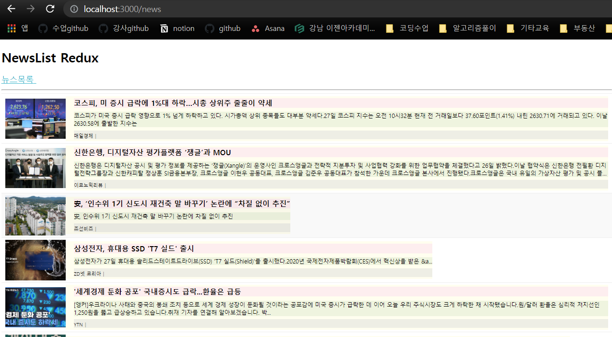

# 연습문제 NewList + Redux


## index.js
```js
import React from 'react';
import ReactDOM from 'react-dom/client';
import App from './App';
import { BrowserRouter } from "react-router-dom";

//리덕스 구성을 위한 참조 
import {Provider} from 'react-redux';
import store from './store';

const root = ReactDOM.createRoot(document.getElementById('root'));
root.render(
  <React.StrictMode>
    <Provider store={store}>
      <BrowserRouter>
        <App />
      </BrowserRouter>
    </Provider>
  </React.StrictMode>
);
```

## NewSlice.js
```js
import { createSlice, createAsyncThunk} from '@reduxjs/toolkit';
import axios from 'axios';

//비동기 처리함수 구현_ payload는 이 함수를 호출할때 전달되는 파라미터
export const getList = createAsyncThunk('news/getList', async(payload, {rejectWithValue})=>{
    let result = null;
    try {
        result= await axios.get(' http://localhost:3001/news');
    } catch (err) {
        result= rejectWithValue(err.response);
    }
    return result;
});

const departmentSlice = createSlice({
    name: 'news',
    initialState:{
        data:null,
        loading: false,
        error: null
    },
    reducers:{

    },
    extraReducers:{
        [getList.pending]:(state, {payload})=>{
            return {...state, loading:true}
        },
        [getList.fulfilled]:(state, {payload})=>{
            return{
                data:payload?.data,
                loading:false,
                error: null
            }
        },
        [getList.rejected]:(state,{payload})=>{
            return{
                data:payload?.data,
                loading:false,
                error: {
                    code:payload?.state? payload.state:500,
                    message: payload?.statusText? payload.statusText:'Server Error'
                }
            }
        }
    }
})
export default departmentSlice.reducer;
```
## store.js
```js
import { configureStore, getDefaultMiddleware } from '@reduxjs/toolkit';
import { createLogger } from 'redux-logger';

import newSlice from './slicdes/NewSlice';

const logger = createLogger();

const store = configureStore({
    reducer:{
        news:newSlice
    },
    middleware: [...getDefaultMiddleware({serializableCheck:false}), logger],
    devTools: true
})
export default store;
```
## News.js
```js
import React from "react";
import styled from "styled-components";
import axios from "axios";
import NewsItem from "../components/NewsItem";
import Spinner from '../components/Spinner';

import { useSelector, useDispatch} from 'react-redux';
import { getList } from "../slicdes/NewSlice";

const ListContainer = styled.ul`
  list-style: none;
  padding: 0;
  margin: 0;
  width: 100%;
  box-sizing: border-box;
  display: flex;
  flex-direction: column;
  margin-bottom: 30px;
`;


const News = () => {
  React.useEffect(()=>{console.clear()},[]);
  
  const {data, loading, error} = useSelector((state)=>state.news);
  console.log(data);

  const dispatch = useDispatch();

  React.useEffect(()=>{
    dispatch(getList())
  },[dispatch]);


  return (
    <div>
      <Spinner visible={loading}/>
      {
        error?(
          <div>
            <h1>Oops~~!! {error.code} Error</h1>
            <hr />
            <p>{error.message}</p>
          </div>
        ):(
          <ListContainer>
            {data && data.map((v, i) => (
              <NewsItem key={i} item={v} />
            ))}
          </ListContainer>
        )
      }
    </div>
  );
};
export default React.memo(News);

```